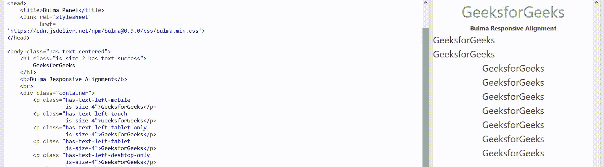

# 布尔玛响应校准

> 原文:[https://www.geeksforgeeks.org/bulma-responsive-alignment/](https://www.geeksforgeeks.org/bulma-responsive-alignment/)

[布尔玛](https://www.geeksforgeeks.org/bulma-introduction/)响应对齐用于使您的网站具有响应性。您可以为每个视口宽度选择特定的对齐方式。只需将视口宽度附加到对齐修改器。

**响应校准等级:**

*   **has-text-left-mobile:** 如果屏幕宽度达到 768px，则使用该类进行对齐。
*   **has-text-left-touch:** 如果屏幕宽度在 768px 到 1023px 之间，该类用于进行对齐。
*   **has-text-left-table t-only:**如果屏幕宽度在 769px 到 1023px 之间，该类用于进行对齐。
*   **has-text-left-table:**如果屏幕宽度在 769px 到 1408px 及以上，则使用该类进行对齐。
*   **has-text-left-desktop-only:**如果屏幕宽度在 1024px 到 1215px 及以上，则使用该类进行对齐。
*   **has-text-left-desktop:** 如果屏幕宽度在 1024px 到 1408px 及以上，则使用该类进行对齐。
*   **has-text-left-宽屏-only:** 如果屏幕宽度在 1216px 到 1407px 及以上，此类用于进行对齐。
*   **has-text-left-宽屏:**如果屏幕宽度在 1216px 到 1408px 及以上，则使用该类进行对齐。
*   **has-text-left-fullhd:** 如果屏幕宽度为 1408px 及以上，则使用该类进行对齐。

**注意:**你可以对 4 个对齐中的每一个使用相同的逻辑，你必须改变左边的边值，可以是左、右、对齐和居中。

**示例:**以下示例说明了布尔玛的响应对齐类

## 超文本标记语言

```
<!DOCTYPE html>
<html>
<head>    
    <link rel='stylesheet'
          href=
'https://cdn.jsdelivr.net/npm/bulma@0.9.0/css/bulma.min.css'>
</head>

<body class="has-text-centered">
    <h1 class="is-size-2 has-text-success">
        GeeksforGeeks
    </h1>
    <b>Bulma Responsive Alignment</b>
    <br>
    <div class="container">
        <p class="has-text-left-mobile is-size-4">
           GeeksforGeeks</p>

        <p class="has-text-left-touch is-size-4">
           GeeksforGeeks</p>

        <p class="has-text-left-tablet-only is-size-4">
           GeeksforGeeks</p>

        <p class="has-text-left-tablet is-size-4">
           GeeksforGeeks</p>

        <p class="has-text-left-desktop-only is-size-4">
           GeeksforGeeks</p>

        <p class="has-text-left-desktop is-size-4">
           GeeksforGeeks</p>

        <p class="has-text-left-widescreen-only is-size-4">
           GeeksforGeeks</p>

        <p class="has-text-left-widescreen is-size-4">
          GeeksforGeeks</p>

        <p class="has-text-left-fullhd is-size-4">
          GeeksforGeeks</p>
    </div>
</body>
</html>
```

**输出:**



**参考:**[https://bulma . io/文档/助手/排版-助手/#响应-对齐](https://bulma.io/documentation/helpers/typography-helpers/#responsive-alignment)