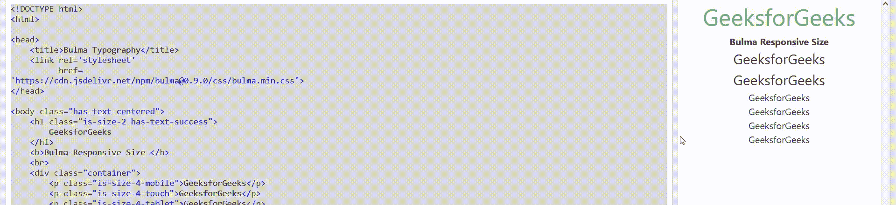

# 布尔玛响应式尺寸

> 原文:[https://www.geeksforgeeks.org/bulma-responsive-size/](https://www.geeksforgeeks.org/bulma-responsive-size/)

[布尔玛](https://www.geeksforgeeks.org/bulma-introduction/)响应大小用来让你的网站有响应。您可以为每个视口宽度选择特定的大小。您只需要将视口宽度附加到大小修改器。

**响应大小等级:**

*   **is-size-1-mobile:** 如果宽度高达 768px，则此类可用于移动设备。
*   **is-size-1-touch:** 如果宽度在 768px 到 1023px 之间，则此类可用于移动和平板设备。
*   **is-size-1-tablet:** 如果宽度在 768px 到 1215px 之间，该类可用于平板电脑、小型台式机、台式机、宽屏和全高清设备。
*   **is-size-1-desktop:** 如果宽度在 1024px 到 1408px 及以上，该类可用于小型台式机、台式机、宽屏和全高清设备。
*   **is-size-1-宽屏:**如果宽度在 1216px 到 1408px 及以上，此类可用于宽屏幕和全高清设备。
*   **is-size-1-fullhd:** 如果宽度为 1408px 及以上，则该类可用于桌面和宽屏设备。

**注意:**你可以对 7 个尺寸中的每一个使用相同的逻辑，你必须改变数值 1，它可以是 1 到 7 之间的任何值。

**示例:**以下示例说明了布尔玛响应大小:

## 超文本标记语言

```html
<!DOCTYPE html>
<html>

<head>
    <title>Bulma Typography</title>
    <link rel='stylesheet'
          href=
'https://cdn.jsdelivr.net/npm/bulma@0.9.0/css/bulma.min.css'>
</head>

<body class="has-text-centered">
    <h1 class="is-size-2 has-text-success">
        GeeksforGeeks
    </h1>
    <b>Bulma Responsive Size </b>
    <br>
    <div class="container">
        <p class="is-size-4-mobile">GeeksforGeeks</p>

        <p class="is-size-4-touch">GeeksforGeeks</p>

        <p class="is-size-4-tablet">GeeksforGeeks</p>

        <p class="is-size-4-desktop">GeeksforGeeks</p>

        <p class="is-size-4-widescreen">GeeksforGeeks</p>

        <p class="is-size-4-fullhd">GeeksforGeeks</p>

    </div>
</body>
</html>
```

**输出:**

