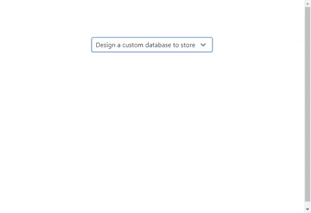
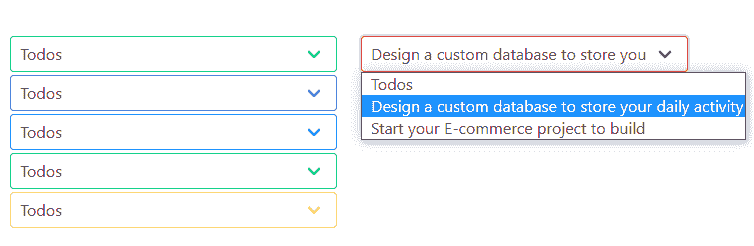
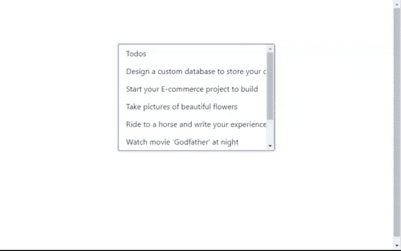
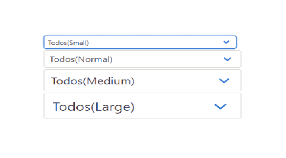
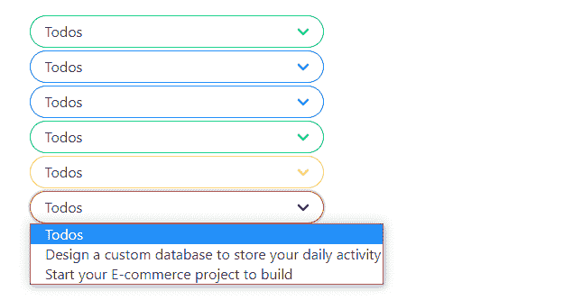
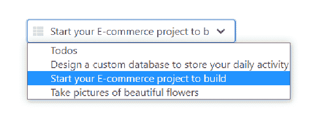

# Bulma | Select

> 原文:[https://www.geeksforgeeks.org/bulma-select/](https://www.geeksforgeeks.org/bulma-select/)

**布尔玛**是一个基于 Flexbox 的免费开源 CSS 框架。它是组件丰富的，兼容的，并且有很好的文档记录。它本质上是高度反应的。它使用类来实现它的设计。
表单的“精选”组件在外观上并没有那么吸引人。使用布尔玛，我们可以通过添加一些简单的布尔玛类，以更好的方式设计表单的精选元素。布尔玛精选元素有不同颜色、不同款式、不同尺寸和不同状态。

**示例 1:** 该示例显示了简单的布尔玛下拉列表。

```html
<html>
  <head>
    <title>Bulma Select</title>
    <link 
    rel='stylesheet' href=
'https://cdnjs.cloudflare.com/ajax/libs/bulma/0.7.5/css/bulma.css'>

    <!-- custom css -->
    <style>
      div.columns{
        margin-top: 80px;
      }
    </style>
  </head>
  <body>   
    <div class='container'>
      <div class='columns is-mobile is-centered'>
        <div class='column is-5'>
          <div class="select">
            <select>
              <option>
                Design a custom database to 
                store your daily activity
              </option>
              <option>
                Start your E-commerce 
                project to build
              </option>
              <option>
                Take pictures of 
                beautiful flowers
              </option>               
            </select>
          </div>
      </div>
    </div> 
  </body>
</html>
```

**输出:**


**示例 2:** 本示例显示不同颜色的选择下拉列表。

```html
`
<html>
  <head>
    <title>Bulma Select</title>
    <link rel='stylesheet' href=
'https://cdnjs.cloudflare.com/ajax/libs/bulma/0.7.5/css/bulma.css'>

    <!-- custom css -->
    <style>
      div.columns{
        margin-top: 80px;
      }

      div.select{
        margin-bottom :3px;
      }
    </style>
  </head>
  <body>   
    <div class='container'>
      <div class='columns is-mobile is-centered'>
        <div class='column is-5'>
          <div class="select is-primary">
            <select>
              <option>Todos</option>
              <option>
                Design a custom database to 
                store your daily activity
              </option>
              <option>
                Start your E-commerce 
                project to build
              </option>                
            </select>
          </div>

          <div class="select is-link">
            <select>
              <option>Todos</option>
              <option>
                Design a custom database to 
                store your daily activity
              </option>
              <option>
                Start your E-commerce 
                project to build
             </option>              
            </select>
          </div>

          <div class="select is-info">
            <select>
              <option>Todos</option>
              <option>
                Design a custom database to 
                store your daily activity
              </option>
              <option>
                Start your E-commerce 
                project to build
              </option>             
            </select>
          </div>

          <div class="select is-success">
            <select>
              <option>Todos</option>
              <option>
                Design a custom database to 
                store your daily activity
              </option>
              <option>
               Start your E-commerce 
               project to build
              </option>                
            </select>
          </div>

          <div class="select is-warning">
            <select>
              <option>Todos</option>
              <option>
                Design a custom database to 
                store your daily activity
              </option>
              <option>
                Start your E-commerce 
                project to build
              </option>                 
            </select>
          </div>
        </div>

        <div class='column is-5'>
          <div class="select is-danger">
            <select>
              <option>Todos</option>
              <option>
                Design a custom database to 
                store your daily activity
              </option>
              <option>
                Start your E-commerce 
                project to build
              </option>
            </select>
          </div>
      </div>
    </div>
  </body>
</html>
```

**输出:**


**示例 3:** 该示例显示了“可滚动”或“多选下拉列表”。

```html
<html>
  <head>
    <title>Bulma Select</title>
    <link rel='stylesheet' href=
'https://cdnjs.cloudflare.com/ajax/libs/bulma/0.7.5/css/bulma.css'>

    <!-- custom css -->
    <style>
      div.columns{
        margin-top: 80px;
      }

      div.select{
        margin-bottom :3px;
      }
    </style>
  </head>
  <body>   
    <div class='container'>
      <div class='columns is-mobile is-centered'>
        <div class='column is-5'>
          <div class="select is-multiple">
            <select multiple size='6'>
              <option>Todos</option>
              <option>
                Design a custom database to 
                store your daily activity
              </option>
              <option>
                Start your E-commerce 
                project to build
              </option>
              <option>
                Take pictures of 
                beautiful flowers
               </option>
              <option>
                Ride to a horse and write 
                your experience
              </option>
              <option>
                Watch movie 'Godfather' at night
               </option>
              <option>Go for a trip with bike</option>  
              <option>Buy a sumsung headset</option>               
            </select>
          </div>
        </div>
      </div>
    </div>
  </body>
</html>
```

**输出:**


**示例 4:** 本示例显示不同大小的选择下拉列表。

```html
<html>
  <head>
    <title>Bulma Select</title>
    <link rel='stylesheet' href=
'https://cdnjs.cloudflare.com/ajax/libs/bulma/0.7.5/css/bulma.css'>

    <!-- custom css -->
    <style>
      div.columns{
        margin-top: 80px;
      }

      div.select{
        margin-bottom :3px;
      }
    </style>
  </head>
  <body>   
    <div class='container'>
      <div class='columns is-mobile is-centered'>
        <div class='column is-5'>
          <div class="select is-small">
            <select>
              <option>Todos(Small)</option>
              <option>
                Design a custom database to 
                store your daily activity
              </option>
              <option>
                Start your E-commerce 
                project to build
             </option>              
            </select>
          </div>
            <div class="select">
              <select>
                <option>Todos(Normal)</option>
                <option>
                  Design a custom database to 
                  store your daily activity
                </option>
                <option>
                  Start your E-commerce 
                  project to build
                </option>                
              </select>
            </div>

            <div class="select is-medium">
              <select>
                <option>Todos(Medium)</option>
                <option>
                  Design a custom database to 
                  store your daily activity
                </option>
                <option>
                  Start your E-commerce 
                  project to build
                </option>               
              </select>
            </div>

            <div class="select is-large">
              <select>
                <option>Todos(Large)</option>
                <option>
                  Design a custom database to 
                  store your daily activity
                </option>
                <option>
                  Start your E-commerce 
                  project to build
                </option>               
              </select>
            </div>
          </div>
      </div>
    </div>
  </body>
</html>
```

**输出:**


**示例 5:** 该示例显示了舍入选择下拉列表。

```html
<html>
  <head>
    <title>Bulma Select</title>
    <link rel='stylesheet' href=
'https://cdnjs.cloudflare.com/ajax/libs/bulma/0.7.5/css/bulma.css'>

    <!-- custom css -->
    <style>
      div.columns{
        margin-top: 80px;
      }

      div.select{
        margin-bottom :3px;
      }
    </style>
  </head>
  <body>   
    <div class='container'>
      <div class='columns is-mobile is-centered'>
        <div class='column is-5'>
          <div class="select is-rounded is-primary">
            <select>
              <option>Todos</option>
              <option>
                Design a custom database to 
                store your daily activity
              </option>
              <option>
                Start your E-commerce project to build
             </option>           
            </select>
          </div>
            <div class="select is-rounded is-link">
              <select>
                <option>Todos</option>
                <option>
                  Design a custom database to 
                  store your daily activity
                </option>
                <option>
                  Start your E-commerce project to build
               </option>               
              </select>
            </div>

            <div class="select is-rounded is-info">
              <select>
                <option>Todos</option>
                <option>
                  Design a custom database to 
                  store your daily activity
                </option>
                <option>
                  Start your E-commerce project to build
                </option>               
              </select>
            </div>

            <div class="select is-rounded is-success">
              <select>
                <option>Todos</option>
                <option>
                  Design a custom database to 
                  store your daily activity
                </option>
                <option>
                  Start your E-commerce project to build
               </option>               
              </select>
            </div>

            <div class="select is-rounded is-warning">
              <select>
                <option>Todos</option>
                <option>
                  Design a custom database to 
                  store your daily activity
                </option>
                <option>
                  Start your E-commerce project to build
                </option>                
              </select>
            </div>

            <div class="select is-rounded is-danger">
              <select>
                <option>Todos</option>
                <option>
                  Design a custom database to 
                  store your daily activity
                </option>
                <option>
                  Start your E-commerce project to build
                </option>               
              </select>
            </div>
          </div>
      </div>
    </div>
  </body>
</html>
```

**输出:**


**示例 6:** 本示例显示带有“字体棒极了”图标的选择下拉列表。

```html
<html>
  <head>
    <title>Bulma Select</title>
    <link rel='stylesheet' href=
'https://cdnjs.cloudflare.com/ajax/libs/bulma/0.7.5/css/bulma.css'>

    <!-- custom css -->
    <style>
      div.columns{
        margin-top: 80px;
      }

      div.select{
        margin-bottom :3px;
      }
    </style>
  </head>
  <body>
    <!-- font-awesome cdn -->
    <script src=
'https://cdnjs.cloudflare.com/ajax/libs/font-awesome/5.12.0-2/js/all.min.js'>
    </script>   
    <div class='container'>
      <div class='columns is-mobile is-centered'>
        <div class='column is-5'>
          <div class="control has-icons-left">
            <div class="select">
              <select>
                <option>Todos</option>
                <option>
                  Design a custom database to 
                  store your daily activity
                </option>
                <option>
                  Start your E-commerce project to build
                </option>
                <option>
                  Take pictures of beautiful flowers
               </option>                
              </select>    
            </div>
            <div class="icon is-small is-left">
              <i class="fas fa-th-list"></i>
            </div>
          </div>   
        </div>
      </div>
    </div>
  </body>
</html>
```

**输出:**
