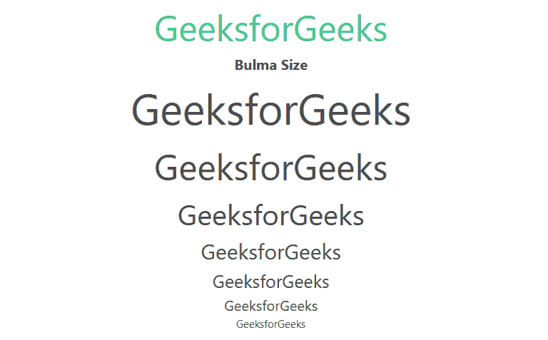

# Bulma 大小

> 哎哎哎:# t0]https://www . geeksforgeeks . org/bulma-size/

[布尔玛](https://www.geeksforgeeks.org/bulma-introduction/)字号用来设置你网站的内容字号，在布尔玛有 7 个不同大小的班级。您可以使用它们中的任何一个来定义上下文的大小。

**大小班:**

*   **是-size-1:** 这个类的大小是预定义的，是 3rem 的字号。
*   **是-size-2:** 这个类的大小是预定义的，字体大小为 2.5 雷姆。
*   **是-size-3:** 这个类的大小是预定义的，字体大小为 2 雷姆。
*   **是-size-4:** 这个类的大小是预定义的，字体大小为 1.5 雷姆。
*   **是-size-5:** 这个类的大小是预定义的，字体大小为 1.25 雷姆。
*   **是-size-6:** 这个类的大小是预定义的，字体大小为 1.0rem。
*   **是-size-7:** 这个类的大小是预定义的，字体大小为 0.75 雷姆。

**示例:**下面的示例说明了布尔玛的大小类。

## 超文本标记语言

```html
<!DOCTYPE html>
<html>

<head>
    <title>Bulma Typography</title>
    <link rel='stylesheet'
          href=
'https://cdn.jsdelivr.net/npm/bulma@0.9.3/css/bulma.min.css'>
</head>

<body class="has-text-centered">
    <h1 class="is-size-2 has-text-success">
        GeeksforGeeks
    </h1>
    <b>Bulma Size</b>
    <br>
    <div class="container">
        <p class="is-size-1">GeeksforGeeks</p>

        <p class="is-size-2">GeeksforGeeks</p>

        <p class="is-size-3">GeeksforGeeks</p>

        <p class="is-size-4">GeeksforGeeks</p>

        <p class="is-size-5">GeeksforGeeks</p>

        <p class="is-size-6">GeeksforGeeks</p>

        <p class="is-size-7">GeeksforGeeks</p>

    </div>
</body>
</html>
```

**输出:**



大小

**参考:**[https://bulma . io/documentation/helper/排版-helper/# size](https://bulma.io/documentation/helpers/typography-helpers/#size)