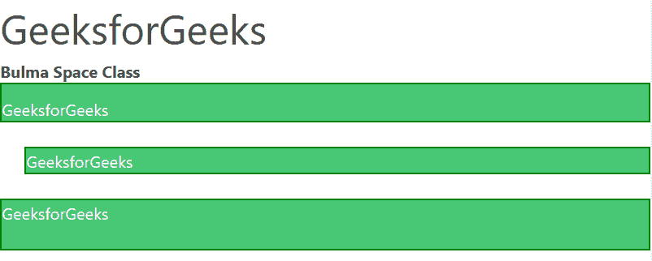

# 布尔马间距

> 原文:[https://www.geeksforgeeks.org/bulma-spacing/](https://www.geeksforgeeks.org/bulma-spacing/)

[布尔玛](https://www.geeksforgeeks.org/bulma-introduction/)有很多类的工具，可以轻松地在 HTML 中设置元素的样式。它包括用于修改元素外观的各种响应填充和边距类。间隔实用程序没有断点符号可应用于断点。

以下语法用于各种添加间距的类中。

*   xs 的(属性)(边)-(大小)
*   sm、md、lg 和 xl 的(属性)(边)-(断点)-(大小)。

**属性:**有两种给元素增加间距的方法。

*   **m:** 该属性定义了[边界](https://www.geeksforgeeks.org/css-margins-padding/)。边距提供了一条边或边框。
*   **p:** 该属性定义了[填充](https://www.geeksforgeeks.org/css-margins-padding/)。填充属性用于在内容周围生成空间。

**配置边:**这允许用户在任何需要的地方向特定边添加内容间距。

*   **t :** 边距顶/填充顶。
*   **b :** 边距-底部/填充-底部。
*   **l :** 左边距/左边距。
*   **r :** 边距-右侧/填充-右侧。
*   **x :** 表示左填充和右填充/左边距和右边距。
*   **y :** 表示填充-顶部和填充-底部/边距-顶部和边距-底部。
*   **空白:**元素所有边的边距/填充。

**所有尺寸的列表:**这允许用户向一个级别添加特定量的间距。

*   0–0 rem 边距/填充。
*   1–0.25 rem 边距/填充。
*   2–0.5 rem 边距/填充。
*   3–0.75 rem 边距/填充。
*   4–1 空白/填充。
*   5–1.5 rem 边距/填充。
*   6–3 倍边距/填充。
*   自动–自动边距。

**断点:**断点是网站内容可以根据设备进行调整并允许向用户展示最佳布局的点。

**示例:**

## 超文本标记语言

```html
<!DOCTYPE html>
<html>

<head>
    <title>Bulma Panel</title>

    <link rel='stylesheet' href=
'https://cdn.jsdelivr.net/npm/bulma@0.9.0/css/bulma.min.css'>

    <style>
        p {
            border: 2px solid green;
        }
    </style>
</head>

<body>
    <h1 class="is-size-2">
        GeeksforGeeks
    </h1>

    <b>Bulma Space Class</b>
    <br>

    <div class="container">
        <p class="mr-0 pt-3 has-text-light 
                has-background-success">
            GeeksforGeeks
        </p>

        <br>
        <p class="ml-5 has-text-light 
                has-background-success">
            GeeksforGeeks
        </p>

        <br>
        <p class="pb-5 has-text-light 
                has-background-success">
            GeeksforGeeks
        </p>
    </div>
</body>

</html>
```

**输出:**



布尔玛太空班