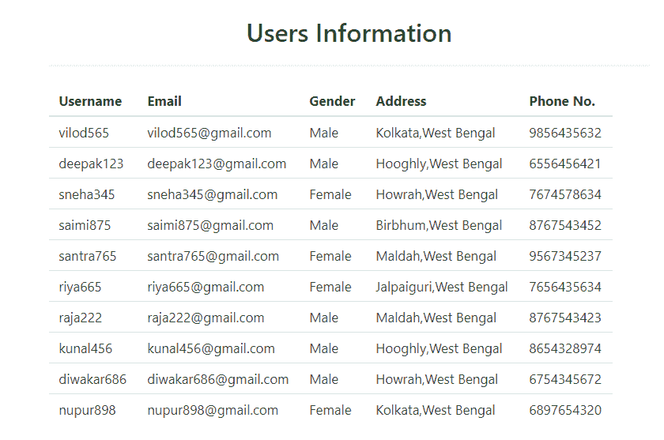
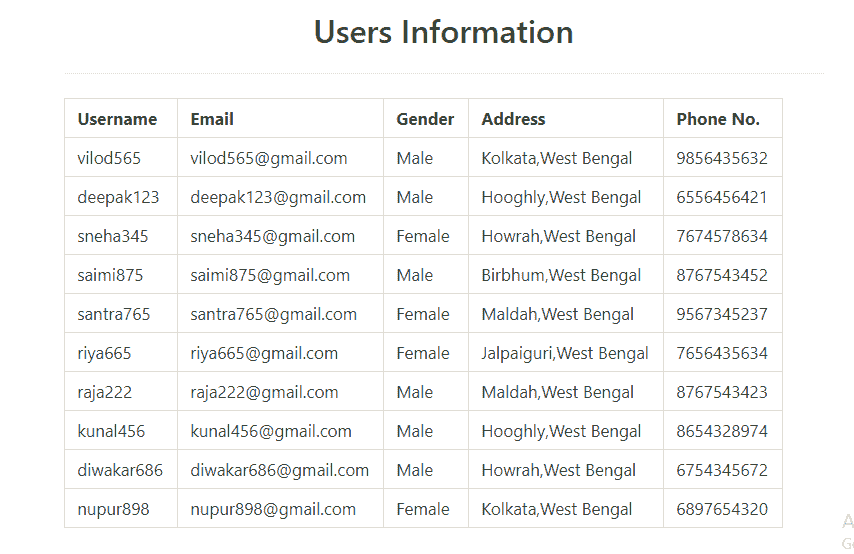
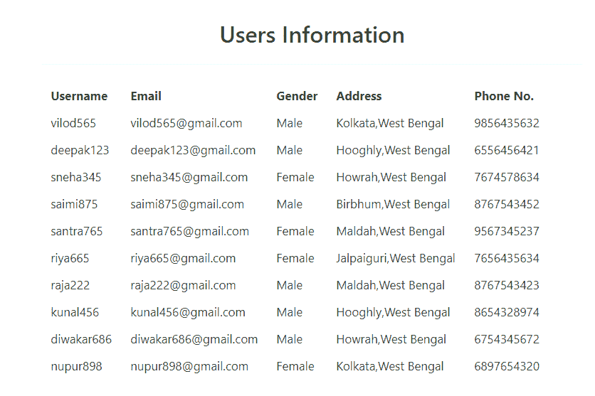
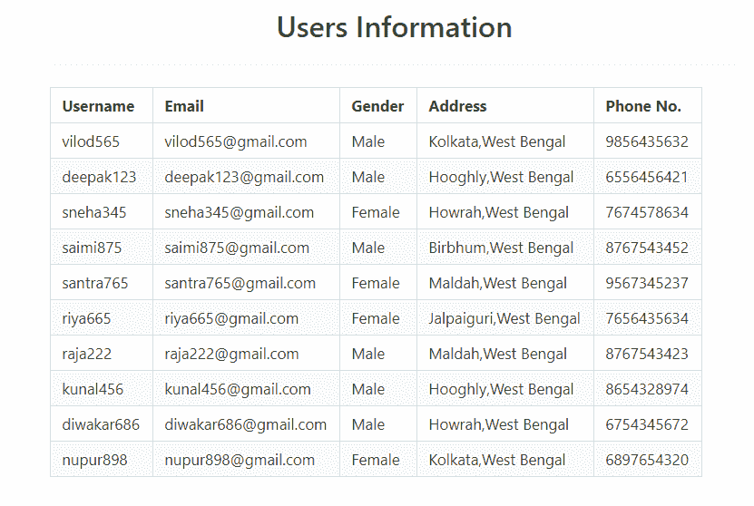
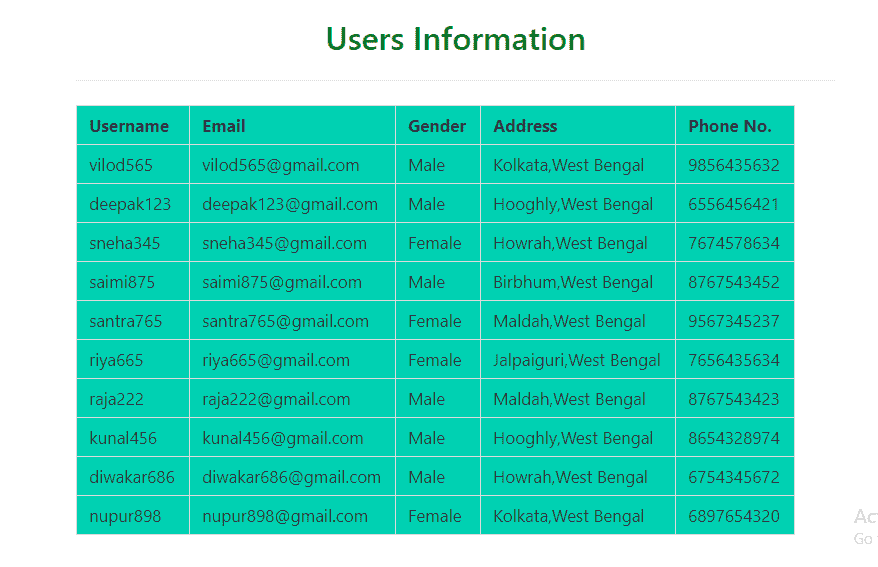

# 茶壶|桌子

> 哎哎哎:# t0]https://www . geeksforgeeks . org/bulma-table/

**布尔玛**是一个基于 Flexbox 的免费开源 CSS 框架。它是组件丰富的，兼容的，并且有很好的文档记录。它本质上是高度反应的。它使用类来实现它的设计。
布尔玛支持多种类型的表，如带边框表、分条表、可悬停表、可滚动表等。只需在 HTML 中添加一些布尔玛类，我们就可以实现非常交互式的表格。

**示例 1:** 本示例使用布尔玛创建一个简单的表。

## 超文本标记语言

```html
<!DOCTYPE html>
<html>

<head>
  <title>Bulma Table</title>
  <link rel='stylesheet' href=
'https://cdnjs.cloudflare.com/ajax/libs/bulma/0.7.5/css/bulma.css'>

  <!-- custom css -->
  <style>
    div.columns {
      margin-top: 50px;
    }

    h1 {
      color: green !important;
      margin-bottom: 20px;

    }

    .table td {
      font-size: 17px
    }

    .table th {
      font-size: 17px
    }
  </style>
</head>

<body>
  <div class='container has-text-centered'>
    <div class='columns is-mobile is-centered'>
      <div class='column is-8'>
        <div>
          <h1 class='title'>User Information</h1>
          <hr>
        </div>
        <table class='table'>
          <thead>
            <tr>
              <th>Username</th>
              <th>Email</th>
              <th>Gender</th>
              <th>Address</th>
              <th>Phone No.</th>
            </tr>
          </thead>
          <tbody>
            <tr>
              <td>vilod565</td>
              <td>vilod565@gmail.com</td>
              <td>Male</td>
              <td>Kolkata, West Bengal</td>
              <td>9856435632</td>
            </tr>

            <tr>
              <td>deepak123</td>
              <td>deepak123@gmail.com</td>
              <td>Male</td>
              <td>Hooghly, West Bengal</td>
              <td>6556456421</td>
            </tr>

            <tr>
              <td>sneha345</td>
              <td>sneha345@gmail.com</td>
              <td>Female</td>
              <td>Howrah, West Bengal</td>
              <td>7674578634</td>
            </tr>

            <tr>
              <td>saimi875</td>
              <td>saimi875@gmail.com</td>
              <td>Male</td>
              <td>Birbhum, West Bengal</td>
              <td>8767543452</td>
            </tr>

            <tr>
              <td>santra765</td>
              <td>santra765@gmail.com</td>
              <td>Female</td>
              <td>Maldah, West Bengal</td>
              <td>9567345237</td>
            </tr>

            <tr>
              <td>riya665</td>
              <td>riya665@gmail.com</td>
              <td>Female</td>
              <td>Jalpaiguri, West Bengal</td>
              <td>7656435634</td>
            </tr>

            <tr>
              <td>raja222</td>
              <td>raja222@gmail.com</td>
              <td>Male</td>
              <td>Maldah, West Bengal</td>
              <td>8767543423</td>
            </tr>

            <tr>
              <td>kunal456</td>
              <td>kunal456@gmail.com</td>
              <td>Male</td>
              <td>Hooghly, West Bengal</td>
              <td>8654328974</td>
            </tr>

            <tr>
              <td>diwakar686</td>
              <td>diwakar686@gmail.com</td>
              <td>Male</td>
              <td>Howrah, West Bengal</td>
              <td>6754345672</td>
            </tr>

            <tr>
              <td>nupur898</td>
              <td>nupur898@gmail.com</td>
              <td>Female</td>
              <td>Kolkata, West Bengal</td>
              <td>6897654320</td>
            </tr>
          </tbody>
        </table>
      </div>
    </div>
  </div>
</body>

</html>
```

**输出:**



**示例 2:** 本示例使用布尔玛创建带边框的表格。

## 超文本标记语言

```html
<!DOCTYPE html>
<html>

<head>
  <title>Bulma Table</title>
  <link rel='stylesheet' href=
'https://cdnjs.cloudflare.com/ajax/libs/bulma/0.7.5/css/bulma.css'>

  <!-- custom css -->
  <style>
    div.columns {
      margin-top: 50px;
    }

    h1 {
      color: green !important;
      margin-bottom: 20px;

    }

    .table td {
      font-size: 17px
    }

    .table th {
      font-size: 17px
    }
  </style>
</head>

<body>
  <div class='container has-text-centered'>
    <div class='columns is-mobile is-centered'>
      <div class='column is-8'>
        <div>
          <h1 class='title'>Users Information</h1>
          <hr>
        </div>
        <table class='table is-bordered'>
          <thead>
            <tr>
              <th>Username</th>
              <th>Email</th>
              <th>Gender</th>
              <th>Address</th>
              <th>Phone No.</th>
            </tr>
          </thead>
          <tbody>
            <tr>
              <td>vilod565</td>
              <td>vilod565@gmail.com</td>
              <td>Male</td>
              <td>Kolkata, West Bengal</td>
              <td>9856435632</td>
            </tr>

            <tr>
              <td>deepak123</td>
              <td>deepak123@gmail.com</td>
              <td>Male</td>
              <td>Hooghly, West Bengal</td>
              <td>6556456421</td>
            </tr>

            <tr>
              <td>sneha345</td>
              <td>sneha345@gmail.com</td>
              <td>Female</td>
              <td>Howrah, West Bengal</td>
              <td>7674578634</td>
            </tr>

            <tr>
              <td>saimi875</td>
              <td>saimi875@gmail.com</td>
              <td>Male</td>
              <td>Birbhum, West Bengal</td>
              <td>8767543452</td>
            </tr>

            <tr>
              <td>santra765</td>
              <td>santra765@gmail.com</td>
              <td>Female</td>
              <td>Maldah, West Bengal</td>
              <td>9567345237</td>
            </tr>

            <tr>
              <td>riya665</td>
              <td>riya665@gmail.com</td>
              <td>Female</td>
              <td>Jalpaiguri, West Bengal</td>
              <td>7656435634</td>
            </tr>

            <tr>
              <td>raja222</td>
              <td>raja222@gmail.com</td>
              <td>Male</td>
              <td>Maldah, West Bengal</td>
              <td>8767543423</td>
            </tr>

            <tr>
              <td>kunal456</td>
              <td>kunal456@gmail.com</td>
              <td>Male</td>
              <td>Hooghly, West Bengal</td>
              <td>8654328974</td>
            </tr>

            <tr>
              <td>diwakar686</td>
              <td>diwakar686@gmail.com</td>
              <td>Male</td>
              <td>Howrah, West Bengal</td>
              <td>6754345672</td>
            </tr>

            <tr>
              <td>nupur898</td>
              <td>nupur898@gmail.com</td>
              <td>Female</td>
              <td>Kolkata, West Bengal</td>
              <td>6897654320</td>
            </tr>
          </tbody>
        </table>
      </div>
    </div>
  </div>
</body>

</html>
```

**输出:**



**示例 3:** 本示例使用布尔玛创建一个没有边框的表格。

## 超文本标记语言

```html
<!DOCTYPE html>
<html>

<head>
  <title>Bulma Table</title>
  <link rel='stylesheet' href=
'https://cdnjs.cloudflare.com/ajax/libs/bulma/0.7.5/css/bulma.css'>

  <!-- custom css -->
  <style>
    div.columns {
      margin-top: 50px;
    }

    h1 {
      color: green !important;
      margin-bottom: 20px;

    }

    .table td {
      font-size: 17px;
      border: none
    }

    .table th {
      font-size: 17px;
      border: none
    }
  </style>
</head>

<body>
  <div class='container has-text-centered'>
    <div class='columns is-mobile is-centered'>
      <div class='column is-8'>
        <div>
          <h1 class='title'>Users Information</h1>
          <hr>
        </div>
        <table class='table'>
          <thead>
            <tr>
              <th>Username</th>
              <th>Email</th>
              <th>Gender</th>
              <th>Address</th>
              <th>Phone No.</th>
            </tr>
          </thead>
          <tbody>
            <tr>
              <td>vilod565</td>
              <td>vilod565@gmail.com</td>
              <td>Male</td>
              <td>Kolkata, West Bengal</td>
              <td>9856435632</td>
            </tr>

            <tr>
              <td>deepak123</td>
              <td>deepak123@gmail.com</td>
              <td>Male</td>
              <td>Hooghly, West Bengal</td>
              <td>6556456421</td>
            </tr>

            <tr>
              <td>sneha345</td>
              <td>sneha345@gmail.com</td>
              <td>Female</td>
              <td>Howrah, West Bengal</td>
              <td>7674578634</td>
            </tr>

            <tr>
              <td>saimi875</td>
              <td>saimi875@gmail.com</td>
              <td>Male</td>
              <td>Birbhum, West Bengal</td>
              <td>8767543452</td>
            </tr>

            <tr>
              <td>santra765</td>
              <td>santra765@gmail.com</td>
              <td>Female</td>
              <td>Maldah, West Bengal</td>
              <td>9567345237</td>
            </tr>

            <tr>
              <td>riya665</td>
              <td>riya665@gmail.com</td>
              <td>Female</td>
              <td>Jalpaiguri, West Bengal</td>
              <td>7656435634</td>
            </tr>

            <tr>
              <td>raja222</td>
              <td>raja222@gmail.com</td>
              <td>Male</td>
              <td>Maldah, West Bengal</td>
              <td>8767543423</td>
            </tr>

            <tr>
              <td>kunal456</td>
              <td>kunal456@gmail.com</td>
              <td>Male</td>
              <td>Hooghly, West Bengal</td>
              <td>8654328974</td>
            </tr>

            <tr>
              <td>diwakar686</td>
              <td>diwakar686@gmail.com</td>
              <td>Male</td>
              <td>Howrah, West Bengal</td>
              <td>6754345672</td>
            </tr>

            <tr>
              <td>nupur898</td>
              <td>nupur898@gmail.com</td>
              <td>Female</td>
              <td>Kolkata, West Bengal</td>
              <td>6897654320</td>
            </tr>
          </tbody>
        </table>
      </div>
    </div>
  </div>
</body>

</html>
```

**输出:**



**示例 4:** 本示例使用布尔玛创建一个剥离带边框的表格。

## 超文本标记语言

```html
<!DOCTYPE html>
<html>

<head>
  <title>Bulma Table</title>
  <link rel='stylesheet' href=
'https://cdnjs.cloudflare.com/ajax/libs/bulma/0.7.5/css/bulma.css'>

  <!-- custom css -->
  <style>
    div.columns {
      margin-top: 50px;
    }

    h1 {
      color: green !important;
      margin-bottom: 20px;

    }

    .table td {
      font-size: 17px
    }

    .table th {
      font-size: 17px
    }
  </style>
</head>

<body>
  <div class='container has-text-centered'>
    <div class='columns is-mobile is-centered'>
      <div class='column is-8'>
        <div>
          <h1 class='title'>Users Information</h1>
          <hr>
        </div>
        <table class='table is-stripped is-bordered'>
          <thead>
            <tr>
              <th>Username</th>
              <th>Email</th>
              <th>Gender</th>
              <th>Address</th>
              <th>Phone No.</th>
            </tr>
          </thead>
          <tbody>
            <tr>
              <td>vilod565</td>
              <td>vilod565@gmail.com</td>
              <td>Male</td>
              <td>Kolkata, West Bengal</td>
              <td>9856435632</td>
            </tr>

            <tr>
              <td>deepak123</td>
              <td>deepak123@gmail.com</td>
              <td>Male</td>
              <td>Hooghly, West Bengal</td>
              <td>6556456421</td>
            </tr>

            <tr>
              <td>sneha345</td>
              <td>sneha345@gmail.com</td>
              <td>Female</td>
              <td>Howrah, West Bengal</td>
              <td>7674578634</td>
            </tr>

            <tr>
              <td>saimi875</td>
              <td>saimi875@gmail.com</td>
              <td>Male</td>
              <td>Birbhum, West Bengal</td>
              <td>8767543452</td>
            </tr>

            <tr>
              <td>santra765</td>
              <td>santra765@gmail.com</td>
              <td>Female</td>
              <td>Maldah, West Bengal</td>
              <td>9567345237</td>
            </tr>

            <tr>
              <td>riya665</td>
              <td>riya665@gmail.com</td>
              <td>Female</td>
              <td>Jalpaiguri, West Bengal</td>
              <td>7656435634</td>
            </tr>

            <tr>
              <td>raja222</td>
              <td>raja222@gmail.com</td>
              <td>Male</td>
              <td>Maldah, West Bengal</td>
              <td>8767543423</td>
            </tr>

            <tr>
              <td>kunal456</td>
              <td>kunal456@gmail.com</td>
              <td>Male</td>
              <td>Hooghly, West Bengal</td>
              <td>8654328974</td>
            </tr>

            <tr>
              <td>diwakar686</td>
              <td>diwakar686@gmail.com</td>
              <td>Male</td>
              <td>Howrah, West Bengal</td>
              <td>6754345672</td>
            </tr>

            <tr>
              <td>nupur898</td>
              <td>nupur898@gmail.com</td>
              <td>Female</td>
              <td>Kolkata, West Bengal</td>
              <td>6897654320</td>
            </tr>
          </tbody>
        </table>
      </div>
    </div>
  </div>
</body>

</html>
```

**输出:**



**示例 5:** 本示例使用布尔玛创建一个可悬停的表格。

## 超文本标记语言

```html
<html>

<head>
  <title>Bulma Table</title>
  <link rel='stylesheet' href=
'https://cdnjs.cloudflare.com/ajax/libs/bulma/0.7.5/css/bulma.css'>

  <!-- custom css -->
  <style>
    div.columns {
      margin-top: 50px;
    }

    h1 {
      color: green !important;
      margin-bottom: 20px;

    }

    .table td {
      font-size: 17px
    }

    .table th {
      font-size: 17px
    }
  </style>
</head>

<body>
  <div class='container has-text-centered'>
    <div class='columns is-mobile is-centered'>
      <div class='column is-8'>
        <div>
          <h1 class='title'>Users Information</h1>
          <hr>
        </div>
        <table class='table is-bordered is-hoverable'>
          <thead>
            <tr>
              <th>Username</th>
              <th>Email</th>
              <th>Gender</th>
              <th>Address</th>
              <th>Phone No.</th>
            </tr>
          </thead>
          <tbody>
            <tr>
              <td>vilod565</td>
              <td>vilod565@gmail.com</td>
              <td>Male</td>
              <td>Kolkata, West Bengal</td>
              <td>9856435632</td>
            </tr>

            <tr>
              <td>deepak123</td>
              <td>deepak123@gmail.com</td>
              <td>Male</td>
              <td>Hooghly, West Bengal</td>
              <td>6556456421</td>
            </tr>

            <tr>
              <td>sneha345</td>
              <td>sneha345@gmail.com</td>
              <td>Female</td>
              <td>Howrah, West Bengal</td>
              <td>7674578634</td>
            </tr>

            <tr>
              <td>saimi875</td>
              <td>saimi875@gmail.com</td>
              <td>Male</td>
              <td>Birbhum, West Bengal</td>
              <td>8767543452</td>
            </tr>

            <tr>
              <td>santra765</td>
              <td>santra765@gmail.com</td>
              <td>Female</td>
              <td>Maldah, West Bengal</td>
              <td>9567345237</td>
            </tr>

            <tr>
              <td>riya665</td>
              <td>riya665@gmail.com</td>
              <td>Female</td>
              <td>Jalpaiguri, West Bengal</td>
              <td>7656435634</td>
            </tr>

            <tr>
              <td>raja222</td>
              <td>raja222@gmail.com</td>
              <td>Male</td>
              <td>Maldah, West Bengal</td>
              <td>8767543423</td>
            </tr>

            <tr>
              <td>kunal456</td>
              <td>kunal456@gmail.com</td>
              <td>Male</td>
              <td>Hooghly, West Bengal</td>
              <td>8654328974</td>
            </tr>

            <tr>
              <td>diwakar686</td>
              <td>diwakar686@gmail.com</td>
              <td>Male</td>
              <td>Howrah, West Bengal</td>
              <td>6754345672</td>
            </tr>

            <tr>
              <td>nupur898</td>
              <td>nupur898@gmail.com</td>
              <td>Female</td>
              <td>Kolkata, West Bengal</td>
              <td>6897654320</td>
            </tr>
          </tbody>
        </table>
      </div>
    </div>
  </div>
</body>

</html>
```

**输出:**

<video class="wp-video-shortcode" id="video-433323-1" width="640" height="360" preload="metadata" controls=""><source type="video/mp4" src="https://media.geeksforgeeks.org/wp-content/uploads/20200613163602/Bulma-Table-Google-Chrome-2020-06-13-16-32-18.mp4?_=1">[https://media.geeksforgeeks.org/wp-content/uploads/20200613163602/Bulma-Table-Google-Chrome-2020-06-13-16-32-18.mp4](https://media.geeksforgeeks.org/wp-content/uploads/20200613163602/Bulma-Table-Google-Chrome-2020-06-13-16-32-18.mp4)</video>

**示例 6:** 本示例创建一个带有彩色背景的表格。

## 超文本标记语言

```html
<!DOCTYPE html>
<html>

<head>
  <title>Bulma Table</title>
  <link rel='stylesheet' href=
'https://cdnjs.cloudflare.com/ajax/libs/bulma/0.7.5/css/bulma.css'>
  <!-- custom css -->
  <style>
    div.columns {
      margin-top: 50px;
    }

    h1 {
      color: green !important;
      margin-bottom: 20px;

    }

    .table td {
      font-size: 17px
    }

    .table th {
      font-size: 17px
    }
  </style>
</head>

<body>
  <div class='container has-text-centered'>
    <div class='columns is-mobile is-centered'>
      <div class='column is-8'>
        <div>
          <h1 class='title'>Users Information</h1>
          <hr>
        </div>
        <table class='table is-bordered has-background-primary'>
          <thead>
            <tr>
              <th>Username</th>
              <th>Email</th>
              <th>Gender</th>
              <th>Address</th>
              <th>Phone No.</th>
            </tr>
          </thead>
          <tbody>
            <tr>
              <td>vilod565</td>
              <td>vilod565@gmail.com</td>
              <td>Male</td>
              <td>Kolkata, West Bengal</td>
              <td>9856435632</td>
            </tr>

            <tr>
              <td>deepak123</td>
              <td>deepak123@gmail.com</td>
              <td>Male</td>
              <td>Hooghly, West Bengal</td>
              <td>6556456421</td>
            </tr>

            <tr>
              <td>sneha345</td>
              <td>sneha345@gmail.com</td>
              <td>Female</td>
              <td>Howrah, West Bengal</td>
              <td>7674578634</td>
            </tr>

            <tr>
              <td>saimi875</td>
              <td>saimi875@gmail.com</td>
              <td>Male</td>
              <td>Birbhum, West Bengal</td>
              <td>8767543452</td>
            </tr>

            <tr>
              <td>santra765</td>
              <td>santra765@gmail.com</td>
              <td>Female</td>
              <td>Maldah, West Bengal</td>
              <td>9567345237</td>
            </tr>

            <tr>
              <td>riya665</td>
              <td>riya665@gmail.com</td>
              <td>Female</td>
              <td>Jalpaiguri, West Bengal</td>
              <td>7656435634</td>
            </tr>

            <tr>
              <td>raja222</td>
              <td>raja222@gmail.com</td>
              <td>Male</td>
              <td>Maldah, West Bengal</td>
              <td>8767543423</td>
            </tr>

            <tr>
              <td>kunal456</td>
              <td>kunal456@gmail.com</td>
              <td>Male</td>
              <td>Hooghly, West Bengal</td>
              <td>8654328974</td>
            </tr>

            <tr>
              <td>diwakar686</td>
              <td>diwakar686@gmail.com</td>
              <td>Male</td>
              <td>Howrah, West Bengal</td>
              <td>6754345672</td>
            </tr>

            <tr>
              <td>nupur898</td>
              <td>nupur898@gmail.com</td>
              <td>Female</td>
              <td>Kolkata, West Bengal</td>
              <td>6897654320</td>
            </tr>
          </tbody>
        </table>
      </div>
    </div>
  </div>
</body>

</html>
```

**输出:**



**注意:**在上面所有的例子中，我们使用了一些额外的布尔玛类，如容器、列、以文本为中心的标题等来很好地设计内容。