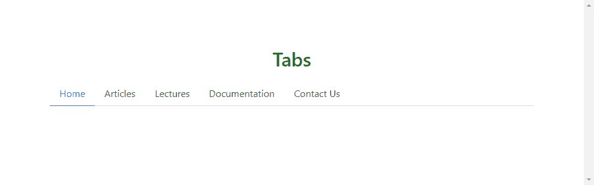
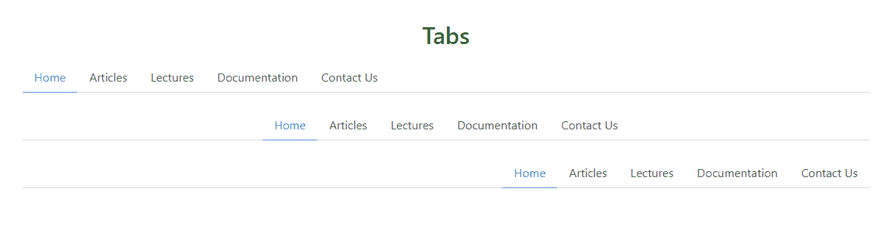
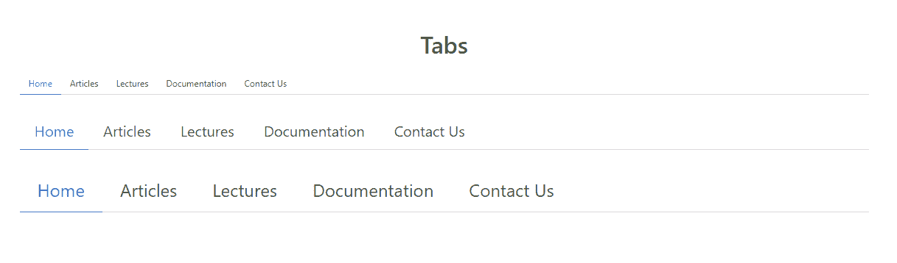
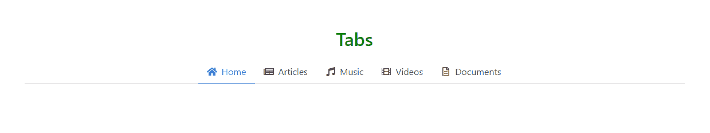
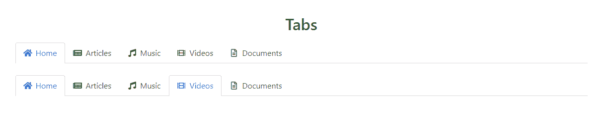
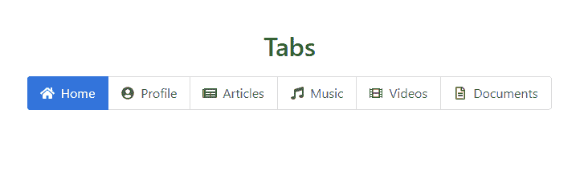
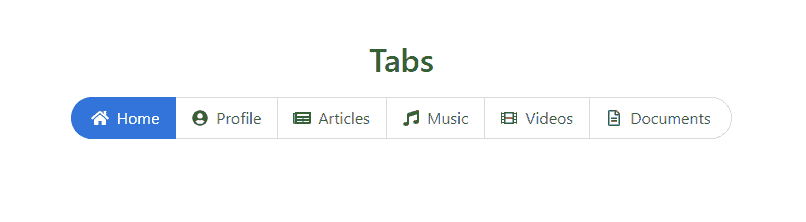

# Bulma | Tabs

> 哎哎哎:# t0]https://www . geeksforgeeks . org/bulma-tabs/

布尔玛是一个基于 Flexbox 的免费开源 CSS 框架。它是组件丰富的，兼容的，并且有很好的文档记录。它本质上是高度反应的。它使用类来实现它的设计。

布尔玛的标签是简单的水平导航标签，具有不同的风格。它们需要以下结构:

*   一个装标签的容器。
*   用于保存标签的 HTML

*   每个标签的
*   元素列表。
*   每个标签链接的 HTML 锚元素

**示例 1:** 此示例说明了简单的布尔玛选项卡。

## 超文本标记语言

```html
<!DOCTYPE html>
<html lang="en">
<head>
  <link rel='stylesheet' href=
'https://cdnjs.cloudflare.com/ajax/libs/bulma/0.7.5/css/bulma.css'>

  <title>Bulma Tabs</title>
  <style>
    div.container {
      margin-top: 80px;
    }

    div h1 {
      margin-bottom: 20px;
      color: green !important
    }
  </style>
</head>
<body>
  <div class='container'>
    <div class="columns is-centered">
      <div class="column is-10">
        <div class='has-text-centered'>
          <h1 class='title'>Tabs</h1>
        </div>
        <div class="tabs">
          <ul>
            <li class="is-active"
                ><a>Home</a>
            </li>
            <li><a>Articles</a></li>
            <li><a>Lectures</a></li>
            <li><a>Documentation</a></li>
            <li><a>Contact Us</a></li>
          </ul>
        </div>
      </div>
    </div>
  </div>
</body>
</html>
```

**输出:**



**示例 2:** 此示例说明了不同对齐方式的选项卡。

## 超文本标记语言

```html
<!DOCTYPE html>
<html lang="en">
<head>
  <link rel='stylesheet' href=
'https://cdnjs.cloudflare.com/ajax/libs/bulma/0.7.5/css/bulma.css'>

  <title>Bulma Tabs</title>
  <style>
    div.container {
      margin-top: 80px;
    }

    div h1 {
      margin-bottom: 20px;
      color: green !important
    }
  </style>
</head>
<body>
  <div class='container'>
    <div class='has-text-centered'>
      <h1 class='title'>
        Tabs
      </h1>
    </div>
    <div class="tabs">
      <ul>
        <li class="is-active">
          <a>Home</a>
        </li>
        <li><a>Articles</a></li>
        <li><a>Lectures</a></li>
        <li><a>Documentation</a></li>
        <li><a>Contact Us</a></li>
      </ul>
    </div>

    <!-- Tabs aligned to the center -->
    <div class="tabs is-centered">
      <ul>
        <li class="is-active">
          <a>Home</a>
        </li>
        <li><a>Articles</a></li>
        <li><a>Lectures</a></li>
        <li><a>Documentation</a></li>
        <li><a>Contact Us</a></li>
      </ul>
    </div>

    <!-- Tabs aligned to the right -->
    <div class="tabs is-right">
      <ul>
        <li class="is-active">
          <a>Home</a>
        </li>
        <li><a>Articles</a></li>
        <li><a>Lectures</a></li>
        <li><a>Documentation</a></li>
        <li><a>Contact Us</a></li>
      </ul>
    </div>
  </div>
</body>
</html>
```

**输出:**



**示例 2:** 此示例说明了不同大小的选项卡。

## 超文本标记语言

```html
<!DOCTYPE html>
<html lang="en">
<head>
  <link rel='stylesheet' href=
'https://cdnjs.cloudflare.com/ajax/libs/bulma/0.7.5/css/bulma.css'>

  <title>Bulma Tabs</title>
  <style>
    div.container {
      margin-top: 80px;
    }

    div h1 {
      margin-bottom: 20px;
      color: green !important
    }
  </style>
</head>
<body>
  <div class='container'>
    <div class='has-text-centered'>
      <h1 class='title'>
        Tabs
      </h1>
    </div>

    <!-- Small sized tabs -->
    <div class="tabs is-small">
      <ul>
        <li class="is-active">
          <a>Home</a>
        </li>
        <li><a>Articles</a></li>
        <li><a>Lectures</a></li>
        <li><a>Documentation</a></li>
        <li><a>Contact Us</a></li>
      </ul>
    </div>

    <!-- Medium sized tabs -->
    <div class="tabs is-medium">
      <ul>
        <li class="is-active">
          <a>Home</a>
        </li>
        <li><a>Articles</a></li>
        <li><a>Lectures</a></li>
        <li><a>Documentation</a></li>
        <li><a>Contact Us</a></li>
      </ul>
    </div>

    <!-- Large sized tabs -->
    <div class="tabs is-large">
      <ul>
        <li class="is-active">
          <a>Home</a>
        </li>
        <li><a>Articles</a></li>
        <li><a>Lectures</a></li>
        <li><a>Documentation</a></li>
        <li><a>Contact Us</a></li>
      </ul>
    </div>
  </div>
</body>
</html>
```

**输出:**



**示例 4:** 该示例使用字体棒极了的图标来说明选项卡。

## 超文本标记语言

```html
<!DOCTYPE html>
<html lang="en">

<head>
  <!-- Bulma CSS CDN -->
  <link rel='stylesheet' href=
'https://cdnjs.cloudflare.com/ajax/libs/bulma/0.7.5/css/bulma.css'>

  <!-- FontAwesome CDN -->
  <script src=
'https://cdnjs.cloudflare.com/ajax/libs/font-awesome/5.12.0-2/js/all.min.js'>
  </script>

  <title>Bulma Tabs</title>

  <style>
    div.container {
      margin-top: 80px;
    }

    div h1 {
      margin-bottom: 20px;
      color: green !important
    }
  </style>
</head>

<body>
  <div class='container'>
    <div class='has-text-centered'>
      <h1 class='title'>Tabs</h1>
    </div>
    <div class="tabs is-centered">
      <ul>
        <li class="is-active">
          <a>

            <!-- Using the home icon -->
            <span class="icon is-small">
              <i class="fas fa-home"
                 aria-hidden="true">
              </i>
            </span>
            <span>Home</span>
          </a>
        </li>
        <li>
          <a>

            <!-- Using the newspaper icon -->
            <span class="icon is-small">
              <i class="fas fa-newspaper"
                 aria-hidden="true">
              </i>
            </span>
            <span>Articles</span>
          </a>
        </li>
        <li>
          <a>

            <!-- Using the music icon -->
            <span class="icon is-small">
              <i class="fas fa-music" 
                 aria-hidden="true">
              </i>
            </span>
            <span>Music</span>
          </a>
        </li>
        <li>
          <a>

            <!-- Using the film icon -->
            <span class="icon is-small">
              <i class="fas fa-film"
                 aria-hidden="true">
              </i>
            </span>
            <span>Videos</span>
          </a>
        </li>
        <li>
          <a>

            <!-- Using the file icon -->
            <span class="icon is-small">
              <i class="far fa-file-alt" 
                 aria-hidden="true">
              </i>
            </span>
            <span>Documents</span>
          </a>
        </li>
      </ul>
    </div>
  </div>
</body>
</html>
```

**输出:**



**示例 5:** 本示例说明了盒装样式选项卡(活动选项卡将被装箱)。

## 超文本标记语言

```html
<!DOCTYPE html>
<html lang="en">
<head>
  <!-- Bulma CSS CDN -->
  <link rel='stylesheet' href=
'https://cdnjs.cloudflare.com/ajax/libs/bulma/0.7.5/css/bulma.css'>

  <!-- FontAwesome CDN -->
  <script src=
'https://cdnjs.cloudflare.com/ajax/libs/font-awesome/5.12.0-2/js/all.min.js'>
  </script>

  <title>Bulma Tabs</title>

  <style>
    div.container {
      margin-top: 80px;
    }

    div h1 {
      margin-bottom: 20px;
      color: green !important
    }
  </style>
</head>
<body>
  <div class='container'>
    <div class='has-text-centered'>
      <h1 class='title'>Tabs</h1>
    </div>
    <div class="tabs is-boxed">
      <ul>
        <li class="is-active">
          <a>
            <span class="icon is-small">
              <i class="fas fa-home"
                 aria-hidden="true">
              </i>
            </span>
            <span>Home</span>
          </a>
        </li>
        <li>
          <a>
            <span class="icon is-small">
              <i class="fas fa-newspaper"
                 aria-hidden="true">
              </i>
            </span>
            <span>Articles</span>
          </a>
        </li>
        <li>
          <a>
            <span class="icon is-small">
              <i class="fas fa-music" 
                 aria-hidden="true">
              </i>
            </span>
            <span>Music</span>
          </a>
        </li>
        <li>
          <a>
            <span class="icon is-small">
              <i class="fas fa-film"
                 aria-hidden="true">
              </i>
            </span>
            <span>Videos</span>
          </a>
        </li>
        <li>
          <a>
            <span class="icon is-small">
              <i class="far fa-file-alt" 
                 aria-hidden="true">
              </i>
            </span>
            <span>Documents</span>
          </a>
        </li>
      </ul>
    </div>
    <div class="tabs is-boxed">
      <ul>
        <li class="is-active">
          <a>
            <span class="icon is-small">
              <i class="fas fa-home"
                 aria-hidden="true">
              </i>
            </span>
            <span>Home</span>
          </a>
        </li>
        <li>
          <a>
            <span class="icon is-small">
              <i class="fas fa-newspaper"
                 aria-hidden="true">
              </i>
            </span>
            <span>Articles</span>
          </a>
        </li>
        <li>
          <a>
            <span class="icon is-small">
              <i class="fas fa-music" 
                 aria-hidden="true">
              </i>
            </span>
            <span>Music</span>
          </a>
        </li>
        <li class='is-active'>
          <a>
            <span class="icon is-small">
              <i class="fas fa-film"
                 aria-hidden="true">
              </i>
            </span>
            <span>Videos</span>
          </a>
        </li>
        <li>
          <a>
            <span class="icon is-small">
              <i class="far fa-file-alt" 
                 aria-hidden="true">
              </i>
            </span>
            <span>Documents</span>
          </a>
        </li>
      </ul>
    </div>
  </div>
</body>
</html>
```

**输出:**



**示例 6:** 此示例说明了互斥的选项卡。

## 超文本标记语言

```html
<!DOCTYPE html>
<html lang="en">
<head>
  <!-- Bulma CSS CDN -->
  <link rel='stylesheet' href=
'https://cdnjs.cloudflare.com/ajax/libs/bulma/0.7.5/css/bulma.css'>

  <!-- FontAwesome CDN -->
  <script src=
'https://cdnjs.cloudflare.com/ajax/libs/font-awesome/5.12.0-2/js/all.min.js'>
  </script>

  <title>Bulma Tabs</title>

  <style>
    div.container {
      margin-top: 80px;
    }

    div h1 {
      margin-bottom: 20px;
      color: green !important
    }
  </style>
</head>

<body>
  <div class='container'>
    <div class='has-text-centered'>
      <h1 class='title'>Tabs</h1>
    </div>
    <div class="tabs is-toggle is-centered">
      <ul>
        <li class="is-active">
          <a>
            <span class="icon is-small">
              <i class="fas fa-home"
                 aria-hidden="true">
              </i>
            </span>
            <span>Home</span>
          </a>
        </li>
        <li>
          <a>
            <span class="icon is-small">
              <i class="fas fa-user-circle"
                 aria-hidden="true">
              </i>
            </span>
            <span>Profile</span>
          </a>
        </li>
        <li>
          <a>
            <span class="icon is-small">
              <i class="fas fa-newspaper"
                 aria-hidden="true">
              </i>
            </span>
            <span>Articles</span>
          </a>
        </li>
        <li>
          <a>
            <span class="icon is-small">
              <i class="fas fa-music" 
                 aria-hidden="true">
              </i>
            </span>
            <span>Music</span>
          </a>
        </li>
        <li>
          <a>
            <span class="icon is-small">
              <i class="fas fa-film" 
                 aria-hidden="true">
              </i>
            </span>
            <span>Videos</span>
          </a>
        </li>
        <li>
          <a>
            <span class="icon is-small">
              <i class="far fa-file-alt"
                 aria-hidden="true">
              </i>
            </span>
            <span>Documents</span>
          </a>
        </li>
      </ul>
    </div>
  </div>
</body>
</html>
```

**输出:**



**示例 7:** 此示例说明了互斥的圆角选项卡。

## 超文本标记语言

```html
<!DOCTYPE html>
<html lang="en">
<head>
  <!-- Bulma CSS CDN -->
  <link rel='stylesheet' href=
'https://cdnjs.cloudflare.com/ajax/libs/bulma/0.7.5/css/bulma.css'>

  <!-- FontAwesome CDN -->
  <script src=
'https://cdnjs.cloudflare.com/ajax/libs/font-awesome/5.12.0-2/js/all.min.js'>
  </script>

  <title>Bulma Tabs</title>

  <style>
    div.container {
      margin-top: 80px;
    }

    div h1 {
      margin-bottom: 20px;
      color: green !important
    }
  </style>
</head>
<body>
  <div class='container'>
    <div class='has-text-centered'>
      <h1 class='title'>Tabs</h1>
    </div>
    <div class="tabs is-toggle
                is-toggle-rounded is-centered">
      <ul>
        <li class="is-active">
          <a>
            <span class="icon is-small">
              <i class="fas fa-home" 
                 aria-hidden="true">
              </i>
            </span>
            <span>Home</span>
          </a>
        </li>
        <li>
          <a>
            <span class="icon is-small">
              <i class="fas fa-user-circle" 
                 aria-hidden="true">
              </i>
            </span>
            <span>Profile</span>
          </a>
        </li>
        <li>
          <a>
            <span class="icon is-small">
              <i class="fas fa-newspaper"
                 aria-hidden="true">
              </i>
            </span>
            <span>Articles</span>
          </a>
        </li>
        <li>
          <a>
            <span class="icon is-small">
              <i class="fas fa-music"
                 aria-hidden="true">
              </i>
            </span>
            <span>Music</span>
          </a>
        </li>
        <li>
          <a>
            <span class="icon is-small">
              <i class="fas fa-film" 
                 aria-hidden="true">
              </i>
            </span>
            <span>Videos</span>
          </a>
        </li>
        <li>
          <a>
            <span class="icon is-small">
              <i class="far fa-file-alt"
                 aria-hidden="true">
              </i>
            </span>
            <span>Documents</span>
          </a>
        </li>
      </ul>
    </div>
  </div>
</body>
</html>
```

**输出:**

