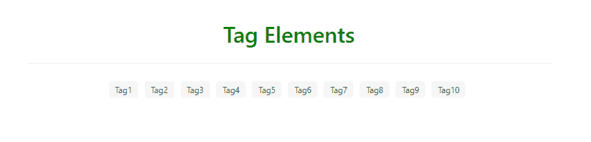
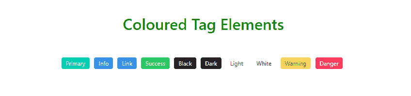
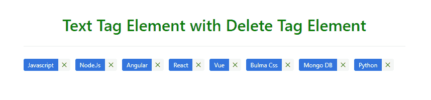
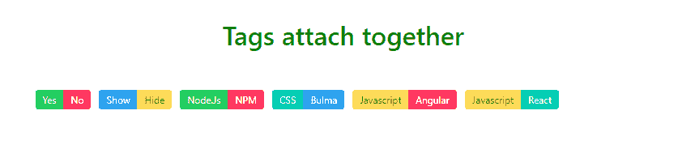

# bulma | tags

> 哎哎哎:# t0]https://www . geeksforgeeks . org/bulma 标记/

**布尔玛**是一个基于 Flexbox 的免费开源 CSS 框架。它是组件丰富的，兼容的，并且有很好的文档记录。它本质上是高度反应的。它使用类来实现它的设计。
布尔玛标签是一个小元素，对于将信息附加到块或其他组件非常有用。

**示例 1:** 简单标签元素

```
<html>
  <head>
    <title>Bulma Tag</title>
    <link rel='stylesheet' 
          href=
'https://cdnjs.cloudflare.com/ajax/libs/bulma/0.7.5/css/bulma.css'>
    <!-- custom css -->
    <style>
      div.columns{
        margin-top: 50px;
      }

      h1{
        color:green !important;
        margin-bottom: 20px;
      }

      span{
        margin-right:5px;
      }

    </style>
  </head>
  <body>
    <div class='container has-text-centered'>
      <div class='columns is-mobile is-centered'>
        <div class='column is-8'>
          <div>
            <h1 class='title'>Tag Elements</h1>
            <hr>
          </div>

          <div>
            <span class="tag">
              Tag1
            </span>
            <span class="tag">
              Tag2
            </span>
            <span class="tag">
              Tag3
            </span>
            <span class="tag">
              Tag4
            </span>
            <span class="tag">
              Tag5
            </span>
            <span class="tag">
              Tag6
            </span>
            <span class="tag">
              Tag7
            </span>
            <span class="tag">
              Tag8
            </span>
            <span class="tag">
              Tag9
            </span>
            <span class="tag">
              Tag10
            </span>
          </div>
        </div>
      </div>
    </div>
    </div>
  </body>
</html>
```

**输出:**


**示例 2:** 彩色标签元素

```
<html>
  <head>
    <title>Bulma Tag</title>
    <link rel='stylesheet' href=
'https://cdnjs.cloudflare.com/ajax/libs/bulma/0.7.5/css/bulma.css'>
    <!-- custom css -->
    <style>
      div.columns{
        margin-top: 50px;
      }

      h1{
        color:green !important;
        margin-bottom: 20px;
      }

      span{
        margin-right:5px;
      }

    </style>
  </head>
  <body>
    <div class='container has-text-centered'>
      <div class='columns is-mobile is-centered'>
        <div class='column is-8'>
          <div>
            <h1 class='title'>Coloured Tag Elements</h1>
            <hr>
          </div>

          <div>
            <span class="tag is-primary">
              Primary
            </span>
            <span class="tag is-info">
              Info
            </span>
            <span class="tag is-link">
              Link
            </span>
            <span class="tag is-success">
              Success
            </span>
            <span class="tag is-black">
              Black
            </span>

            <span class="tag is-dark">
              Dark
            </span>
            <span class="tag is-light">
              Light
            </span>
            <span class="tag is-white">
              White
            </span>
            <span class="tag is-warning">
              Warning
            </span>
            <span class="tag is-danger">
              Danger
            </span>
          </div>
        </div>
      </div>
    </div>
    </div>
  </body>
</html>
```

**输出:**


**示例 3:** 不同大小的标签元素

```
<html>
  <head>
    <title>Bulma Tag</title>
    <link rel='stylesheet' href=
'https://cdnjs.cloudflare.com/ajax/libs/bulma/0.7.5/css/bulma.css'>
    <!-- custom css -->
    <style>
      div.columns{
        margin-top: 50px;
      }

      h1{
        color:green !important;
        margin-bottom: 20px;
      }

      span{
        margin-right:5px;
      }

    </style>
  </head>
  <body>
    <div class='container has-text-centered'>
      <div class='columns is-mobile is-centered'>
        <div class='column is-8'>
          <div>
            <h1 class='title'>
                Different sizes Tag Elements
            </h1>
            <hr>
          </div>

          <div>
            <span class="tag is-primary is-normal">
              Normal
            </span>
            <span class="tag is-info is-medium">
              Medium
            </span>
            <span class="tag is-link is-large">
              Large
            </span>

          </div>
        </div>
      </div>
    </div>
    </div>
  </body>
</html>
```

**输出:**


**示例 4:** 圆形标签元素

```
<html>
  <head>
    <title>Bulma Tag</title>
    <link rel='stylesheet' href=
'https://cdnjs.cloudflare.com/ajax/libs/bulma/0.7.5/css/bulma.css'>
    <!-- custom css -->
    <style>
      div.columns{
        margin-top: 50px;
      }

      h1{
        color:green !important;
        margin-bottom: 20px;
      }

      span{
        margin-right:5px;
      }

    </style>
  </head>
  <body>
    <div class='container has-text-centered'>
      <div class='columns is-mobile is-centered'>
        <div class='column is-8'>
          <div>
            <h1 class='title'>Rounded Tag Elements</h1>
            <hr>
          </div>

          <div>
            <span class="tag is-primary is-rounded">
              Primary
            </span>
            <span class="tag is-info is-rounded">
              Info
            </span>
            <span class="tag is-link is-rounded">
              Link
            </span>
            <span class="tag is-success is-rounded">
              Success
            </span>
            <span class="tag is-black is-rounded">
              Black
            </span>
             <span class="tag is-warning is-rounded">
              Warning
            </span>
            <span class="tag is-danger is-rounded">
              Danger
            </span>
          </div>
        </div>
      </div>
    </div>
    </div>
  </body>
</html>
```

**输出:**


**示例 5:** 带有删除标记元素的文本标记元素

```
<html>
  <head>
    <title>Bulma Tag</title>
    <link rel='stylesheet' href=
'https://cdnjs.cloudflare.com/ajax/libs/bulma/0.7.5/css/bulma.css'>
    <!-- custom css -->
    <style>
      div.columns{
        margin-top: 50px;
      }

      h1{
        color:green !important;
        margin-bottom: 20px;
      }

      div.tags{
        display:flex;
        float:left;
        margin-right:10px;
      }

    </style>
  </head>
  <body>
    <div class='container has-text-centered'>
      <div class='columns is-mobile is-centered'>
        <div class='column is-8'>
          <div>
            <h1 class='title'>
 Text Tag Element with Delete Tag Element 
            </h1>
            <hr>
          </div>

          <div>
            <div class="tags has-addons">
              <span class="tag is-link">Javascript</span>
              <a class="tag is-delete"></a>
            </div>

            <div class="tags has-addons">
              <span class="tag is-link">Node.Js</span>
              <a class="tag is-delete"></a>
            </div>

            <div class="tags has-addons">
              <span class="tag is-link">Angular</span>
              <a class="tag is-delete"></a>
            </div>

            <div class="tags has-addons">
              <span class="tag is-link">React</span>
              <a class="tag is-delete"></a>
            </div>

            <div class="tags has-addons">
              <span class="tag is-link">Vue</span>
              <a class="tag is-delete"></a>
            </div>

            <div class="tags has-addons">
              <span class="tag is-link">Bulma Css</span>
              <a class="tag is-delete"></a>
            </div>

            <div class="tags has-addons">
              <span class="tag is-link">Mongo DB</span>
              <a class="tag is-delete"></a>
            </div>

            <div class="tags has-addons">
              <span class="tag is-link">Python</span>
              <a class="tag is-delete"></a>
            </div>

          </div>
        </div>
      </div>
    </div>
    </div>
  </body>
</html>
```



**例 6:** 标签贴在一起

```
<html>
  <head>
    <title>Bulma Tag</title>
    <link rel='stylesheet' href=
'https://cdnjs.cloudflare.com/ajax/libs/bulma/0.7.5/css/bulma.css'>
    <!-- custom css -->
    <style>
      div.columns{
        margin-top: 50px;
      }

      h1{
        color:green !important;
        margin-bottom: 20px;
      }

      div.tags{
        display:flex;
        float:left;
        margin-right:10px;
      }

    </style>
  </head>
  <body>
    <div class='container has-text-centered'>
      <div class='columns is-mobile is-centered'>
        <div class='column is-8'>
          <div>
            <h1 class='title'>Tags attach together</h1>
            <hr>
          </div>

          <div class="control">
            <div class="tags has-addons">
              <span class="tag is-success">Yes</span>
              <span class="tag is-danger">No</span>
            </div>

            <div class="tags has-addons">
              <span class="tag is-info">Show</span>
              <span class="tag is-warning">Hide</span>
            </div>

            <div class="tags has-addons">
              <span class="tag is-success">Node.Js</span>
              <span class="tag is-danger">NPM</span>
            </div>

            <div class="tags has-addons">
              <span class="tag is-primary">CSS</span>
              <span class="tag is-info">Bulma</span>
            </div>

            <div class="tags has-addons">
              <span class="tag is-warning">Javascript</span>
              <span class="tag is-danger">Angular</span>
            </div>

            <div class="tags has-addons">
              <span class="tag is-warning">Javascript</span>
              <span class="tag is-primary">React</span>
            </div>

          </div>
        </div>
      </div>
    </div>
    </div>
  </body>
</html>
```

**输出:**
