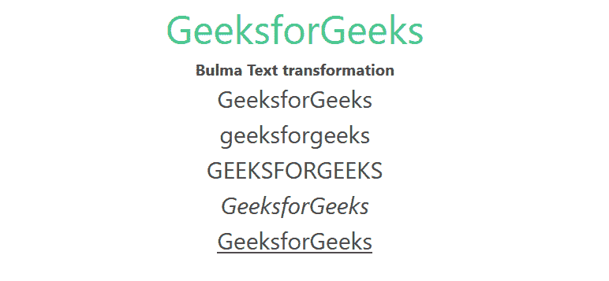

# 布尔玛文字转换

> 原文:[https://www.geeksforgeeks.org/bulma-text-transformation/](https://www.geeksforgeeks.org/bulma-text-transformation/)

[布尔玛](https://www.geeksforgeeks.org/bulma-introduction/)文本转换用于设置文本的转换，如是否希望文本斜体、下划线或大写等。然后你可以用这些类来定义它。

**文本转换类:**

*   **大写:**这个类用来大写你使用这个类的标签里面的整个文本。
*   **是-小写:**这个类用来小写你使用这个类的标签里面的整个文本。
*   **是-大写:**这个类用来大写你使用这个类的标签里面的整个文本。
*   **是-斜体:**这个类用来斜体你使用这个类的标签里面的整个文本。
*   **是-下划线:**这个类用来给你使用这个类的标签里面的整个文本加下划线。

**示例:**下面的示例说明了布尔玛的文本转换类。

## 超文本标记语言

```
<!DOCTYPE html>
<html>

<head>
    <title>Bulma Panel</title>
    <link rel='stylesheet'
          href=
'https://cdn.jsdelivr.net/npm/bulma@0.9.3/css/bulma.min.css'>
</head>

<body class="has-text-centered">
    <h1 class="is-size-2 has-text-success">
        GeeksforGeeks
    </h1>
    <b>Bulma Text transformation</b>
    <br>
    <div class="container">
        <p class="is-capitalized is-size-4">geeksforGeeks</p>

        <p class="is-lowercase is-size-4">GeeksforGeeks</p>

        <p class="is-uppercase is-size-4">GeeksforGeeks</p>

        <p class="is-italic is-size-4">GeeksforGeeks</p>

        <p class="is-underlined is-size-4">GeeksforGeeks</p>
    </div>
</body>

</html>
```

**输出:**



文本转换

**参考:**[https://bulma . io/documentation/helper/排版-helper/# text-transformation](https://bulma.io/documentation/helpers/typography-helpers/#text-transformation)