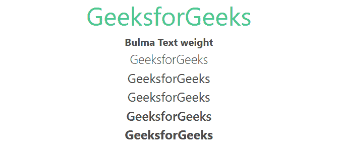

# 布尔玛文字权重

> 原文:[https://www.geeksforgeeks.org/bulma-text-weight/](https://www.geeksforgeeks.org/bulma-text-weight/)

[布尔玛](https://www.geeksforgeeks.org/bulma-introduction/)文本权重类用于将文本设置为粗体文本。有 5 个文本权重，您可以使用 5 个文本权重助手之一来转换文本权重。

**文本权重等级:**

*   **has-text-weight-light:** 这个类用于将文本权重转换为 light。
*   **has-text-weight-normal:** 这个类用于将文本权重转换为 normal。
*   **has-text-weight-medium:** 这个类用于将文本权重转换为 medium。
*   **has-text-weight-semi bold:**这个类用于将文本权重转换为半粗体。
*   **has-text-weight-bold:** 这个类用于将文本权重转换为加粗。

**示例:**下面的示例说明了布尔玛的文本大小类。

## 超文本标记语言

```html
<!DOCTYPE html>
<html>

<head>
    <title>Bulma Typography</title>
    <link rel='stylesheet'
          href=
'https://cdn.jsdelivr.net/npm/bulma@0.9.3/css/bulma.min.css'>
</head>

<body class="has-text-centered">
    <h1 class="is-size-2 has-text-success">
        GeeksforGeeks
    </h1>
    <b>Bulma Text weight</b>
    <br>
    <div class="container">
        <p class="is-size-5 has-text-weight-light">GeeksforGeeks</p>

        <p class="is-size-5 has-text-weight-normal">GeeksforGeeks</p>

        <p class="is-size-5 has-text-weight-medium">GeeksforGeeks</p>

        <p class="is-size-5 has-text-weight-semibold">GeeksforGeeks</p>

        <p class="is-size-5 has-text-weight-bold">GeeksforGeeks</p>

    </div>
</body>
</html>
```

**输出:**



布尔玛文本权重

**参考:**[https://bulma . io/documentation/helper/排版-helper/# text-weight](https://bulma.io/documentation/helpers/typography-helpers/#text-weight)