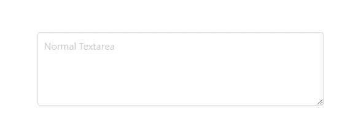
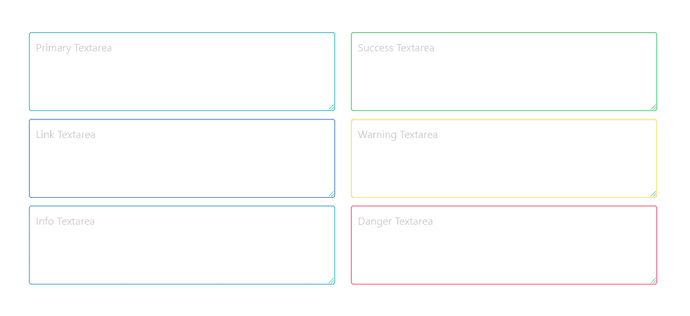
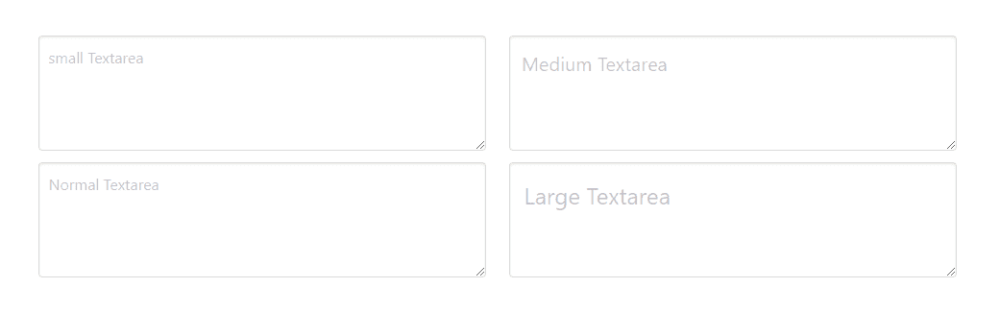
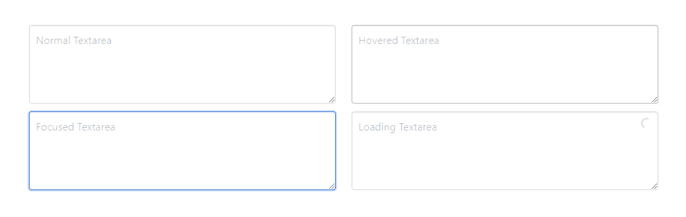
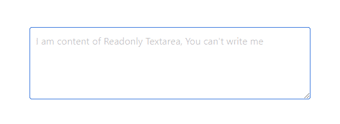
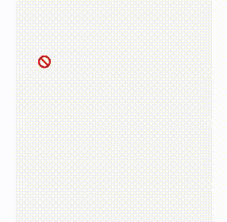

# Bulma | Textarea

> 哎哎哎:# t0]https://www . geeksforgeeks . org/bulma-textarea/

**布尔玛**是一个基于 Flexbox 的免费开源 CSS 框架。它是组件丰富的，兼容的，并且有很好的文档记录。它本质上是高度反应的。它使用类来实现它的设计。
表单的“文本区”组件在外观上没有那么吸引人。使用布尔玛，我们可以通过添加一些简单的布尔玛类，以更好的方式设计表单的文本区元素。布尔玛 textarea 元素有不同的颜色、不同的样式、不同的大小和不同的状态。
**例 1:** 这个例子说明了简单的布尔玛文本区。

## 超文本标记语言

```html
<html>
  <head>
    <title>Bulma Textarea</title>
    <link rel='stylesheet'
          href=
'https://cdnjs.cloudflare.com/ajax/libs/bulma/0.7.5/css/bulma.css'>
    <!-- custom css -->
    <style>
      div.columns{
        margin-top: 80px;
      }
    </style>
  </head>
  <body>  
    <div class='container'>
      <div class='columns is-mobile is-centered'>
        <div class='column is-5'>
          <div class="field">
            <div class="control">
              <textarea class="textarea"
                        placeholder='Normal Textarea'>
              </textarea>
            </div>
          </div>
        </div>
      </div>
    </div>
  </body>
</html>
```

**输出:**



**示例 2:** 该示例说明了不同颜色的文本区域。

## 超文本标记语言

```html
<html>
  <head>
    <title>Bulma Textarea</title>
    <link rel='stylesheet'
          href=
'https://cdnjs.cloudflare.com/ajax/libs/bulma/0.7.5/css/bulma.css'>
    <!-- custom css -->
    <style>
      div.columns{
        margin-top: 80px;
      }
    </style>
  </head>
  <body>  
    <div class='container'>
      <div class='columns is-mobile is-centered'>
        <div class='column is-5'>
          <div class="field">
            <div class="control">
              <textarea class="textarea is-primary"
                        placeholder='Primary Textarea'>
              </textarea>
            </div>
          </div>
          <div class="field">
            <div class="control">
              <textarea class="textarea is-link"
                        placeholder='Link Textarea'>
               </textarea>
            </div>
          </div>
          <div class="field">
            <div class="control">
              <textarea class="textarea is-info"
                        placeholder='Info Textarea'>
             </textarea>
            </div>
          </div>
        </div>

        <div class='column is-5'>
          <div class="field">
            <div class="control">
              <textarea class="textarea is-success"
                        placeholder='Success Textarea'>
              </textarea>
            </div>
          </div>
          <div class="field">
            <div class="control">
              <textarea class="textarea is-warning"
                        placeholder='Warning Textarea'>
              </textarea>
            </div>
          </div>
          <div class="field">
            <div class="control">
              <textarea class="textarea is-danger"
                        placeholder='Danger Textarea'>
               </textarea>
            </div>
          </div>
        </div>
      </div>
    </div>
  </body>
</html>
```

**输出:**



**示例 3:** 该示例说明了不同大小的文本区域。

## 超文本标记语言

```html
<html>
  <head>
    <title>Bulma Textarea</title>
    <link rel='stylesheet'
          href=
'https://cdnjs.cloudflare.com/ajax/libs/bulma/0.7.5/css/bulma.css'>
    <!-- custom css -->
    <style>
      div.columns{
        margin-top: 80px;
      }
    </style>
  </head>
  <body>  
    <div class='container'>
      <div class='columns is-mobile is-centered'>
        <div class='column is-5'>
          <div class="field">
            <div class="control">
              <textarea class="textarea is-small"
                        placeholder='small Textarea'>
              </textarea>
            </div>
          </div>
          <div class="field">
            <div class="control">
              <textarea class="textarea"
                        placeholder='Normal Textarea'>
              </textarea>
            </div>
          </div>
        </div>

        <div class='column is-5'>
          <div class="field">
            <div class="control">
              <textarea class="textarea is-medium"
                        placeholder='Medium Textarea'>
              </textarea>
            </div>
          </div>
          <div class="field">
            <div class="control">
              <textarea class="textarea is-large"
                        placeholder='Large Textarea'>
              </textarea>
            </div>
          </div>
        </div>
      </div>
    </div>
  </body>
</html>
```

**输出:**



**例 4:** 这个例子说明了 textarea 的不同状态。

## 超文本标记语言

```html
<html>
  <head>
    <title>Bulma Textarea</title>
    <link rel='stylesheet'
          href=
'https://cdnjs.cloudflare.com/ajax/libs/bulma/0.7.5/css/bulma.css'>
    <!-- custom css -->
    <style>
      div.columns{
        margin-top: 80px;
      }
    </style>
  </head>
  <body>  
    <div class='container'>
      <div class='columns is-mobile is-centered'>
        <div class='column is-5'>
          <div class="field">
            <div class="control">
              <textarea class="textarea"
                        placeholder='Normal Textarea'>
              </textarea>
            </div>
          </div>
          <div class="field">
            <div class="control">
              <textarea class="textarea is-focused"
                        placeholder='Focused Textarea'>
               </textarea>
            </div>
          </div>
        </div>

        <div class='column is-5'>
          <div class="field">
            <div class="control">
              <textarea class="textarea is-hovered"
                        placeholder='Hovered Textarea'>
              </textarea>
            </div>
          </div>
          <div class="field">
            <div class="control is-loading">
              <textarea class="textarea"
                        placeholder='Loading Textarea'>
             </textarea>
            </div>
          </div>
        </div>
      </div>
    </div>
  </body>
</html>
```

**输出:**



**示例 5:** 此示例显示只读文本区域。

## 超文本标记语言

```html
<html>
  <head>
    <title>Bulma Textarea</title>
    <link rel='stylesheet'
          href=
'https://cdnjs.cloudflare.com/ajax/libs/bulma/0.7.5/css/bulma.css'>
    <!-- custom css -->
    <style>
      div.columns{
        margin-top: 80px;
      }
    </style>
  </head>
  <body>  
    <div class='container'>
      <div class='columns is-mobile is-centered'>
        <div class='column is-5'>
          <div class="field">
            <div class="control">
              <textarea class="textarea"
                        placeholder=
                          "I am content of Readonly
 Textarea, You can't write me" readonly></textarea>
            </div>
          </div>
      </div>
    </div>

  </body>
</html>
```

**输出:**



**示例 6:** 本示例显示禁用的文本区域。

## 超文本标记语言

```html
<html>
  <head>
    <title>Bulma Textarea</title>
    <link rel='stylesheet'
          href=
'https://cdnjs.cloudflare.com/ajax/libs/bulma/0.7.5/css/bulma.css'>
    <!-- custom css -->
    <style>
      div.columns{
        margin-top: 80px;
      }
    </style>
  </head>
  <body>  
    <div class='container'>
      <div class='columns is-mobile is-centered'>
        <div class='column is-5'>
          <div class="field">
            <div class="control">
              <textarea col='20'
                        class="textarea"
                        placeholder='Disabled Textarea'
                               disabled>
               </textarea>
            </div>
          </div>
      </div>
    </div>

  </body>
</html>
```

**输出:**

