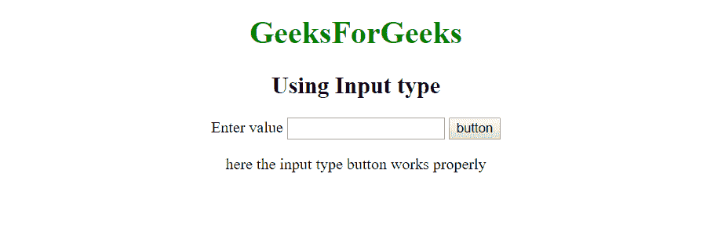
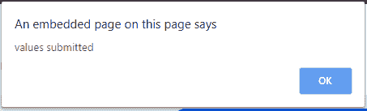
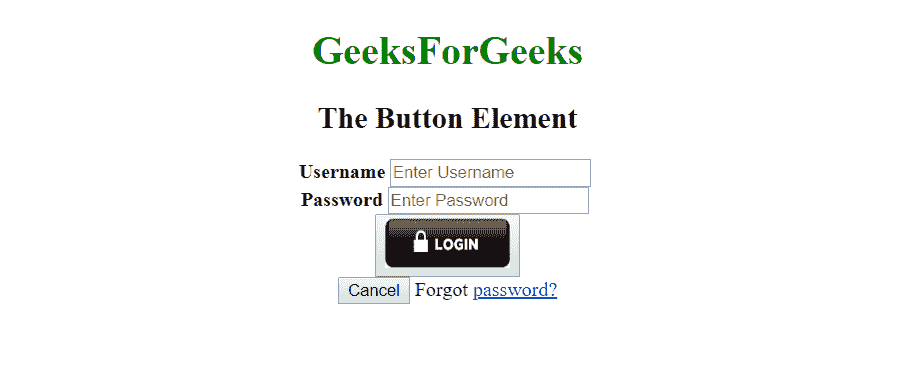
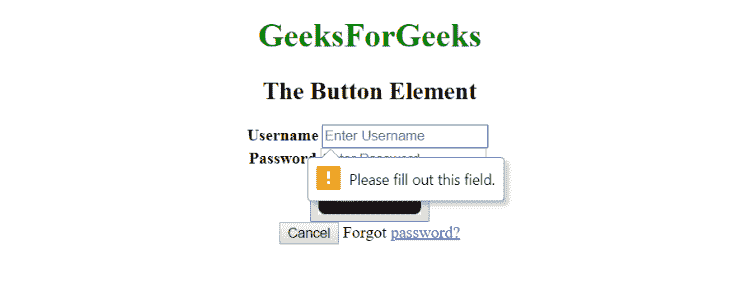

# 按钮标签 vs 输入类型=“按钮”属性

> 原文:[https://www . geesforgeks . org/button-tag-vs-input-type button-attribute/](https://www.geeksforgeeks.org/button-tag-vs-input-typebutton-attribute/)

**<输入 type="button" >** 和 **<按钮>** 标签是在 HTML 文档中使用 button 的两种不同方法。它们之间的区别在于，使用<按钮>标签创建的按钮提供了比<输入类型=“按钮”>属性更多的贡献可能性。<按钮>里面可以有内容。<按钮>标签允许对按钮元素内容(如文本或图像等)中的内容进行措辞，以及定义类型功能。但是输入 type="button "属性不允许内容。例如，包含图像功能的按钮标签可能类似于类型设置为“图像”的输入标签，但按钮元素类型允许内容。下面的两个例子非常清楚地表明了这种差异。

**注意:**的<按钮>标记使用了开括号，但是<输入 type="button" >属性只使用了单个标记。

**示例 1:** 本示例使用<输入 type="button" >属性在 HTML 文档中创建按钮。

```htmlhtml
<!DOCTYPE html>
<html>

<head>
    <script>
        function msg() {
            alert("values submitted");
        }
    </script>
</head>

<body style = "text-align:center;"> 

    <h1 style = "color:green;" > 
        GeeksForGeeks 
    </h1> 

    <h2>Using Input type</h2> 

    <form>
        <label for="submit">
            Enter value
        </label>

        <input type = "text">

        <input type="button" id="submit" 
            onclick ="msg()" value="button"> 
    </form> 
    <p>
        here the input type button
        works properly
    </p>
</body>

</html>                    
```

**输出:**

*   **点击按钮前:**
    
*   **点击按钮后:**
    

**示例 2:** 本示例使用<按钮>标签在 HTML 文档中创建按钮。

```htmlhtml
<!DOCTYPE html>
<html>

<body style = "text-align:center;"> 

    <h1 style = "color:green;"> 
        GeeksForGeeks 
    </h1> 

    <h2>The Button Element</h2>

    <form method="post" >
        <label for="uname"><b>Username</b></label>

        <input type="text" placeholder="Enter Username" 
                name="uname" required>

        <br>

        <label for="psw"><b>Password</b></label>

        <input type="password" placeholder="Enter Password"
                name="psw" required>

        <br>

        <button type="submit">
        </button><br>

        <button type="button" class="cancelbtn">Cancel</button>

        <span class="psw">Forgot <a href="#">password?</a></span>
    </form>
</body>

</html>                    
```

**输出:**

*   **点击按钮前:**
    
*   **点击按钮后:**
    