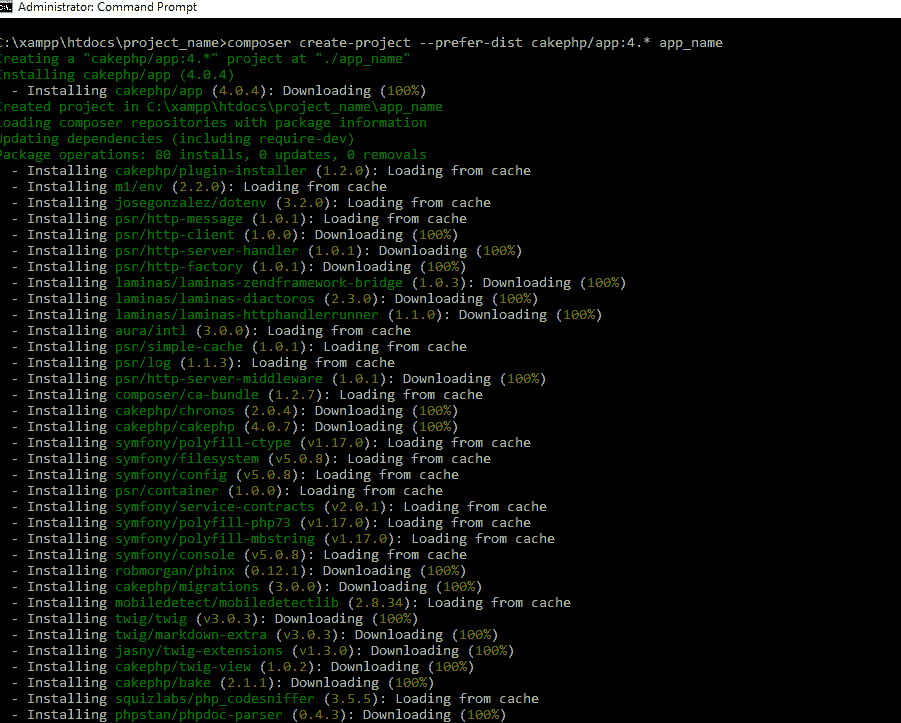
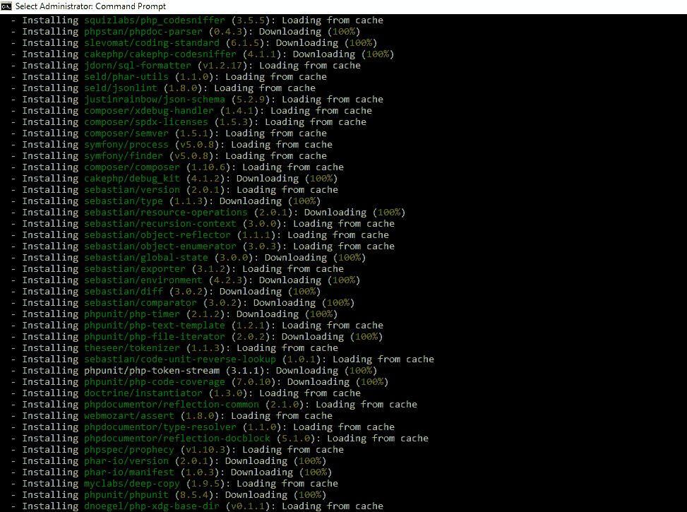
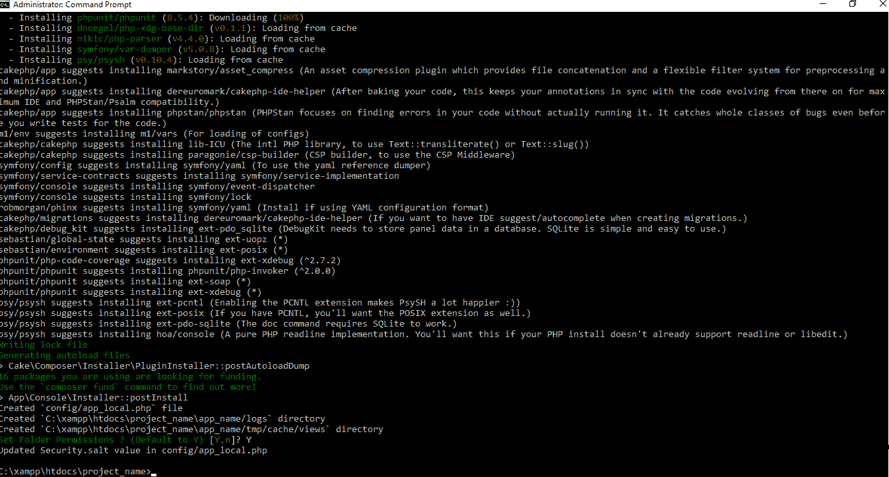
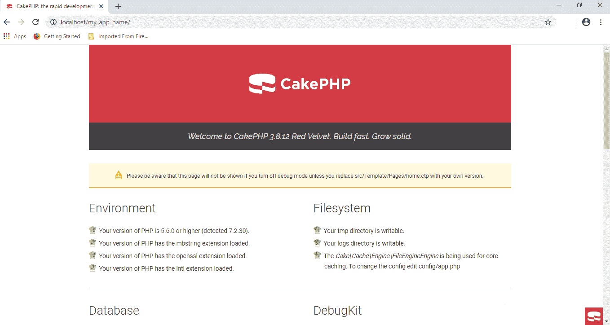

# CakePHP 框架|安装配置

> 原文:[https://www . geesforgeks . org/cakephp-framework-安装和配置/](https://www.geeksforgeeks.org/cakephp-framework-installation-and-configuration/)

**CakePHP** 是一个 PHP 开源框架，基于类似 Model-View-Controller(MVC)的架构，仿照 Ruby on Rails 的概念建模，功能强大且易学。这是程序员创建 web 应用程序的基础结构。模型、视图和控制器用于将业务逻辑与数据和表示层分离。

**先决条件:**

1.  [在 windows 上安装 PHP](https://www.geeksforgeeks.org/how-to-execute-php-code-using-command-line/)
2.  [运行项目的环境设置](https://www.geeksforgeeks.org/how-to-set-php-development-environment-in-windows/)
3.  [安装 CakePHP 的 Composer 软件](https://getcomposer.org/download/)

**安装:**

1.  进入你安装 XAMPP 的目录**打开 htdocs 文件夹**。(在我的例子中是 C:\xampp\htdocs)。
2.  打开命令提示符，导航到当前工作目录作为当前目录。
    
3.  Enter the command.

    ```html
    mkdir project_name && cd project_name
    ```

    该命令将创建一个名为 project_name 的项目文件夹，并将当前工作目录设置为该文件夹。
    

4.  Now enter the command.

    ```html
    composer create-project --prefer-dist cakephp/app:4.* app_name
    ```

    (这里 4。*指版本号)
    这将在当前目录下安装 CakePHP 框架。
    

    

    

5.  打开 xampp 控制面板**运行 apache 服务器**。
6.  现在打开一个网页浏览器**转到 URL->[http://localhost:80/project _ name/app _ name/](http://localhost:80/project_name/app_name/)**
    可以看到我们的第一个 app 在服务器上成功运行。
    
    你已经成功安装了 CakePHP，并且用它创建了你的第一个应用。