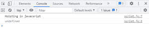
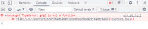

# 可以使用带箭头功能的吊装吗？

> 原文:[https://www . geesforgeks . org/can-we-use-吊装-带箭头-功能/](https://www.geeksforgeeks.org/can-we-use-hoisting-with-arrow-function/)

[**Arrow 函数:**](https://www.geeksforgeeks.org/arrow-functions-in-javascript/) 在 ES6 中引入的 Arrow 函数，提供了一种用 JavaScript 编写函数的简洁方式。它提供的另一个显著优势是，它不绑定自己的。换句话说，箭头函数内部的上下文是由词汇或静态定义的。

[**提升:**](https://www.geeksforgeeks.org/javascript-hoisting/) 在 JavaScript 中，提升是在代码执行前将所有声明移动到作用域顶部的默认行为。基本上，它给了我们一个优势，无论函数和变量在哪里声明，它们都被移动到它们的作用域的顶部，无论它们的作用域是全局的还是局部的。

**语法:**

```
const geekforggeks = (argument1, argumnet2) => {
    // body
}
```

像 Javascript 中的所有其他函数一样，箭头函数并不是你在初始化之前不能调用它们的主要原因。因为默认情况下，提升是在执行代码之前将所有声明移动到作用域顶部的动作。JavaScript 为其所有变量分配内存。所以这给了我们一个优势，不管函数和变量在哪里声明，它们都会被移动到它们作用域的顶部，不管它们的作用域是全局的还是局部的。另一个原因是箭头函数是匿名的。

现在让我们通过一些例子来理解这一点:

**示例 1:** 在本例中，我们展示了在调用函数之前无法访问该值。如果在初始化之前调用，那么将会抛出一个未定义的错误。这意味着该值没有在 gfg()中定义。

## java 描述语言

```
<script>
    gfg();
    console.log(input1);
    var input1 = 8;
    function gfg() {
        console.log("Hoisting in javacsript")
    }
</script>
```

**输出:**



**解释:**所以当我们想要访问的时候，我们不能从 gfg()函数上面访问变量名 input1，然后它会在浏览器的控制台中抛出未定义的错误，这样就像另一种编程语言一样，它在声明之前不能调用。引发该错误的主要原因是 JavaScript 为 x 的内存保留了空间，并将未定义的特殊占位符放在其中

**示例 2:** 在这个示例中，我们将显示，如果我们使用箭头函数，然后如果我们想要访问该值，那么它将在浏览器的控制台中抛出未捕获的 Typeerror。

## java 描述语言

```
<script>
    gfg2();
    console.log(gfg2);
    var input1 = 8;
    var gfg2 = () => {
        console.log("function calling");
    }
</script>
```

**输出:**



**解释:**现在显示抛出一个未捕获类型错误 gfg2 不是函数。原因是 gfg2 的行为类似于另一个变量，它使用一个类似 undefined 的占位符来分配内存。