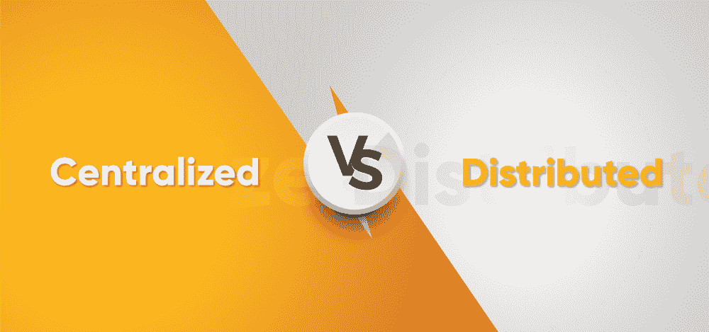
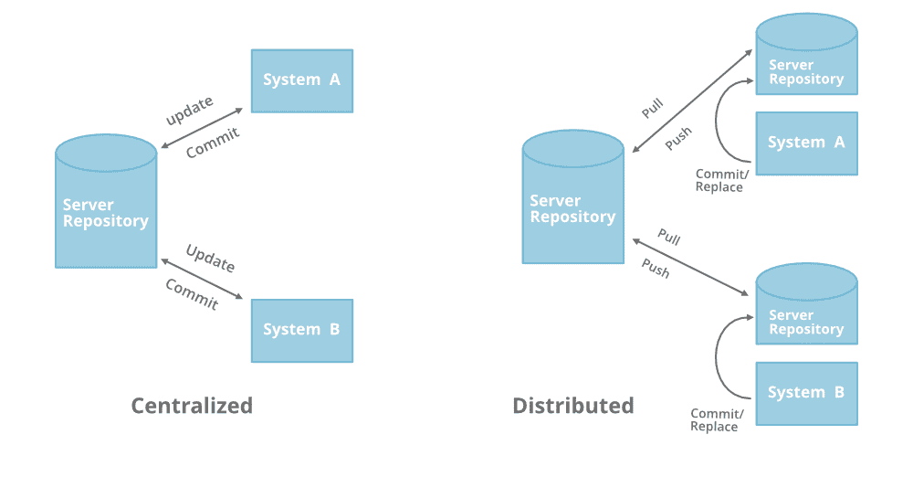
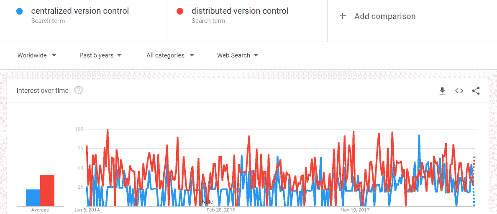

# 集中式与分布式版本控制:我们应该选择哪一种？

> 原文:[https://www . geesforgeks . org/集中式-vs-分布式-版本-控制-我们应该选择哪一个/](https://www.geeksforgeeks.org/centralized-vs-distributed-version-control-which-one-should-we-choose/)

当涉及到在一个项目上与多个开发人员合作并与他们协作时，我们中的许多人都知道版本控制。毫无疑问，版本控制使开发人员的工作更加轻松快捷。在大多数组织中，开发人员要么使用像 Subversion(SVN)或并发版本系统(CVS)这样的*集中式版本控制系统(CVCS)* ，要么使用像 [Git](https://git-scm.com/) (用 [C](https://www.geeksforgeeks.org/c-programming-language/) 编写)、 [Mercurial](https://www.mercurial-scm.org/) (用 [Python](https://www.geeksforgeeks.org/python-programming-language/) 编写)或 Bazaar(用 Python 编写)。
现在言归正传，到底哪一个最好，还是我们需要选择哪一个？我们将比较每个人的工作流程、学习曲线、安全性、受欢迎程度等方面。
首先我们需要打破一个大多数初学者对 DVCS 的误解，即“*代码中没有中心版本，也没有主分支*”这不是真的， ***在 DVCS，代码*** 中也有一个主分支或中心版本，但它的工作方式与集中式源代码控制不同。

让我们浏览一下这两个版本控制系统的概述。

### 集中式版本控制系统

在集中式源代码管理中，有一个服务器和一个客户端。服务器是包含所有代码版本的主存储库。要处理任何项目，首先用户或客户端需要从主存储库或服务器获取代码。因此，客户端与服务器通信，并将所有代码或代码的当前版本从服务器拉至它们的本地机器。换句话说，我们可以说，您需要从主存储库中获取更新，然后在您的系统中获取代码的本地副本。因此，一旦您获得了代码的最新版本，您就可以开始对代码进行自己的更改，之后，您只需要将这些更改直接提交到主存储库中。提交变更仅仅意味着将您自己的代码合并到主存储库中，或者制作源代码的新版本。所以一切都集中在这个模型中。
将只有一个存储库，它将包含代码的所有历史或版本以及代码的不同分支。因此，集中源代码控制中涉及的基本工作流是从中央存储库中获取最新版本的代码，该存储库还包含其他人的代码，在代码中进行自己的更改，然后将这些更改提交或合并到中央存储库中。

### 分布式版本控制系统

在分布式版本控制中，大多数机制或模型与集中式相同。您在这里会发现的唯一主要区别是，不是一个单一的存储库，即服务器，而是每个开发人员或客户端都有自己的服务器，他们将在本地服务器或机器上拥有整个代码历史或版本及其所有分支的副本。基本上，每个客户端或用户都可以在本地工作，并且断开连接，这比集中式源代码控制更方便，这就是为什么它被称为分布式。
不需要依赖中央服务器，可以将整个历史或者代码的副本克隆到硬盘上。因此，当您开始处理一个项目时，您可以从自己的硬盘上的主存储库中克隆代码，然后从自己的存储库中获取代码进行更改，在进行更改后，您可以将更改提交到本地存储库中，此时， 您的本地存储库将具有“*变更集*”，但它仍然与主存储库断开连接(主存储库将具有来自每个单独开发人员的存储库的不同的“ ***”变更集*** )，因此为了与其通信，您向主存储库发出请求，并将您的本地存储库代码推送到主存储库。 从存储库中获取新的变更被称为“T7”拉动，合并本地存储库的“变更集”被称为“T9”推动。
它不遵循在进行更改后直接将代码传递或合并到主存储库的方式。首先，您在自己的服务器或存储库中提交所有更改，然后“更改集”将合并到主存储库中。

下图更好地理解了这两者的区别:

### 正反两方面的基本区别

*   集中式版本控制比分布式更容易学习。如果你是一个初学者，你必须记住所有在 DVCS 的操作的所有命令，在 DVCS 工作最初可能会令人困惑。CVCS 很容易学习，也很容易建立。
*   DVCS 最大的优势在于，它允许你离线工作，并提供了灵活性。你在你自己的硬盘里有代码的全部历史，所以你将在你自己的服务器或你自己的存储库中进行所有的改变，这不需要互联网连接，但这不是 CVCS 的情况。
*   DVCS 比 CVCS 快，因为你不需要为每个命令与远程服务器通信。你在当地做的每件事都让你比 CVCS 工作得更快。
*   在 DVCS，在树枝上工作很容易。每个开发人员在 DVCS 都有完整的代码历史，因此开发人员可以在将所有的更改集合合并到远程服务器之前共享他们的更改。在 CVCS，在分支机构上工作既困难又耗时，因为它需要直接与服务器通信。
*   如果项目历史悠久或项目包含大型二进制文件，在这种情况下，在 DVCS 下载整个项目会比平时花费更多的时间和空间，而在 CVCS，您只需要获得几行代码，因为您不需要将整个历史或完整的项目保存在自己的服务器上，因此不需要额外的空间。
*   如果主服务器在 DVCS 出现故障或崩溃，您仍然可以从本地存储库或服务器获取代码的备份或整个历史记录，其中已经保存了代码的完整版本。CVCS 的情况并非如此，只有一台远程服务器拥有完整的代码历史。
*   在 DVCS，与其他开发人员代码的合并冲突较少。因为每个开发人员都在开发自己的代码。与 DVCS 相比，CVCS 的合并冲突更多。
*   在 DVCS，有时候开发人员利用了拥有整个代码历史的优势，他们可能会孤立地工作太久，这不是一件好事。CVCS 的情况并非如此。

**结论:**让我们看看 DVCS 和 CVCS 在全球的受欢迎程度。

图片来源:谷歌趋势

从谷歌趋势和以上几点来看，很明显 DVCS 比 CVCS 更有优势，也更受欢迎，但是如果我们需要谈论选择版本控制，那么这也取决于作为初学者的你学习哪个更方便。你可以选择其中的任何一个，但是一旦你使用它的命令，DVCS 会给你更多的好处。