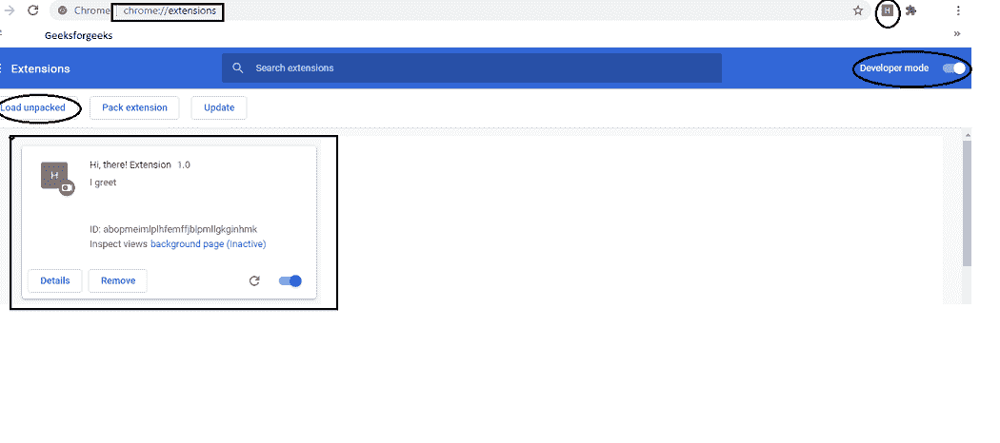
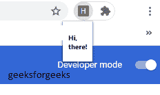

# Chrome 扩展–Youtube 书签

> 原文:[https://www . geesforgeks . org/chrome-extension-YouTube-bookmarker/](https://www.geeksforgeeks.org/chrome-extension-youtube-bookmarker/)

在本文中，我们将开发一个 chrome 扩展，使用该扩展，用户可以创建对应于不同时间戳的书签，将它们存储在某个地方(目前存储在 chrome 本地存储中)，并检索书签(存储为带有时间戳的 youtube 视频链接)。

代码托管在这里: [GitHub](https://github.com/Parikshit-Hooda/YTVideoBookmarker) 。主分机的视频讲解可以在[这里](https://github.com/Parikshit-Hooda/YTVideoBookmarker/blob/master/images/project%20demo%20video%20draft%201.mp4)找到(在主分机的回购中)。请注意，在撰写本文时，该项目仍然是一个进行中的工作。

我们开始吧。概括地说，我们将把这篇文章分成 3 个部分。在第一部分中，我们将连接扩展，这样我们就可以在 Chrome 中访问我们正在开发的扩展。在第二部分中，我们将了解一个基本的扩展，并讨论代码和架构。在第三部分，我们将开发主要的扩展。

### 1.在开发过程中测试我们的扩展

为了在开发阶段测试和调试我们的扩展，我们将按照下面的步骤启动并运行一个基本的扩展。

1.  如上所示创建 manifest.json 文件和项目结构，或者从文章顶部的链接下载它们。
2.  从浏览器转到 chrome://extensions。
3.  将“开发人员模式”切换为开。
4.  单击“加载未打包”选项，加载扩展文件夹进行测试、调试和进一步开发。
5.  此时，您应该会在 chrome 地址栏的右侧看到您的扩展。



显示用于设置功能扩展的各种选项的浏览器屏幕片段

现在我们已经在 chrome 上加载了我们的 Extension 文件夹，我们准备构建一个基本的 chrome 扩展并测试它。

### 2.基本的 Chrome 扩展–嗨，你好！

我们将建造一个分机，上面写着:“嗨，你好！”当用户点击扩展图标时。代码可以在[这里](https://github.com/Parikshit-Hooda/hitherechromeextension)找到。



点击“H”图标打开 popup.html 与嗨，在那里！消息

为此，我们需要以下文件。

*   manifest . JSON–保存关于 Chrome 扩展的信息。
*   popup.html——说“嗨，你好！”当用户点击扩展图标时。
*   在这一点上，这个文件没有什么重要的工作。不过，我们会留在这里。
*   后台. js–加载带有基本后端功能的扩展。嗨，这里不需要！分机。
*   我们将包含 jQuery 来帮助开发。

**1。manifest.json 文件**

```html
{
"name": "Hi, there! Extension",
"version": "1.0",
"description": "I greet",
"permissions": ["activeTab"],
"options_page": "options.html",
"background": {
"scripts": ["background.js"],
"persistent": false
},
"browser_action": {
"default_popup": "popup.html",
"default_title": "Hi, there Extension"
},
"manifest_version": 2
}

```

让我们更详细地看看 manifest.json 文件中的键值对。

1.  **名称**–这是分机的名称。在浏览器屏幕快照中，您可以看到这是“嗨，你好！分机。
2.  **版本**–这是扩展的版本。它被认为是 1.0，因为当我们把它上传到 chrome 网络商店查看时，它最初是 1.0。在开发阶段，您可以将其命名为 0.0，然后是 0.1，依此类推。
3.  **描述**–分机的描述。保持简洁是个好习惯。
4.  **权限**–权限键值对持有扩展正常工作所需的不同权限。该值是字符串数组。数组的元素可以是已知的字符串，也可以是模式匹配(通常用于匹配网址)。例如，https://youtube.com/*->允许所有域名为 youtube.com 的链接进行扩展。这里，' * '是通配符模式。另外，请注意，这里声明的一些权限可能也需要用户的明确批准。您可以在官方[文档](https://developer.chrome.com/docs/extensions/mv2/declare_permissions/)中了解更多权限信息。
5.  **选项页面**–选项页面用于给用户更多的选项。用户可以通过右键单击扩展并单击菜单中的“选项”按钮，或者从“chrome://extensions”页面转到选项页面来访问选项页面。上述清单中使用的设置将导致 options.html 页面在新选项卡中打开。也可以在同一个选项卡中以嵌入式方式打开“选项”页面。在基本的‘嗨，那里！’分机，我们不需要这个选项。你可以在官方[文档](https://developer.chrome.com/docs/extensions/mv2/options/)中阅读更多关于“选项”的信息。**或许在这里补充更多**
6.  **背景**–此处声明背景脚本。后台脚本用于倾听事件并对事件做出反应，因为扩展是一个事件驱动的范例。需要时加载后台页面，空闲时卸载后台页面，即后台脚本在执行操作时将保持运行，在执行操作后卸载。在我们的‘嗨，你好！’扩展，我们没有使用后台脚本功能。您还可以注意到“persistent”键被设置为 false，因为这是标准做法，正如文档中提到的，我们唯一应该将“persistent”设置为 true 的时候是扩展使用 chrome.webRequest API 来阻止或修改网络请求的时候，而我们并没有这样做。
7.  **browser_action**–扩展使用 browser _ action 将图标放在 chrome 地址栏的右侧。然后，扩展监听点击，当图标被点击时，它会做一些事情。在我们的例子中，它打开了包含嗨，在那里的 popup.html 页面！问候。“default_title”字段值是当用户将鼠标悬停在扩展图标上时显示的字符串。
8.  **manifest _ version**–在撰写本文时，正在鼓励开发人员试用即将推出的 manifest_version 3。然而，版本 2 仍然是可用的和熟悉的，所以我们将使用版本 2。对于版本 3，可以在这里开始[。](https://developer.chrome.com/docs/extensions/mv3/intro/)

**2.弹出窗口.html 文件**

## 超文本标记语言

```html
<!DOCTYPE html>
<html>
  <head></head>
  <body>
    <h5>Hi, there!</h5>
    <script src="jquery-3.5.1.js">
    </script><script src="popup.js">
    </script>
  </body>
</html>
```