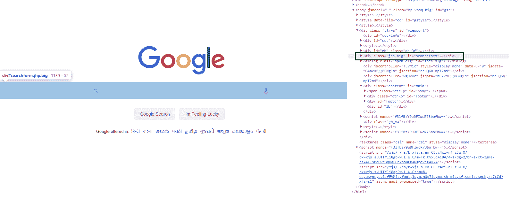
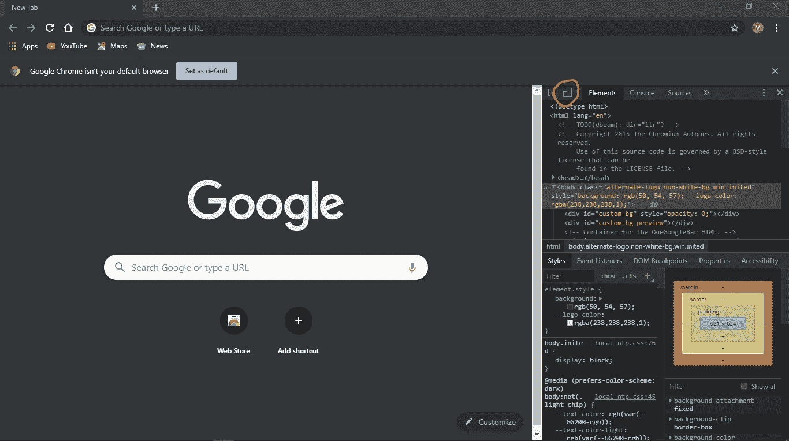
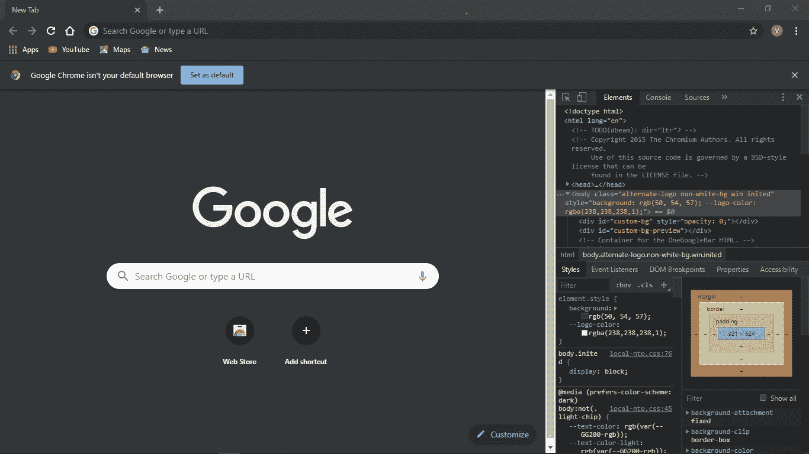
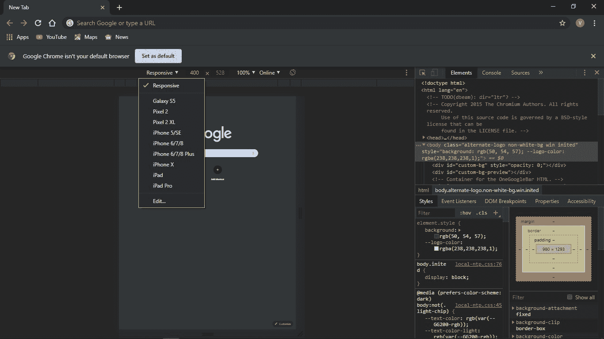

# 铬元素检测工具&快捷方式

> 原文:[https://www . geesforgeks . org/chrome-inspect-element-tool-快捷键/](https://www.geeksforgeeks.org/chrome-inspect-element-tool-shortcut/)

chrome inspects element 工具被认为是一个开发工具，用来调试网站。

右键单击任意网页，单击 inspect，您将看到该网站的 viscus:
它的源代码、形成其风格的图片和 CSS、它使用的字体和图标、为动画提供动力的 Javascript 代码等等。你可以看到网站加载需要多长时间，它习惯了传输多少带宽，以及它的文本的实际颜色。
这种明智的老式工具访问方式是通过在浏览器窗口中右键单击并选择**“检查元素”**一旦启动检查元素，用户现在可以通过单击检查按钮来识别页面上的任何对象。

通过在浏览器上移动鼠标，工具所处位置的窗口元素将被高亮显示。
下面可能是谷歌“谷歌搜索”按钮的示例输出截图，该按钮位于网站的主登录页面上。

**Mac 快捷键:**

*   **Cmd + Opt + I** 打开开发者工具
*   **Cmd + Opt + J** 打开开发者工具，将焦点放在控制台上
*   **Cmd + Shift + C** 以检查元素模式打开开发工具，或者如果开发工具已经打开，则切换检查元素模式。

**windows/Linux 快捷键:**

*   **F12，或者 Ctrl + Shift + I** 打开开发者工具。
*   **Ctrl + Shift + J** 打开开发者工具，将焦点带到控制台。
*   **Ctrl + Shift + C** 以检查元素模式打开开发工具，或者如果开发工具已经打开，则切换检查元素模式。

[Chrome 开发者快捷键](https://developers.google.com/web/tools/chrome-devtools/shortcuts)

在浏览器中预览谷歌放大器页面

*   打开 chrome，进入开发者模式。(`F12`、`Ctrl + Shift + I`或`Cmd + Opt + I`)。
    
*   确保您处于设备模式。(`Cmd+Shift+M`)。
    
*   选择您想要刺激的设备，点击刷新按钮，然后转到您想要点击或搜索的任何网页，这样就完成了。
    