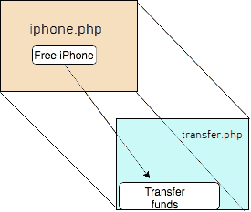

# 点击顶起/界面矫正

> 原文:[https://www.geeksforgeeks.org/clickjacking-ui-redressing/](https://www.geeksforgeeks.org/clickjacking-ui-redressing/)

**点击劫持或 UI 修复**是常见的网络安全攻击之一。在这种攻击中，最终用户会获得一个看起来合法的网页，他/她会被诱骗点击用户界面中的某些内容。但是在幕后，一个特别制作的页面被加载到合法页面的后面。

对最终用户来说，用户界面中的组件似乎正在被单击，但不幸的是，单击是在隐藏页面中的不可见组件上进行的，并且将执行为该按钮单击映射的操作。

在这个例子中，用户被给予垃圾邮件页面*iphone.php*，在该页面中他/她被诱惑点击免费 iPhone 按钮。但是*iphone.php*后面加载的实际页面是*transfer.php*，可能是您银行网站的网页。可以使用 CSS 隐藏目标网站。

用户只在界面中看到 iphone.php，并不知道 transfer.php 是在 iphone.php 的正后方，但背景页面是隐藏的。点击 iphone.php 可以映射到点击 transfer.php，在那里定义从账户转移资金的动作，这可能会使最终用户赔钱。

使用 **iframe** html 标签可以将一个页面加载到其他页面。攻击者打算在其页面内加载的目标网站在 **src** 属性中给出。在这种情况下，目标网站可以是**https://mybankwebsite.com/transferFunds.do**，当用户点击**iphone.php**按钮时，将执行转账操作

点击劫持纯粹基于鼠标点击事件，执行起来非常简单。HTML 的基础知识足以在网站中尝试点击劫持攻击。有许多由不同公司运营的活跃的 bug 赏金计划，为道德黑客提供了一个测试和报告其产品中潜在安全漏洞的平台。但除了极少数项目外，这些项目大多不认为这是一个严重的漏洞。

**防点击劫持保护–**

确保网站的内容是不可框架的(不应该加载到 iframe 元素中)。这可以通过在网页中设置适当的响应标题来实现。响应头的名称为 **X-Frame-Options** 。根据在此页眉上设置的值，页面可能会也可能不会呈现在框架元素中。

标题可以有三个可能的值:

*   **X-Frame-Options : DENY**
    将`**X-Frame-Options**`设置为`DENY`将阻止页面加载到任何其他网页，包括您自己网站中的网页。
*   **X-Frame-Options:same origin**
    将`X-Frame-Options`设置为`SAMEORIGIN`将阻止该页面加载到除网站中托管的网页之外的任何其他网页中，换句话说，这将只允许在您的域内进行框架。
*   **X-Frame-Options:ALLOW-FROM:URI**
    将`X-Frame-Options`设置为`ALLOW-FROM : URI`提供了允许特定域在框架中加载目标页面的选项。

虽然在允许发件人标头中没有允许多个域的标准方法，但是有一些变通方法。您可以为每个域/组织提供唯一的端点/网址，并用特定的域名设置 Xframe-OPTION[允许-来自]头。

作为最终用户，在点击广告/垃圾邮件页面中的组件以及打开来自不可信来源的电子邮件时，应该始终保持谨慎。

**参考文献:**

*   [点击劫持-维基百科](https://en.wikipedia.org/wiki/Clickjacking)
*   [xfframe 选项–Mozilla](https://developer.mozilla.org/en-US/docs/Web/HTTP/Headers/X-Frame-Options)