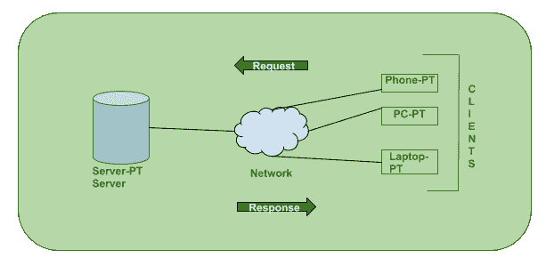
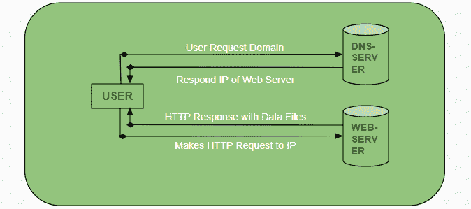

# 客户端-服务器模型

> 原文:[https://www.geeksforgeeks.org/client-server-model/](https://www.geeksforgeeks.org/client-server-model/)

客户机-服务器模型是一种分布式应用程序结构，它在资源或服务的提供者(称为服务器)和服务请求者(称为客户机)之间划分任务或工作负载。在客户端-服务器架构中，当客户端计算机通过互联网向服务器发送数据请求时，服务器接受请求的进程，并将请求的数据包发送回客户端。客户不共享他们的任何资源。客户端-服务器模式的例子有电子邮件、万维网等。

**客户端-服务器模型是如何工作的？**
在本文中，我们将深入到**客户端-服务器**模型中，看看**互联网**是如何通过网络浏览器工作的。这篇文章将帮助我们有一个坚实的网络基础，并帮助我们轻松地使用网络技术。

*   **客户:**当我们谈论**客户**这个词时，它指的是使用特定服务的个人或组织。类似地，在数字世界中，**客户端**是计算机(**主机**)，即能够从服务提供商(**服务器**)接收信息或使用特定服务。
*   **服务器:**同样，当我们谈论**服务器**这个词时，它指的是提供某物的人或媒介。类似地，在这个数字世界中，**服务器**是一台提供信息(数据)或访问特定服务的远程计算机。

所以，基本上是**客户端**请求什么，而**服务器**只要它存在于数据库中就提供服务。

**浏览器如何与服务器交互？**
与客户端的服务器进行交互需要遵循的步骤很少。

*   用户输入网站或文件的**网址**(统一资源定位符)。浏览器然后请求**域名系统**(域名系统)服务器。
*   **域名系统服务器**查找**网络服务器**的地址。
*   **DNS 服务器**用**网络服务器**的 **IP 地址**响应。
*   浏览器通过 **HTTP/HTTPS** 请求发送到**网络服务器的 IP** (由**域名系统服务器**提供)。
*   服务器发送网站的必要文件。
*   浏览器随后呈现文件并显示网站。这个渲染是在 **DOM** (文档对象模型)解释器、 **CSS** 解释器和 **JS 引擎**的帮助下完成的，统称为 **JIT** 或(适时)编译器。

**客户端-服务器模式的优势:**

*   所有数据集中在一个地方的集中式系统。
*   节约成本需要更少的维护成本，并且数据恢复是可能的。
*   客户端和服务器的容量可以分别更改。

**客户端-服务器模式的缺点:**

*   如果存在于服务器中或上传到服务器中，客户端容易感染病毒、特洛伊木马和蠕虫。
*   服务器容易受到拒绝服务攻击。
*   数据包在传输过程中可能被欺骗或修改。
*   网络钓鱼或获取用户的登录凭证或其他有用信息是常见的，MITM(中间人)攻击也很常见。