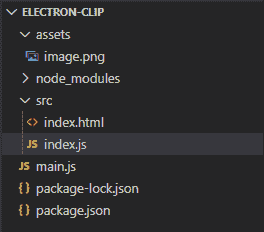
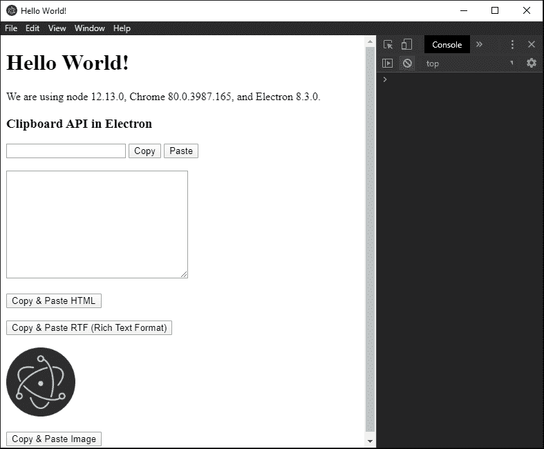

# 电子 JS 中的剪贴板 API

> 原文:[https://www.geeksforgeeks.org/clipboard-api-in-electronjs/](https://www.geeksforgeeks.org/clipboard-api-in-electronjs/)

**[electronijs](https://www.geeksforgeeks.org/introduction-to-electronjs/)**是一个开源框架，用于使用能够在 Windows、macOS 和 Linux 操作系统上运行的 **HTML** 、 **CSS** 和 **JavaScript** 等 web 技术构建跨平台原生桌面应用。它将 Chromium 引擎和 **[NodeJS](https://www.geeksforgeeks.org/introduction-to-nodejs/)** 结合成一个单一的运行时。

有时，开发人员希望对基本的系统行为(如复制和粘贴操作)进行更精细的控制。为此，Electron 为我们提供了使用内置**剪贴板**模块访问系统剪贴板的途径。使用**剪贴板**模块，开发人员可以使用该模块的不同实例方法，为不同格式提供复制和粘贴功能，如**图像文件**、**纯文本**、 **HTML 标记**等。本教程将演示电子版剪贴板应用编程接口支持的不同操作。

我们假设您熟悉上述链接中介绍的先决条件。电子要工作， **[节点](https://www.geeksforgeeks.org/introduction-to-nodejs/)** 和 **[npm](https://www.geeksforgeeks.org/node-js-npm-node-package-manager/)** 需要预装在系统中。

*   **项目结构:**
    

**电子中的剪贴板 API:****剪贴板**模块用于对系统剪贴板进行复制粘贴操作。系统剪贴板在整个系统操作系统环境中使用，因此在电子应用程序中执行的任何复制粘贴操作在整个系统操作系统中都有效。**剪贴板**模块可以直接在应用的**主进程**和**渲染器进程**中使用。因此我们不需要电子**远程**模块来导入它。

**示例:**按照给出的步骤在 electronic 中实现剪贴板 API。

*   **Step 1:** Navigate to an Empty Directory to setup the project, and run the following command,

    ```
    npm init
    ```

    生成**包. json** 文件。安装 **[电子](https://www.geeksforgeeks.org/introduction-to-electronjs/)** 如果没有安装，使用 npm。

    ```
    npm install electron --save
    ```

    该命令还将创建**包-lock.json** 文件，并安装所需的**节点 _ 模块**依赖项。一旦电子安装成功，打开**包. json** 文件，并在**脚本**键下执行必要的更改。将您选择的任何图像文件复制到**资产**文件夹中，并将其命名为**image.png**。在本教程中，我们将使用电子标志作为****image.png****文件。
    **package.json:**

    ```
    {
      "name": "electron-clip",
      "version": "1.0.0",
      "description": "Clipboard API in Electron",
      "main": "main.js",
      "scripts": {
        "start": "electron ."
      },
      "keywords": [
        "electron"
      ],
      "author": "Radhesh Khanna",
      "license": "ISC",
      "dependencies": {
        "electron": "^8.3.0"
      }
    }

    ```

*   **Step 2:** Create a **main.js** file according to the project structure. This file is the **Main Process** and acts as an entry point into the application. Copy the Boilerplate code for the **main.js** file as given in the following [link](https://www.electronjs.org/docs/tutorial/first-app#electron-development-in-a-nutshell). We have modified the code to suit our project needs.

    **main.js:**

    ```
    const { app, BrowserWindow } = require('electron')

    function createWindow () {

      // Create the browser window.
      const win = new BrowserWindow({
        width: 800,
        height: 600,
        webPreferences: {
          nodeIntegration: true
        }
      })

      // Load the index.html of the app.
      win.loadFile('src/index.html')

      // Open the DevTools.
      win.webContents.openDevTools()
    }

    // This method will be called when Electron 
    // has finished initialization and is ready 
    // to create browser windows. Some APIs can 
    // only be used after this event occurs. This 
    // method is equivalent to 'app.on('ready', function())'
    app.whenReady().then(createWindow)

    // Quit when all windows are closed.
    app.on('window-all-closed', () => {

      // On macOS it is common for applications and 
      // their menu bar to stay active until the user 
      // quits explicitly with Cmd + Q
      if (process.platform !== 'darwin') {
        app.quit()
      }
    })

    app.on('activate', () => {

        // On macOS it's common to re-create a window
        // in the app when the dock icon is clicked and
        // there are no other windows open.
      if (BrowserWindow.getAllWindows().length === 0) {
        createWindow()
      }
    })

    // In this file, you can include the rest of your 
    // app's specific main process code. You can also 
    // put them in separate files and require them here.
    ```

*   **Step 3:** Create the **index.html** file and **index.js** file within the **src** directory. We will also copy the Boilerplate code for the **index.html** file from the above-mentioned link. We have modified the code to suit our project needs.

    **index.html:**

    ```
    <!DOCTYPE html>
    <html>
      <head>
        <meta charset="UTF-8">
        <title>Hello World!</title>
        <!-- https://electronjs.org/docs/tutorial
                               /security#csp-meta-tag -->
        <meta http-equiv="Content-Security-Policy" 
              content="script-src 'self' 'unsafe-inline';" />
      </head>
      <body>
        <h1>Hello World!</h1>
        We are using node 
        <script>
            document.write(process.versions.node)
        </script>, Chrome 
        <script>
            document.write(process.versions.chrome)
        </script>, and Electron 
        <script>
            document.write(process.versions.electron)
        </script>.

        <h3>Clipboard API in Electron</h3>
        <input id="enter" type="text">
        <button id="copy">Copy</button>
        <button id="paste">Paste</button>

        <br><br>
        <textarea name="area" id="area" cols="30" rows="10"></textarea>

        <br><br>
        <button id="copyHtml">Copy & Paste HTML</button>

        <br><br>
        <button id="copyRtf">
            Copy & Paste RTF (Rich Text Format)
        </button>

        <br><br>
        
        <br><br>
        <button id="copyImage">Copy & Paste Image</button>

        <!-- Adding Individual Renderer Process JS File -->
        <script src="index.js"></script>
      </body>
    </html>
    ```

    **输出:**此时，我们的应用程序已经设置好了，我们可以启动应用程序来检查 GUI 输出。要启动电子应用程序，请运行命令:

    ```
    npm start
    ```

    

*   **Step 4:** The buttons do not have any functionality associated with them yet. To change this, add the following code in the **index.js** file,

    下面给出了代码中使用的**剪贴板**模块的所有实例方法的详细说明。有关剪贴板应用编程接口的更多详细信息，请参考此[链接](https://www.electronjs.org/docs/api/clipboard#clipboard)。
    **注**–在 **Linux** 环境中，还有一个**选择**剪贴板。要使用和操作**选择**剪贴板，我们可以简单地将值**选择**传递给支持它的**剪贴板**模块的所有实例方法。此外，根据官方电子文档，**剪贴板**模块提供的所有实验实例方法都可以在未来的电子更新中删除。

    *   **剪贴板.清除(类型)**此方法用于清除所有系统剪贴板内容。
        *   **类型:字符串(可选)**值可以是**选择** **(Linux)** 或**剪贴板**。默认值为**剪贴板**。
    *   **剪贴板. availableFormats(type)** 此方法返回一个**字符串[]** ，代表给定剪贴板**类型**的所有支持的格式，如**文本/html** 、**文本/纯文本**等。
        **注意**–该方法不返回在**窗口**中测试的一致值。它有时返回一个空数组，有时返回剪贴板类型支持的所有可能值的组合。根据官方电子文档，这不是预期的行为。
        *   **类型:字符串(可选)**值可以是**选择** **(Linux)** 或**剪贴板**。默认值为**剪贴板**。
    *   **剪贴板. writeText(文本，类型)**该方法将**文本**以纯文本格式写入剪贴板。此方法没有返回类型。该方法与 **Ctrl+C** 在**窗口**上触发的功能相同。在我们的代码中，该方法与**复制**按钮相关联。
        *   **文本:字符串**该值不能为空。
        *   **类型:字符串(可选)**值可以是**选择** **(Linux)** 或**剪贴板**。默认值为**剪贴板**。
    *   **剪贴板. readText(类型)**此方法以纯文本形式返回剪贴板的内容。它返回一个包含文本的**字符串**值。该方法与 **Ctrl+V** 在**窗口**上触发的功能相同。在我们的代码中，该方法与**粘贴**按钮相关联。
        *   **类型:字符串(可选)**值可以是**选择** **(Linux)** 或**剪贴板**。默认值为**剪贴板**。
    *   **剪贴板.写 HTML(标记，类型)**这个方法将**标记**字符串作为 HTML 标记写入剪贴板。此方法没有返回类型。在我们的代码中，这个方法是**复制&粘贴 HTML** 按钮的一部分。
        *   **标记:字符串**该值不能为空。
        *   **类型:字符串(可选)**值可以是**选择** **(Linux)** 或**剪贴板**。默认值为**剪贴板**。
    *   **clipboard.readHTML()** 此方法将剪贴板的内容作为 HTML 标记返回。它返回一个包含标记的**字符串**值。在我们的代码中，这个方法是**复制&粘贴 HTML** 按钮的一部分。
        **注意:**该方法并不总是返回在**窗口**中测试的 HTML 标记。即使我们将纯文本传递给 **clipboard.writeHTML()** 方法，该方法也只会以纯文本的形式返回值。根据官方电子文档，这不是预期的行为。
        *   **类型:字符串(可选)**值可以是**选择** **(Linux)** 或**剪贴板**。默认值为**剪贴板**。
    *   **剪贴板. writeRTF(文本，类型)**该方法将**文本**字符串作为 RTF(富文本格式)写入剪贴板。此方法没有返回类型。在我们的代码中，这个方法是**复制&粘贴 RTF(富文本格式)**按钮的一部分。
        *   **文本:字符串**该值不能为空。
        *   **类型:字符串(可选)**值可以是**选择** **(Linux)** 或**剪贴板**。默认值为**剪贴板**。
    *   **剪贴板. readRTF()** 该方法将剪贴板的内容作为 RTF 返回。它返回一个包含 RTF 的**字符串**值。在我们的代码中，这个方法是**复制&粘贴 RTF(富文本格式)**按钮的一部分。
        *   **类型:字符串(可选)**值可以是**选择** **(Linux)** 或**剪贴板**。默认值为**剪贴板**。
    *   **剪贴板. writeImage(image，type)** 此方法将一个**图像**写入剪贴板。此方法没有返回类型。在我们的代码中，这个方法是**复制&粘贴图像**按钮的一部分。
        *   **图像:NativeImage(可选)**图像需要是一个由 electronic**native image**API 使用的 **nativeImage** 才能写入剪贴板。如果该参数未通过，则使用 **null** 。我们使用 **nativeImage.createFromPath(路径)**方法在**资产**文件夹中创建了**image.png**文件的 **NativeImage** 对象。有关**nativeimage . createfrompath()**方法的更多详细信息，请参考此[链接](https://www.electronjs.org/docs/api/native-image#nativeimagecreatefrompathpath)。
        *   **类型:字符串(可选)**值可以是**选择** **(Linux)** 或**剪贴板**。默认值为**剪贴板**。
    *   **剪贴板. readImage(type)** 该方法将剪贴板的内容作为 **NativeImage** 图像对象返回。在我们的代码中，这个方法是**复制&粘贴图像**按钮的一部分。
        *   **类型:字符串(可选)**值可以是**选择** **(Linux)** 或**剪贴板**。默认值为**剪贴板**。

    **index.js:** 在该文件中添加以下代码片段。

    ```
    const electron = require('electron')

    // Importing the clipboard Module
    const clipboard = electron.clipboard;

    // Importing the nativeImage module 
    const nativeImage = electron.nativeImage

    var input = document.getElementById('enter');
    var copy = document.getElementById('copy');
    var paste = document.getElementById('paste');
    var area = document.getElementById('area');

    clipboard.clear();
    const formats = clipboard.availableFormats();
    console.log(formats);

    copy.addEventListener('click', () => {
        if (input.value) {
            clipboard.writeText(input.value);
            console.log('Copied Text Successfully')
        }
    });

    paste.addEventListener('click', () => {
        area.innerText = clipboard.readText();
        console.log('Pasted Text Successfully')
    });

    var copyHtml = document.getElementById('copyHtml');
    copyHtml.addEventListener('click', () => {
        clipboard.writeHTML('<b>Hello GeeksForGeeks</b>');

        console.log(clipboard.readHTML());
    });

    var copyRtf = document.getElementById('copyRtf');
    copyRtf.addEventListener('click', () => {
      clipboard.writeRTF('{\\rtf1\\ansi{\\fonttbl\\f0\\fswiss Helvetica;}' + 
        '\\f0\\pard\nThis is some {\\b bold} text.\\par\n}')

      console.log(clipboard.readRTF());
    });

    var copyImage = document.getElementById('copyImage');
    copyImage.addEventListener('click', () => {
        const image = nativeImage.createFromPath('/assets/image.png')
        clipboard.writeImage(image);
        console.log('Copied Image Successfully');

        console.log(clipboard.readImage());
    });
    ```

    **注意:**我们已经介绍了代码中使用的**剪贴板**模块的所有实例方法。此时，我们应该能够使用**剪贴板**模块执行复制和粘贴操作。然而，剪贴板应用编程接口支持更多的实例方法，这些方法将在下一步中演示。
    **输出:** 

*   **步骤 5:** 更多一些**剪贴板**模块支持的实例方法，
    *   **clipboard.has(format, type)** This method is an **Experimental** method. This method is used to check whether a particular format is supported by the clipboard or not. It returns a **Boolean**.
        *   **格式:字符串**该值不能为空。要检查的格式。我们可以传递任何值，例如纯文本、HTML 标记、RTF 或 **NativeImage** 对象。
        *   **类型:字符串(可选)**值可以是**选择** **(Linux)** 或**剪贴板**。默认值为**剪贴板**。

        **注意**–该方法并不总是返回在**窗口**中测试的正确值。即使我们传递一个剪贴板支持的格式，返回值也是**假**。根据官方电子文档，这不是预期行为。

    *   **剪贴板. read(格式)**这个方法是**实验**方法。此方法用于从剪贴板中读取格式类型。它返回一个包含格式类型的**字符串**值。
        *   **格式:字符串**该值不能为空。要检查的格式。我们可以传递任何值，例如纯文本、HTML 标记、RTF 或 **NativeImage** 对象。
    *   **剪贴板. writeBookmark(标题、url、类型)**此方法仅在 **Windows** 和 **macOS** 中支持。该方法将**标题**和 **url** 作为书签写入剪贴板。
        **注意:**此方法在**窗口**中没有达到预期效果。此外，大多数**窗口**应用程序不支持在其中粘贴书签。更多详细信息，请参考[链接](https://www.electronjs.org/docs/api/clipboard#clipboardwritebookmarktitle-url-type-macos-windows)。
        *   **标题:字符串**该值不能为空。书签的标题。
        *   **网址:字符串**该值不能为空。书签的 url。
        *   **类型:字符串(可选)**值可以是**选择** **(Linux)** 或**剪贴板**。默认值为**剪贴板**。
    *   **剪贴板. readBookmark()** 此方法仅在 **Windows** 和 **macOS** 中支持。此方法返回一个对象，该对象包含标题**和 URL**作为关键字，表示使用**剪贴板. writeBookmark()** 方法写入剪贴板的书签。当书签不可用时，**标题**和 **url** 键将返回为空。****
    *   **clipboard . writefindtext(text)**此方法仅在 **macOS** 中支持。此方法将**文本**写入**中，找到**粘贴板作为纯文本。**查找**粘贴板保存关于活动应用程序的查找面板粘贴板的当前状态的信息。更多详细信息，请参考[链接](https://www.electronjs.org/docs/api/clipboard#clipboardwritefindtexttext-macos)。从**渲染器进程**调用时，该方法使用同步 [IPC](https://www.geeksforgeeks.org/inter-process-communication-ipc-in-electronjs/) 。
    *   **剪贴板. readFindText()** 此方法仅在 **macOS** 中支持。它从**查找**粘贴板返回一个文本作为**字符串**。从**渲染器进程**调用时，该方法使用同步 [IPC](https://www.geeksforgeeks.org/inter-process-communication-ipc-in-electronjs/) 。该值最初在应用程序最初处于非活动状态时缓存，并在应用程序再次激活时从查找粘贴板中重新读取。
    *   **剪贴板. write(数据，类型)**这个方法用于借助**数据**对象将不同格式的数据集中写入剪贴板。然后可以使用各自的读取方法分别读取不同的格式值，或者使用**剪贴板读取()**方法共同读取，该方法简单地返回包含各种非空键的**数据**对象。任何最初未写入剪贴板或为空的格式都将作为空字符串返回。
        *   **类型:字符串(可选)**值可以是**选择** **(Linux)** 或**剪贴板**。默认值为**剪贴板**。
        *   **数据:对象**它可以保存以下参数。
            *   **文本:字符串(可选)**纯文本格式的字符串。
            *   **html:字符串(可选)**HTML 标记格式的字符串
            *   **rtf:字符串(可选)**RTF 格式的字符串。
            *   **图像:NativeImage(可选)**图像需要是一个由 electronic**native image**API 使用的 **nativeImage** 对象。如果该参数未通过，则使用 **null** 。

**注:**电子**剪贴板**模块到此结束。**剪贴板**模块不支持任何实例事件或静态方法。