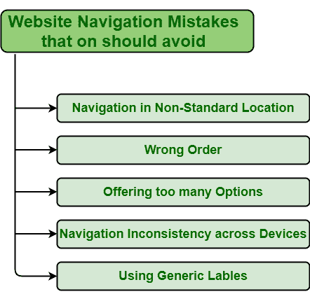

# 你应该避免的常见网站导航错误

> 原文:[https://www . geesforgeks . org/common-网站-导航-错误-你应该-避免/](https://www.geeksforgeeks.org/common-website-navigation-mistakes-you-should-avoid/)

网站导航基本上是一个导航网站的过程，是网站设计必不可少的一部分。因此，在探索品牌时，网站导航非常重要。用户或访问者应该很容易浏览网站。每当用户访问网站时，人们需要确保访问者或用户应该能够以最简单和最充分的方式访问他们正在寻找的网页的内容和信息。人们通过导航在网站上找到他们想要的信息。轻松简单的导航让用户更轻松地导航和浏览网站，让他们更了解产品、服务等。这反过来增加了产品价值和品牌对观众的吸引力。

**确保更好网站导航的失误:**网站导航是增加用户体验的关键因素。如果网站导航不容易，太复杂，或者设计不当，那么你可能会失去你的访问者或用户。为了让网站更好，导航应该很容易。导航不畅只会导致网站用户减少，SEO 排名下降等。网站导航不畅，就无法实现他们的目标。因此，为了使网站导航简单、清晰和直观，在设计网站时需要避免一些常见的错误。一些错误如下:

**1。将导航放在非标准位置:**将导航条放在标准站点非常重要，可以使网站易于使用，导航简单。导航菜单基本上是一组链接，这些链接是网站设计中非常重要的元素，允许用户快速访问网站中的任何信息。因此，把网站放在一个标准的网站上是非常重要的。如果用户无法在他们认为会出现的地方找到信息，那么他们可能不会进一步查看。

**2。错误顺序:**开头和结尾的项目非常重要和有效，因为这些是网站导航中关注度最高的地方。网站导航通常像一张路线图，帮助用户访问网站内的任何地方。因此，内容或项目的正确顺序非常重要。所以，避免把重要的链接放在菜单列表的中间。

**3。提供多种选择:**提供多种选择是人们经常犯的一个常见错误。人们给出了很多选择，这样他们就可以帮助用户，并使其更加有效，但事实上，这并没有帮助用户，反而使其更加混乱和难以导航。给出太多的选项会使从可用选项中进行选择变得更加困难，并且需要更多的时间来做出选择。因此，人们应该避免提供太多的选择，事实上，提供更少但有效和最佳的选择，以鼓励用户做出最佳选择并提高用户体验。

**5。设备间导航不一致:**是否从智能手机、平板电脑、台式机、笔记本电脑等访问网站。，在导航上要有一致性。导航的不一致性使得用户很难理解，也很难在网站中导航。因此，应该避免犯这样的错误。拥有一个在所有设备上导航一致的网站非常重要。无论使用何种设备查看网站，主要控制和导航都应保持不变。

**5。使用通用标签:**标签对于与用户交流内容和解释网站的部分非常重要。因此，使用每个企业都使用的通用标签，如产品和服务，对与用户或访问者沟通没有任何帮助。人们应该避免使用与其他商业网站相同的标签。尽量使导航具体化。