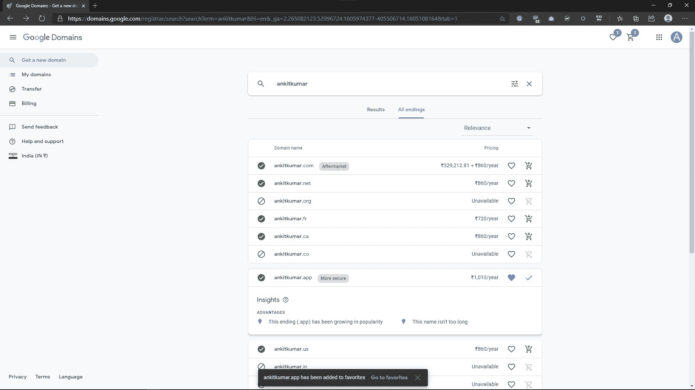
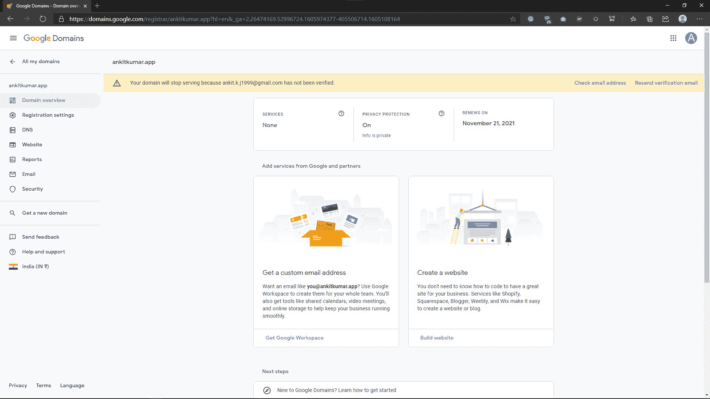
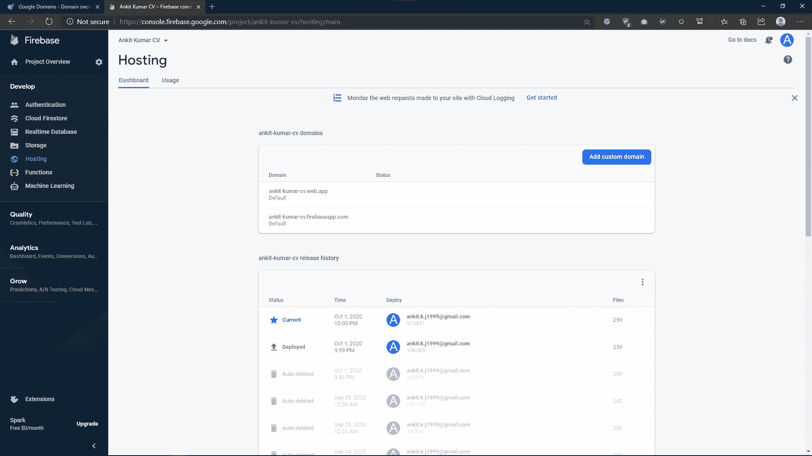
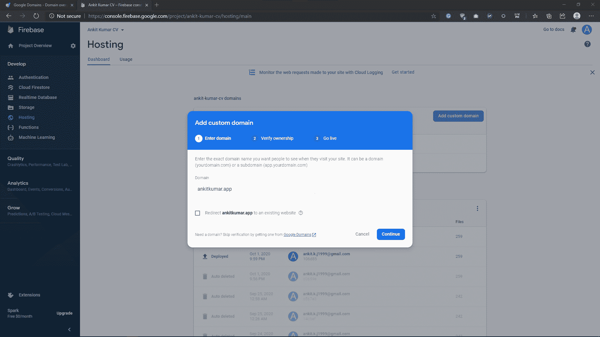
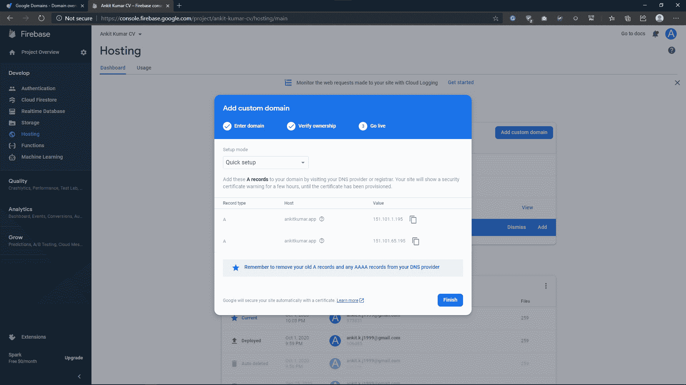
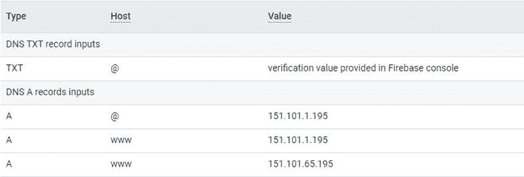
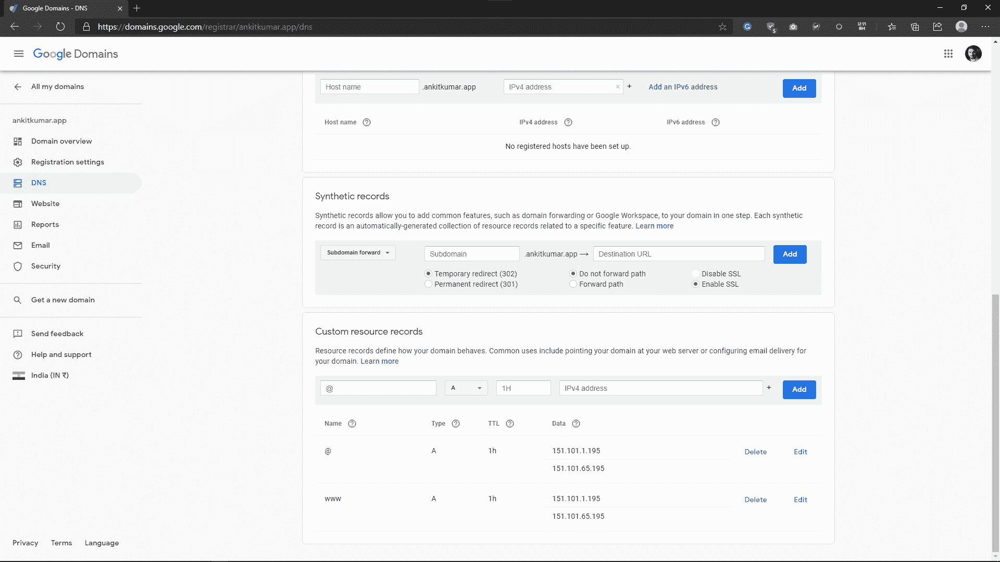
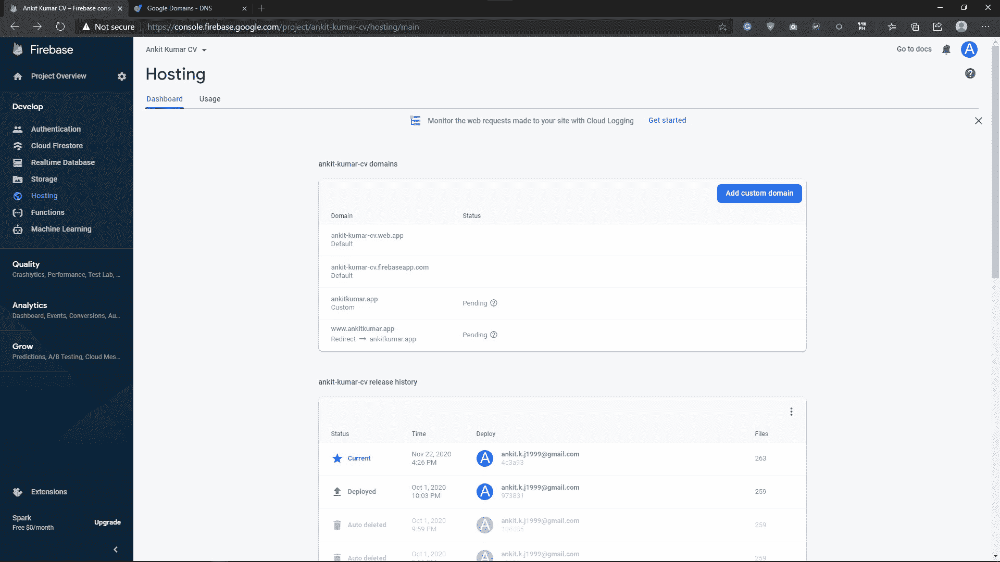
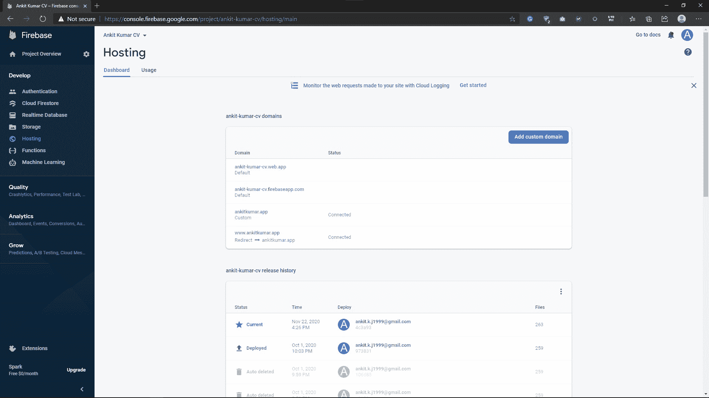

# 将自定义域连接到 Firebase 上托管的网站

> 原文:[https://www . geeksforgeeks . org/connecting-custom-domain-to-site-hosted-on-firebase/](https://www.geeksforgeeks.org/connecting-custom-domain-to-website-hosted-on-firebase/)

[Firebase](firebase.google.com) 是免费托管静态网站的最佳平台之一。当我们有一个网站托管在 firebase 上，我们得到两个域分配给它。例如，已经在 firebase 上托管的我的投资组合网站的项目 id 是“ **ankit-kumar-cv** ”，因此分配给它的 URL 是:

*   project-id . web . app→ankit-Kumar-cv . web . app
*   项目 id fire base app . com→ankit-Kumar-cv . fire base app . com

现在所有这些信息都可以在 **Firebase 控制台→项目仪表盘→托管选项卡**上看到。除了这两个领域，如果我们想给网站分配一个我们选择的领域，我们也可以这样做。这里我们将看到一步一步的过程中添加一个自定义域在 firebase 主机。

在将域添加到 firebase 宿主之前，需要满足两个要求:

1.  firebase 上托管的网站。就我而言，它是 ankit-kumar-cv.web.app。
2.  一个领域。有很多域名注册商，比如 GoDaddy、NameCheap、hostinger 等等。但在这里，我们将从谷歌本身购买我的域名。从谷歌购买域名有很多好处。

### **第一步:购买域名**

首先，我们需要去 domains.google.com 搜索你想看谷歌推荐的名字。如果你想坚持你选择的名字，点击所有结束标签。选择可用的并将其添加到购物车中。

您可以进入购物车页面，选择付款方式结账。签出后，您将进入此页面。它会要求你验证你的电子邮件。完成验证后，该域就是您的了。

你可以点击域名系统标签。因为那里还会有其他的变化。

### **第二步:将域添加到 Firebase 宿主**

#### **步骤 2.1:添加域**

去[console.firebase.google.com](https://console.firebase.google.com/)，选择项目。点击主机选项卡。应该是这样的。

单击添加自定义域按钮。会出现这样一个表单，要求您添加域。

添加您购买的域，然后单击继续。

#### **步骤 2.2 验证所有权**

由于 firebase 和域名注册机构都是谷歌的产品，我们不需要验证 firebase 的域名所有权。但是，如果我们使用任何其他注册的域名，如 GoDaddy 或 Namecheap，这一步是强制性的。和其他步骤一样，一点也不难。这种情况下只需要在域注册器的 DNS 管理页面中添加 **TXT** 类型的自定义记录即可。这个过程通常需要大约 5-12 个小时，可以延长到 24 小时。

#### **第 2.3 步上线**

当我们的域名在屏幕上被自动验证时，你可以看到我们直接从第一步跳到了第三步。在这一步中，我们将把我们的域连接到 firebase 主机。要将我们的域连接到主机，有两种方法:

*   快速设置:是针对新网站，第一次添加域名。
*   高级:对于已经在另一个平台上托管的网站。

在**连接域**窗口中，有两条 **A** 记录需要添加到注册服务商的域名系统页面，如果存在任何其他 **A** 或 **AAAA** 记录，则应将其删除。

如果我们简单地尝试添加两个 A 类型的自定义域记录，那么我们会得到一个*已经在使用*的错误。我们能做的就是参考这张图表。这就是我们应该如何添加自定义资源记录。要查看其他注册服务商的表格，请单击此处的。

我就是这样做的。为了确保一切顺利，我在 A 型记录中加入了主机 **@** 和 **www** 的 IP。

完成后，您可以单击连接域窗口上的完成，它将显示挂起状态，如下所示。

设置可能需要大约 24 小时，但就我而言，只需要两个小时。连接完成后，状态将从*待定*变为*已连接。*

连接完成后，您可以点击“喜欢”来访问您托管的网站。这里我们增加了 ankitkumar.app 和 www.ankitkumar.app(这里 *www。是*子域)到 firebase 同时托管的过程没什么不同你只需要输入 *www* 。在添加域名的时候和休息的时候是一样的。

托管网站

有关向 firebase 主机添加自定义域的更多信息，请单击此处的。