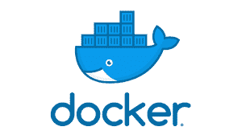
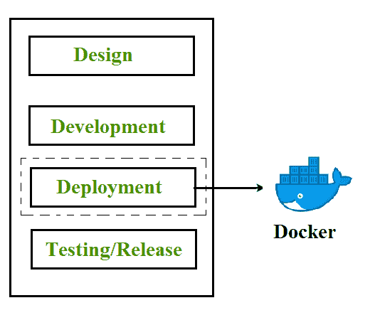
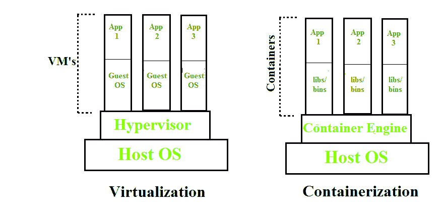
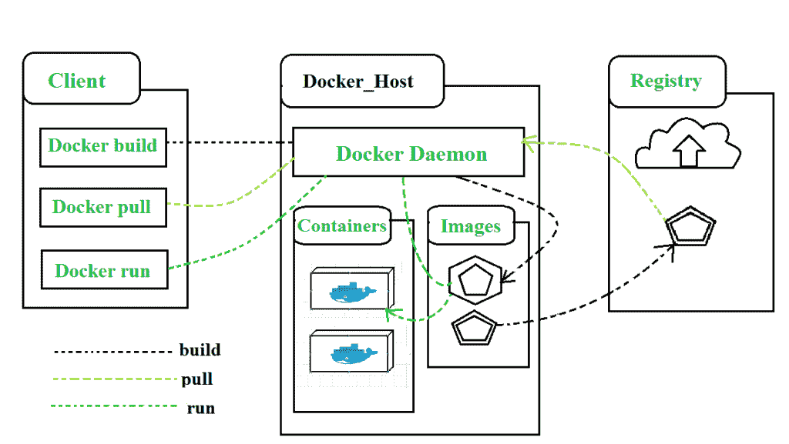
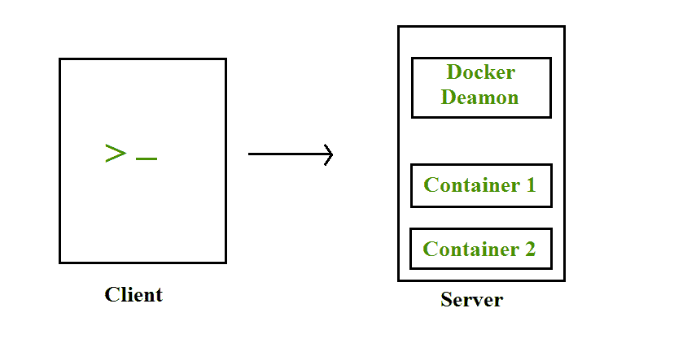
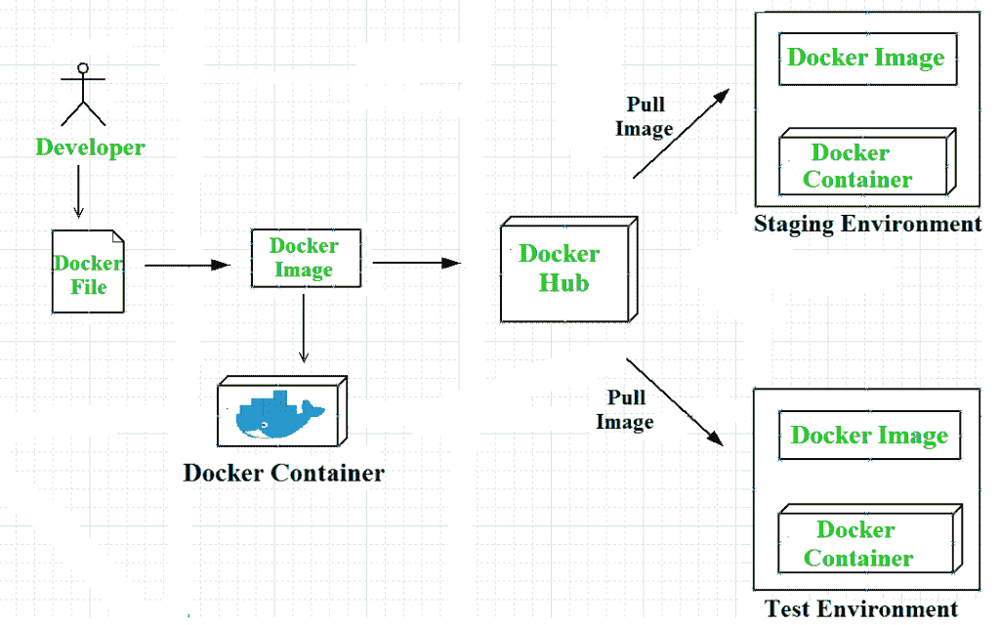
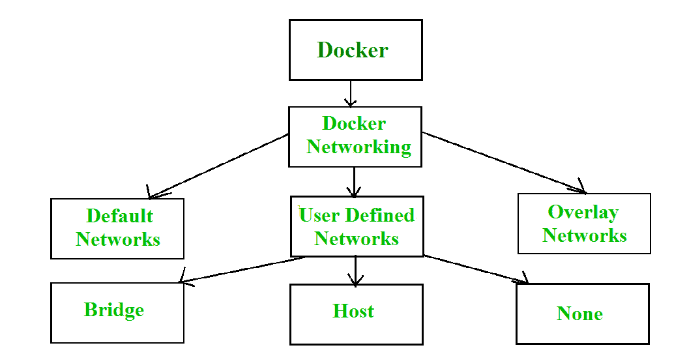
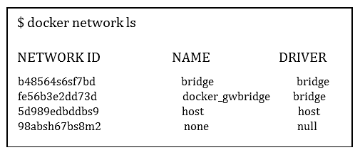

# 使用码头工人进行集装箱化

> 原文:[https://www . geeksforgeeks . org/集装箱化-使用-docker/](https://www.geeksforgeeks.org/containerization-using-docker/)

**Docker** 是容器化平台，用于以容器的形式将您的应用程序及其所有依赖项打包在一起，以确保您的应用程序能够在任何环境下无缝工作，无论是开发环境还是测试环境还是生产环境。Docker 是一种工具，旨在通过使用容器更容易地创建、部署和运行应用程序。



Docker 是世界领先的软件容器平台。它于 2013 年由一家名为 Dotcloud，Inc .的公司推出，该公司后来更名为 Docker，Inc .它是用 Go 语言编写的。Docker 推出才六年，但社区已经从虚拟机转向了它。Docker 旨在使开发人员和系统管理员受益，使其成为许多 DevOps 工具链的一部分。开发人员可以编写代码，而不用担心测试和生产环境。系统管理员无需担心基础设施，因为 Docker 可以轻松地扩大和缩小系统数量。Docker 在软件开发周期的部署阶段发挥作用。



## 集装箱化

容器化是基于操作系统的虚拟化，它在用户空间中创建多个虚拟单元，称为容器。容器共享相同的主机内核，但通过操作系统级别的私有名称空间和资源控制机制相互隔离。与虚拟机管理程序相比，基于容器的虚拟化在虚拟化和隔离方面提供了不同的抽象级别。虚拟机管理程序使用大量硬件，这导致了虚拟化硬件和虚拟设备驱动程序方面的开销。在每个虚拟机实例中，一个完整的操作系统(例如，Linux、Windows)运行在这个虚拟化硬件之上。
但是相比之下，容器在操作系统级别实现了进程的隔离，从而避免了这样的开销。这些容器运行在底层主机的同一个共享操作系统内核之上，每个容器中可以运行一个或多个进程。在容器中，您不必预分配任何内存，它是在创建容器期间动态分配的，而在虚拟机中，您需要首先预分配内存，然后创建虚拟机。与虚拟机相比，容器化具有更好的资源利用率和更短的启动过程。这是虚拟化的下一个发展。

容器几乎可以在任何地方运行，非常易于开发和部署:在 Linux、Windows 和 Mac 操作系统上；在虚拟机或裸机上、在开发人员的机器上或在内部的数据中心中；当然，在公共云中。容器在操作系统级别虚拟化了 CPU、内存、存储和网络资源，为开发人员提供了逻辑上与其他应用程序隔离的操作系统沙箱视图。Docker 是目前最流行的开源容器格式，在谷歌云平台和谷歌 Kubernetes Engine 上都支持。



## 码头工人建筑

Docker 架构由 Docker 客户端、在 Docker 主机上运行的 Docker 守护程序和 Docker Hub 存储库组成。Docker 具有客户端-服务器架构，其中客户端使用 REST APIs、Socket IO 和 TCP 的组合与 Docker 主机上运行的 Docker 守护程序进行通信。如果我们必须构建 Docker 映像，那么我们使用客户端执行 Docker Daemon 的构建命令，然后 Docker Daemon 基于给定的输入构建一个映像，并将其保存到 Docker 注册表中。如果您不想创建映像，那么只需从客户端执行拉取命令，然后 Docker Daemon 将从 Docker Hub 拉取映像，最后，如果我们想要运行映像，那么从客户端执行运行命令，这将创建容器。



## Docker 的组件

Docker 的主要组件包括–Docker 客户端和服务器、Docker 映像、Docker 文件、Docker 注册表和 Docker 容器。这些组件将在下一节详细解释:

1.  **Docker 客户端和服务器**–Docker 采用客户端-服务器架构。Docker 守护程序/服务器由所有容器组成。码头工人守护程序/服务器通过命令行界面或休息应用编程接口从码头工人客户端接收请求，并相应地处理请求。Docker 客户端和 Daemon 可以在同一台主机上，也可以在不同的主机上。



1.  **Docker 图像**–Docker 图像通过使用只读模板来构建 Docker 容器。每个图像的基础都是基础图像，例如–Ubuntu 14.04 LTS，Fedora 20。也可以从头开始创建基础映像，然后通过修改将所需的应用程序添加到基础映像中，因此创建新映像的过程称为“提交更改”。
2.  **Docker 文件**–Docker File 是一个文本文件，包含一系列关于如何构建 Docker 映像的说明。此图像包含所有项目代码及其依赖项。相同的 Docker 图像可用于旋转“n”个容器，每个容器对底层图像进行修改。最终的映像可以上传到 Docker Hub，并在各个协作者之间共享，以便进行测试和部署。您需要在 Docker 文件中使用的命令集有 FROM、CMD、ENTRYPOINT、VOLUME、ENV 等等。
3.  **Docker 注册表**–Docker 注册表是 Docker 映像的存储组件。我们可以将图像存储在公共/私有存储库中，以便多个用户可以协作构建应用程序。Docker Hub 是 Docker 自己的云存储库。Docker Hub 被称为公共注册中心，在这里每个人都可以拉取可用的图像并推送自己的图像，而无需从头开始创建图像。
4.  **Docker Containers**– Docker Containers are runtime instances of Docker images. Containers contain the whole kit required for an application, so the application can be run in an isolated way. For eg.- Suppose there is an image of Ubuntu OS with NGINX SERVER when this image is run with docker run command, then a container will be created and NGINX SERVER will be running on Ubuntu OS. 



## 复合坞站

Docker Compose 是一个工具，我们可以用它创建一个多容器应用程序。它使配置和
运行由多个容器组成的应用程序变得更加容易。例如，假设您有一个需要 WordPress 和 MySQL 的应用程序，您可以创建一个文件来启动两个容器作为服务，而不需要单独启动每个容器。我们在 YAML 文件中定义了一个多容器应用程序。使用 docker-compose up 命令，我们可以在前台启动应用程序。Docker-compose 将在当前文件夹中查找 docker-compose.yaml 文件来启动应用程序。通过向 docker-compose up 命令添加-d 选项，我们可以在后台启动应用程序。为 WordPress 应用程序创建 docker-compose.yaml 文件:

```html
#cat docker-compose.yaml
version: ’2’
services:
db:
image: mysql:5.7
volumes:db_data:/var/lib/mysql
restart: always
environment:
MYSQL_ROOT_PASSWORD: wordpress
MYSQL_DATABASE: wordpress
MYSQL_USER: wordpress
MYSQL_PASSWORD: wordpress
wordpress:
depends_on:
- db
image: wordpress:latest
ports:
- "8000:80"
restart: always
environment:
WORDPRESS_DB_HOST: db:3306

WORDPRESS_DB_PASSWORD: wordpress
volumes:
db_data:
```

在这个 docker-compose.yaml 文件中，我们有 WordPress 容器的以下端口部分，这意味着我们将把主机的 8000 端口映射到容器的 80 端口。以便主机可以使用其 IP 地址和端口号访问应用程序。

## 码头网络公司

默认情况下，当我们创建并运行一个容器时，Docker 会自动为其分配一个 IP 地址。大多数情况下，需要根据我们的需求创建和部署 Docker 网络。所以，Docker 让我们按照我们的要求来设计网络。有三种类型的 Docker 网络-默认网络、用户定义网络和覆盖网络。



要获得 Docker 创建的所有默认网络的列表，我们运行如下所示的命令–



Docker 中有三种类型的网络–

1.  **桥接网络**:在没有–network 参数的情况下创建新的 Docker 容器时，Docker 默认将容器与桥接网络连接。在桥接网络中，单个主机中的所有容器都可以通过它们的 IP 地址相互连接。当 Docker 主机的跨度为一个时，即当所有容器在单个主机上运行时，就会创建桥接网络。我们需要一个覆盖网络来创建一个跨越多个 Docker 主机的网络。
2.  **主机网络**:当使用–network = Host 参数创建一个新的 Docker 容器时，它会将该容器推入运行 Docker 守护程序的主机网络堆栈中。主机的所有接口都可以从分配给主机网络的容器中访问。
3.  **无网络**:当使用–network = None 参数创建新的 Docker 容器时，它会将 Docker 容器放入自己的网络堆栈中。因此，在这个无网络中，没有为容器分配任何 IP 地址，因此它们无法相互通信。

我们可以将任何一个网络分配给 Docker 容器。“docker run”命令的–network 选项用于为容器分配特定的网络。

```html
$docker run --network ="network name"
```

要获得特定网络的详细信息，我们使用命令-

```html
$docker network inspect "network name"
```

## Docker 的优势–

由于 Docker 容器提供的好处，Docker 现在变得流行起来。Docker 的主要优势有:

1.  **速度**–Docker 容器相对于虚拟机的速度非常快。构建一个容器所需的时间非常快，因为它们很小而且很轻。由于容器很小，开发、测试和部署可以更快地完成。容器一旦构建完成，就可以被推送到测试环境中。
2.  **可移植性**–构建在 docker 容器中的应用程序是极其可移植的。这些便携式应用程序可以作为一个单一的元素轻松地移动到任何地方，它们的性能也保持不变。
3.  **可扩展性**–Docker 具有可以部署在多个物理服务器、数据服务器和云平台中的能力。它也可以在每台 Linux 机器上运行。容器可以很容易地从云环境移动到本地主机，然后再从本地主机快速移动到云环境。
4.  **密度**–Docker 更高效地使用可用资源，因为它不使用虚拟机管理程序。这就是与虚拟机相比，单个主机上可以运行更多容器的原因。Docker Containers 具有更高的性能，因为它们的密度很高，没有资源的开销浪费。