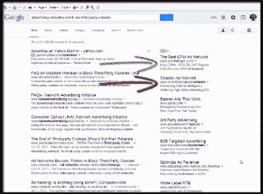

# 一个网站是如何使用 cookies 的？

> 原文:[https://www.geeksforgeeks.org/cookies-used-website/](https://www.geeksforgeeks.org/cookies-used-website/)

**什么是饼干？**

Cookies 是存储在用户计算机上的小文件。它们用于保存特定客户端和网站的少量数据，可以由网络服务器或客户端计算机访问

当 cookies 被发明时，它们基本上是包含关于你和你的偏好的信息的小文档。例如，当您选择您想要查看网站的语言时，网站会将信息保存在您计算机上称为 cookie 的文档中，下次您访问网站时，它将能够读取之前保存的 cookie。这样，网站就可以记住您的语言，并让您以自己喜欢的语言查看网站，而不必再次选择语言。
一个 cookie 可以包含任何类型的信息，比如你访问网站的时间、你添加到购物篮中的项目、你在网站中点击的所有链接等。,

**谁可以访问？**

如果一个 cookie 是在一个特定的网站上创建的，而您稍后访问另一个网站，后者将无法读取第一个网站的内容，换句话说，只有将信息保存到 cookie 中的同一个网站才能访问它。

**互联网 Cookies 的类型**

**会话 cookie:**会话 cookie 只持续用户使用网站的持续时间。网络浏览器通常会在退出时删除会话 cookies。如果用户在服务器选择的时间段内没有访问网站(空闲超时)，会话 cookie 将过期。它们只持续我们在现场的时间。如果有人来使用我们的计算机，他们将无法在使用会话 cookies 的网站上看到任何内容，因为他们需要再次输入用户名和密码。

**持久 cookie:**持久 cookie 比用户会话更持久。如果持久 cookie 的最大期限为 1 年，那么在一年内，每次用户访问服务器时，cookie 中设置的初始值都会被发送回服务器。这可以用来记录一条重要的信息，比如用户最初是如何来到网站的。因此，持久 cookie 也称为跟踪 cookie。这些是在需要知道我们是谁的网站上使用的一种 cookies，但是当您输入用户名和密码时，它为我们提供了“记住我”的能力。
**示例:** Gmail。

**第三方 cookie:**第三方 cookie 是设置了不同于地址栏中显示的域的 cookie。例如，如果你要去 Sendflowers.com，它可能会为 SomeAdvertiser.com 的地址设置 cookie。后来，当你访问 RebuidEngines.com 时，它可能会为 SomeAdvertiser.com 做好准备。这两种饼干都将被 SomeAdvertiser.com 用来确定你是一个送花和在汽车上工作的人。这些广告是由广告公司使用的，他们的客户为展示产品和服务的广告付费，但不想浪费钱向不打算成为客户的人展示这些广告。

**HTTP cookie:**当你向服务器发送请求时，服务器会发送一个回复，在回复中嵌入 cookie，作为识别用户的标识符。所以，下次当你访问同一个网站时，cookie 会让服务器知道你又在访问这个网站了。
 **相关文章:**[Java 中的 Javax.servlet.http.Cookie 类](https://www.geeksforgeeks.org/javax-servlet-http-cookie-class-java/)
本文由**婆罗门赛**投稿。如果你喜欢 GeeksforGeeks 并想投稿，你也可以使用[contribute.geeksforgeeks.org](http://www.contribute.geeksforgeeks.org)写一篇文章或者把你的文章邮寄到 contribute@geeksforgeeks.org。看到你的文章出现在极客博客主页上，帮助其他极客。

如果你发现任何不正确的地方，或者你想分享更多关于上面讨论的话题的信息，请写评论。