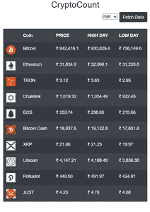
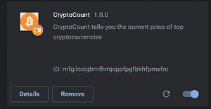
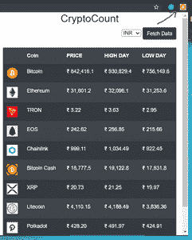

# 创建加密货币价格跟踪 Chrome 扩展

> 原文:[https://www . geesforgeks . org/create-a-crypto-currency-price-tracking-chrome-extension/](https://www.geeksforgeeks.org/create-a-crypto-currency-price-tracking-chrome-extension/)

构建一个 Chrome 扩展需要你对 HTML、CSS、JavaScript 和 Bootstrap 有所了解。在本文中，我们将进行扩展，跟踪各种加密货币的价格。为了获取有关加密货币价格的数据，我们将使用名为[加密比较](https://www.cryptocompare.com/)的应用编程接口。

**什么是 API？**

API 代表应用程序编程接口。基本上，它是一个信使，接受我们的请求并相应地返回响应。应用编程接口也有端点。端点是一个网址，允许应用编程接口访问服务器的某些部分并相应地检索数据。一个应用编程接口以 JSON (JavaScript 对象符号)的形式返回数据，JSON 是键值对的形式。

让我们开始构建加密货币价格跟踪器！！！

**构建用户界面-**

首先，我们将创建两个名为**popup.html**和 **popup.js** 的文件(我们为什么将它们命名为 popup 将在后面说明。现在在 popup.html 内部，我们将创建扩展的基本用户界面。首先添加 HTML 的基本样板代码，然后在正文部分添加如下所示的代码:-

## 超文本标记语言

```html
<!DOCTYPE html>
<html lang="en">

<head>
    <meta charset="UTF-8">
    <meta name="viewport" content=
        "width=device-width, initial-scale=1.0">

    <!--Add Bootstrap CDN link here-->
    <title>CryptoCount</title>

    <style>
        html,
        body {
            font-family: "Open Sans", sans-serif;
            font-size: 14px;
            margin: 0;
            min-height: 600px;
            padding: 0;
            width: 500px;
        }
    </style>
</head>

<body>
    <div class="container">
        <h2 class="text-center">CryptoCount</h2>
        <div class="text-right  pb-4">
            <select id="select1">
                <option value="INR">INR</option>
                <option value="USD">USD</option>
                <option value="EUR">EUR</option>
                <option value="BTC">BTC</option>
            </select>
            <button class="btn btn-dark changeData">
                Fetch Data
            </button>
        </div>
        <table class="table table-striped 
            table-dark data-back">
        </table>
    </div>

    <script src="popup.js"></script>
</body>

</html>
```

这段代码将添加标题 CryptoCount(这是我们给它命名的，你可以随意命名)和一个下拉列表，该列表包含 4 个选项来更改我们将从 CryptoCompare API 获取的数据的货币。添加了一个按钮，它将从应用编程接口中获取数据，我们将使用 JavaScript 将获取的数据动态添加到表元素中。

**添加一些 JavaScript–**

在我们的 **popup.js** 文件中，我们将添加一个 IFFE 函数，基本上这个函数会在加载 DOM 后立即被调用。我们将使用的获取数据的 API 是:-[https://min-api.cryptocompare.com/data/top/totalvolfull?limit = 10&tsym = INR&API _ KEY = { your _ API _ KEY 到这里](https://min-api.cryptocompare.com/data/top/totalvolfull?limit=10&tsym=INR&api_key={your_API_KEY goes here}) }。这个 IFFI 函数将呈现数据，你可以通过做一个 console.log(响应)来检查。

## java 描述语言

```html
document.querySelector(".changeData")
    .addEventListener("click", changeData);

const getDataAndRender =
    (function getData(currency = "INR") {
        const xhr = new XMLHttpRequest();
        const url = 
"min-api.cryptocompare.com/data/top/totalvolfull";
        xhr.open("GET", 
`https://{url}?limit=10&tsym=${currency}&api_key={API_KEY}`,
        true);

        let output = "<tr>
            <td>
                <b></b>
            </td>
            <td>
                <b>Coin</b>
            </td>
            <td>
                <b>PRICE</b>
            </td>
            <td>
                <b>HIGH DAY</b>
            </td>
            <td>
                <b>LOW DAY</b>
            </td>
        </tr>";

xhr.onload = function () {
    if (this.status === 200) {
        const response = JSON.parse(this.responseText);
        const dataArr = response.Data;
        dataArr.forEach(function (data) {
            const name = data.CoinInfo.FullName;
            const imgURL = data.CoinInfo.ImageUrl;
            const price = data.DISPLAY.INR.PRICE;
            console.log(typeof data.CoinInfo.FullName);
            const img = 
            `https://www.cryptocompare.com/${imgURL}`;
            const highDay = data.DISPLAY.INR.HIGHDAY;
            const lowDay = data.DISPLAY.INR.LOWDAY;
            output += 
` <tr><td></td>
            <td>${name}</td>
            <td>${price}</td>
            <td>${highDay}</td>
            <td>${lowDay}</td></tr>`
        })
        document.querySelector(
            ".data-back").innerHTML = output;
    }
}
xhr.send();

}) ();
```

现在，我们已经将数据记录到控制台中，我们可以看到我们能够成功地从应用编程接口获取数据。现在是时候将这些数据反映到我们扩展的用户界面中了。为此，我们将选择类名为 data-back 的 DOM 元素。现在，我们将插入包含 元素的输出变量，参数包括图像、名称、价格(您可以从应用编程接口获得大量信息，但为了简单起见，我们将只使用图像网址、名称、硬币价格)。现在使用代码行–document . queryselector(")将它添加到 DOM 中。数据返回”)。innerHTML =输出；

这就是我们的用户界面的样子–



用户界面

现在我们将实现动态改变货币类型的功能。为了实现这一点，我们将获得下拉列表中的字段值。默认情况下，货币类型是卢比。为了获取下拉列表中的货币类型，我们将创建一个名为 getCurrency()的函数。

## java 描述语言

```html
function getCurrency() { 
    const selectElement =document.querySelector('#select1'); 

    const output = selectElement.value; 

    // console.log("get" ,output);
    return output;
}
```

当有人选择货币类型时，getCurrency 方法会返回是“INR”、“USD”、“BTC”还是“EUR”。现在，我们将通过将端点从 INR(默认端点)更改为从列表中选择的值来进行新的 API 调用。

## java 描述语言

```html
function changeData(){

    const newOutput=getCurrency();
    console.log(newOutput);
    document.querySelector(".data-back").innerHTML="";

    getDataNew(newOutput);
}
```

单击“获取数据”按钮将触发“更改数据”方法，该方法将首先清除 DOM 中已经存在的内容，并将具有新货币类型的新表元素插入到 DOM 中，还将进一步调用两个函数，一个函数将告知货币类型，另一个函数将向 DOM 中插入具有已更改货币类型的新表。函数 getDataNew 的实现与上面讨论的 getData 函数的实现相同。这个加密货币价格跟踪器的开发部分已经结束。现在我们将对它进行 chrome 扩展。

**制作 Chrome 扩展–**为了制作 Chrome 扩展，我们需要一个 **manifest.json** 文件，该文件的创建如下所示–

## java 描述语言

```html
{
    "manifest_version":2,
    "name":"CryptoCount",
    "description":"CryptoCount tells you 
        the current price of top cryptocurrencies",
    "version":"1.0.0",
    "icons":{"128":"favicon.png"},
    "browser_action":{
        "default_icon":"favicon.png",
        "default_popup":"popup.html"
    },
    "permissions":["activeTab"]
}
```

这是根据[https://developer.chrome.com/extensions/manifest](https://developer.chrome.com/extensions/manifest)的文档创建清单文件的方法。将这个文件和 popup.html，popup.js 文件放入一个文件夹中。我们根据文档将它们命名为 popup.js 和 popup.html。创建一个名为 images 的文件夹，并将您想要显示的图像放在 Google Chrome 的 Chrome 扩展栏中。

现在有两种方法可以上传到 chrome 商店–

1.一种方法是支付 5 美元的费用并创建一个开发者账户。

2.另一种是上传到 chrome 商店的免费方式，如下所示

*   在你的 Chrome 浏览器的网址中，输入 [chrome://extensions/](//extensions/)
*   现在打开开发者模式。
*   现在点击左上角的按钮**装载拆封。**
*   将出现一个弹出栏，要求您上传上面创建的文件。
*   上传文件，你就可以走了



这是你上传完文件后会看到的内容。现在转到 Chrome 扩展栏，您将能够看到自己的 Chrome 扩展，并能够访问它。

