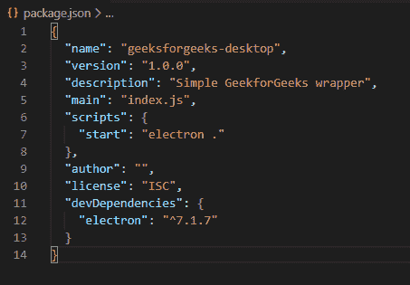
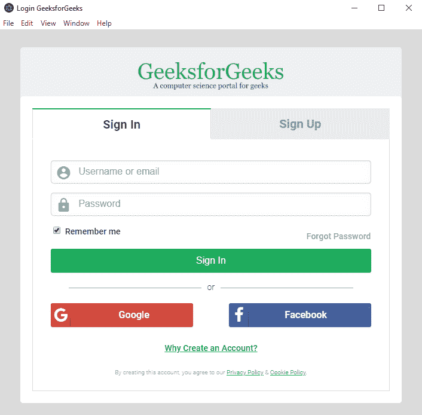
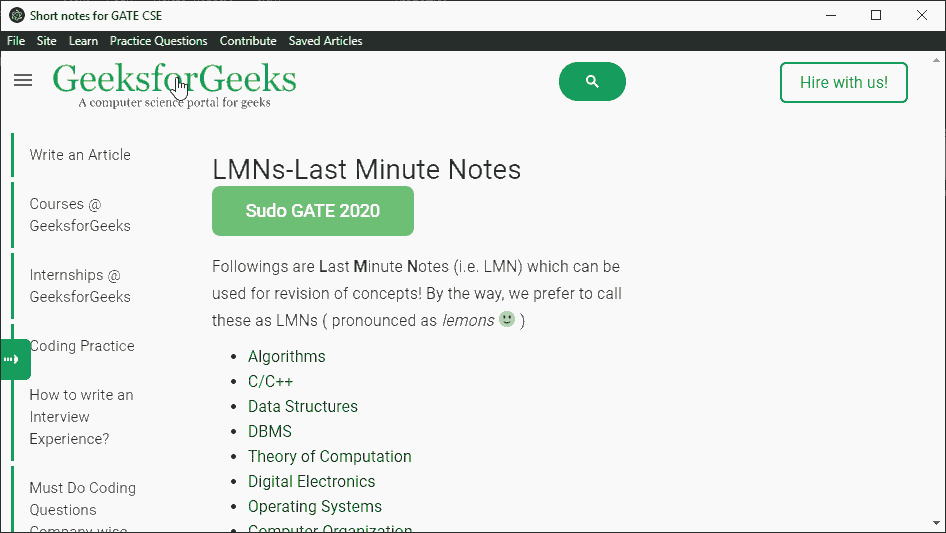
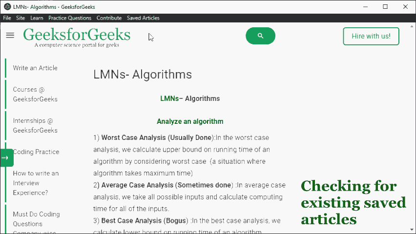
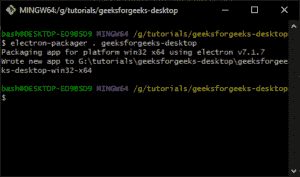
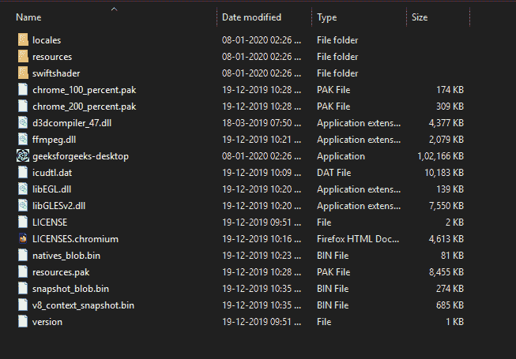

# 使用电子版

创建极客 forgesforgeks 包装应用程序

> 原文:[https://www . geesforgeeks . org/create-a-geesforgeeks-wrapper-application-use-electronic/](https://www.geeksforgeeks.org/create-a-geeksforgeeks-wrapper-application-using-electron/)

**electronic**是一个开源且独立于平台的框架，用于使用 Chromium 引擎和 Node.js 的强大功能创建**原生桌面**应用程序。

我们将使用 Electron 创建一个简单的应用程序，作为 GeeksforGeeks 网站的包装器。它能够快速导航到网站的重要部分，在需要时单独打开“在线集成开发环境”，并保存以后可以离线阅读的文章。

它利用了电子框架的各种特性，包括浏览器窗口、本地菜单、文件处理和打包应用程序以供分发。

**先决条件:**

*   运行一个电子应用程序需要 **Node.js 运行时**。这包括像 **npm** 这样的工具来帮助构建和安装所需的包。[在 Windows 上安装 node . js](https://www.geeksforgeeks.org/installation-of-node-js-on-windows/)。
*   **HTML、CSS、JavaScript** 知识
*   [**电子**T3】和](https://www.geeksforgeeks.org/introduction-to-electronjs/) [Node.js](https://www.geeksforgeeks.org/introduction-to-nodejs/) 入门知识

**初始化一个新的节点项目:**

1.  导航到要创建项目的位置。打开命令提示符，使用以下命令初始化新项目:

    ```html
    npm init
    ```

2.  按照命令提示窗口中的要求填写项目的详细信息。这将创建一个 *package.json* 文件，该文件指示将用于运行应用程序的所有库。
3.  使用以下 npm 命令安装电子包:

    ```html
    npm install electron
    ```

4.  Open the **package.json** file and change the “scripts” portion to the following:

    ```html
    "scripts": {
        "start": "electron ."
      }

    ```

    这使得通过 npm 实用程序运行我们的应用程序变得很容易。

    

**创建电子基本结构:**我们从创建应用程序的基本结构开始。**索引. js** (或在**包. json** 中配置的相应文件)是电子可执行文件尝试启动应用程序的入口点。我们将在 **index.js** 文件中定义应用程序结构，代码如下:

*   **程序:**

    ```html
    const { app, BrowserWindow } = require('electron')

    // Global variable that holds the app window
    let win

    function createWindow() {

      // Creating the browser window
      win = new BrowserWindow({
        width: 960,
        height: 540,
      })

      // Load a redirecting url from
      // login to the feed
      win.loadURL(
    'https://auth.geeksforgeeks.org/?to=https://auth.geeksforgeeks.org/profile.php')

      win.on('closed', () => {
        win = null
      })

      // Prevent from spawning new windows
      win.webContents.on('new-window', (event, url) => {

        event.preventDefault()
        win.loadURL(url)
      })
    }

    // Executing the createWindow function
    // when the app is ready
    app.on('ready', createWindow)
    ```

*   **应用程序可以使用以下命令运行:**

    ```html
    npm start
    ```

*   **输出:**
    

**说明:**

*   我们已经用窗口的尺寸定义了一个**浏览器窗口**，并使用**加载 URL()** 方法加载了网站的登录页面。浏览器窗口就像嵌入在我们应用程序中的浏览器，可以用来浏览网页。
*   无论何时运行这个应用程序，它都会创建一个浏览器窗口的实例，并将指定的网址加载到窗口中。

**创建菜单:**电子应用程序具有创建菜单项的功能，这些菜单项将在应用程序的菜单栏中本地显示。这些可以链接到单击它们时将发生的操作。

菜单最初是从一个模板创建的，该模板定义了每个菜单和子菜单应该如何显示以及它们的角色是什么。我们的菜单有 6 个部分:

*   **文件:**可以选择保存当前页面，也可以退出应用。
*   **网站:**可以选择登录和注销网站。
*   **学习:**它有选项到已经写文章的网站各个部分。
*   **练习题:**它可以选择在单独的窗口中打开 Online IDE，也可以根据问题的难度直接进入问题。
*   **投稿:**它有各种选项对应文章对网站的投稿。
*   **保存的文章:**允许访问之前保存的所有文章。

所有的网址都直接来自极客网站。“保存的页面”部分留空，以便以后更新。通过创建浏览器窗口的新实例并在其中加载网址，为在线集成开发环境创建了一个单独的窗口。

**最终模板菜单代码如下:**

*   **Program:**

    ```html
    let menu_template = [
      {
        label: 'File',
        submenu: [
          {
            label: 'Save Page Offline',
            click() {
              savePageOffline()
            }
          },
          { type: 'separator' },
          {
            label: 'Exit',
            click() {
              app.quit()
            }
          }
        ]
      },
      {
        label: 'Site',
        submenu: [
          {
            label: 'Login',
            click() {
              win.loadURL(
    "https://auth.geeksforgeeks.org")
            }
          },
          {
            label: 'Logout',
            click() {
              win.loadURL(
    "https://auth.geeksforgeeks.org/logout.php")
            }
          },
        ]
      },
      {
        label: 'Learn',
        submenu: [
          {
            label: 'Quiz Corner',
            click() {
              win.loadURL(
    "https://www.geeksforgeeks.org/quiz-corner-gq/")
            }
          },
          {
            label: 'Last Minute Notes',
            click() {
              win.loadURL(
    "https://www.geeksforgeeks.org/lmns-gq/")
            }
          },
          {
            label: 'Interview Experiences',
            click() {
              win.loadURL(
    "https://www.geeksforgeeks.org/company-interview-corner/")
            }
          },
          {
            label: 'Must-Do Questions',
            click() {
              win.loadURL(
    "https://www.geeksforgeeks.org/must-do-coding-questions-for-companies-like-amazon-microsoft-adobe/")
            }
          }
        ]
      },
      {
        label: 'Practice Questions',
        submenu: [
          {
            label: 'Online IDE',
            click() {

              // Creating new browser window for IDE
              ide_win = new BrowserWindow({
                width: 800,
                height: 450,
              })

              ide_win.loadURL(
    "https://ide.geeksforgeeks.org")

              // Delete this window when closed
              ide_win.on('closed', () => {
                ide_win = null
              })
            }
          },
          { type: 'separator' },
          {
            label: 'Easy Questions',
            click() {
              win.loadURL(
    "https://practice.geeksforgeeks.org/explore/?difficulty[]=0&page=1")
            }
          },
          {
            label: 'Medium Questions',
            click() {
              win.loadURL(
    "https://practice.geeksforgeeks.org/explore/?difficulty[]=1&page=1")
            }
          },
          {
            label: 'Hard Questions',
            click() {
              win.loadURL(
    "https://practice.geeksforgeeks.org/explore/?difficulty[]=2&page=1")
            }
          },
          { type: 'separator' },
          {
            label: 'Latest Questions',
            click() {
              win.loadURL(
    "https://practice.geeksforgeeks.org/recent.php")
            }
          }
        ]
      },
      {
        label: 'Contribute',
        submenu: [
          {
            label: 'Write New Article',
            click() {
              win.loadURL(
    "https://contribute.geeksforgeeks.org/wp-admin/post-new.php")
            }
          },
          {
            label: 'Pick Suggested Article',
            click() {
              win.loadURL(
    "https://contribute.geeksforgeeks.org/request-article/request-article.php#pickArticleDiv")
            }
          },
          {
            label: 'Write Interview Experience',
            click() {
              win.loadURL(
    "https://contribute.geeksforgeeks.org/wp-admin/post-new.php?interview_experience")
            }
          }
        ]
      },
      {
        id: 'saved',
        label: 'Saved Articles',
        submenu: []
      }
    ]
    ```

    **说明:**

    *   我们将首先导入**菜单**和**菜单**名称空间。这些包含了我们将要使用的方法的定义。
    *   **标签**属性定义了每个项目的文本。**子菜单**属性指定单击菜单项时将打开的子菜单项数组。
    *   在每个标签之后，可以定义单击子菜单时将发生的操作。例如，我们将使用 **loadURL()** 方法加载网站的其他部分。每当用户点击一个子菜单，它将执行这个方法，网站的一个新部分将被加载。
    *   定义了一个变量，该变量保存将从模板构建的菜单。**菜单**命名空间有方法 **buildFromTemplate()** 和 **setApplicationMenu()** 来使用我们应用程序中创建的菜单。

        ```html
        // Build the template and use the menu
        const menu = Menu.buildFromTemplate(menu_template)
        Menu.setApplicationMenu(menu)
        ```

        

    菜单栏和子菜单

    

    独立窗口中的在线集成开发环境

    **添加保存页面的功能:**我们现在将添加保存页面到磁盘的功能，以便以后即使没有互联网连接也可以访问。我们将首先定义存放物品的位置。我们可以获取当前的工作目录，并为保存的页面创建一个文件夹。

    ```html
    const savedFolder = __dirname + '\\saved\\'
    ```

    有三个功能可以共同保存和检索文章:

    **appendItemToMenu(文件名)函数:**

    *   该函数将给定的页面标题添加到“已保存的页面”子菜单中，并对其进行链接，以便在用户单击页面时加载页面。
    *   使用 *getApplicationMenu()* 方法检索当前激活的菜单。
    *   然后使用 *append()* 方法添加一个新的 MenuItem。这个 MenuItem 构造函数被赋予了将显示为标签的文件名，以及单击它时将发生的功能。
    *   它会自动更新当前菜单，最新的页面可以立即使用。
    *   **代号:**

        ```html
        function appendItemToMenu(filename) {
          curr_menu = Menu.getApplicationMenu()
                .getMenuItemById("saved").submenu

          curr_menu.append(
            new MenuItem({
              label: path.basename(filename, '.html'),
              click() {
                console.log('Saved page opened')
                win.loadFile(savedFolder + path.basename(filename))
              }
            }))
        }
        ```

    **保存页面离线()功能:**

    *   该函数将整个页面以及所有图像和样式表保存到磁盘。
    *   文件名是使用返回当前页面标题的 *getTitle()* 方法确定的。
    *   *contents.savePage()* 方法，将获取当前网页并将其保存到给定位置，标题如上。
    *   它还调用上面更新菜单的 **appendItemToMenu()** 。
    *   **代号:**

        ```html
        function savePageOffline() {
          pageTitle = win.getTitle()
          console.log("Saving:", pageTitle)

          win.webContents.savePage(savedFolder + pageTitle + 
                        '.html', 'HTMLComplete').then(() => {
            appendItemToMenu(pageTitle + '.html');
            console.log('Page was saved successfully.')
          }).catch(err => {
            console.log(err)
          })
        }
        ```

    **getSavedArticles()函数:**

    *   这个函数检索给定文件夹中的所有文件，然后将它们添加到菜单中。
    *   它使用 *readdirSync()* 方法返回“保存”文件目录中的所有文件名。
    *   检查文件名，以便只有扩展名为“.html”被考虑。
    *   然后将这些传递给 **appendItemToMenu()** 功能，以便为每个保存的项目更新菜单。
    *   **代号:**

        ```html
        function getSavedArticles() {
          fs.readdirSync(savedFolder).forEach(file => {
            if (path.extname(file) == '.html') {
              appendItemToMenu(file)
            }
          });
        }
        ```

    **保存页面脱机()**功能从“文件”菜单的“保存页面脱机”中调用。 **getSavedArticles()** 函数在浏览器窗口创建期间被调用，以便前面的页面立即可用。每当保存新页面时，都会调用 **appendItemToMenu()** 函数。这允许无缝保存和检索可以离线阅读的文章。

    

    保存页面并检索保存的页面

    **打包应用程序:**由于 electronic 是一个独立于平台的框架，因此应用程序可以使用单个代码库在所有主要平台上运行。电子社区已经创建了一个包，该包为各种支持的平台捆绑了一个完成的应用程序，并使其准备好分发。

    *   可以使用以下命令在命令行界面中全局安装电子打包工具:

    ```html
    npm install electron-packager -g
    ```

    *   电子打包器有以下语法:

    ```html
    electron-packager 
        <sourcedir> 
           <appname> --platform=<platform> 
           --arch=<architecture> [optional flags...]
    ```

    *   The ‘platform’ and ‘architecture’ could be specified if one is developing for a certain platform. Running the packager specifying only the ‘sourcedir’ and ‘appname’ will produce a bundle that could only be run on the host platform/architecture:

    ```html
    electron-packager . geeksforgeeks-desktop
    ```

    

    电子包装机

    

    windows 平台的最终打包应用程序

    **进一步阅读:**我们已经介绍了一个非常基本的应用，展示了电子的一些特性。该框架有更多的功能，可以集成在一起构建更复杂的应用程序。建议通过以下链接进一步阅读:

    *   官方电子[文档](https://electronjs.org/docs)
    *   用电子构建的应用集合:[电子应用](https://github.com/electron/apps)
    *   本应用的参考代码: [geeksforgeeks-desktop](https://github.com/sayantanm19/geeksforgeeks-desktop)