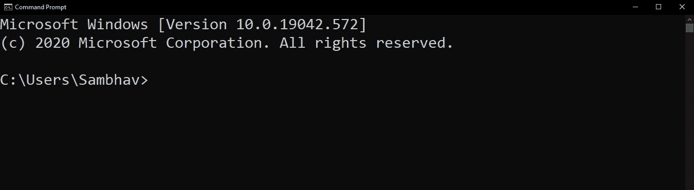
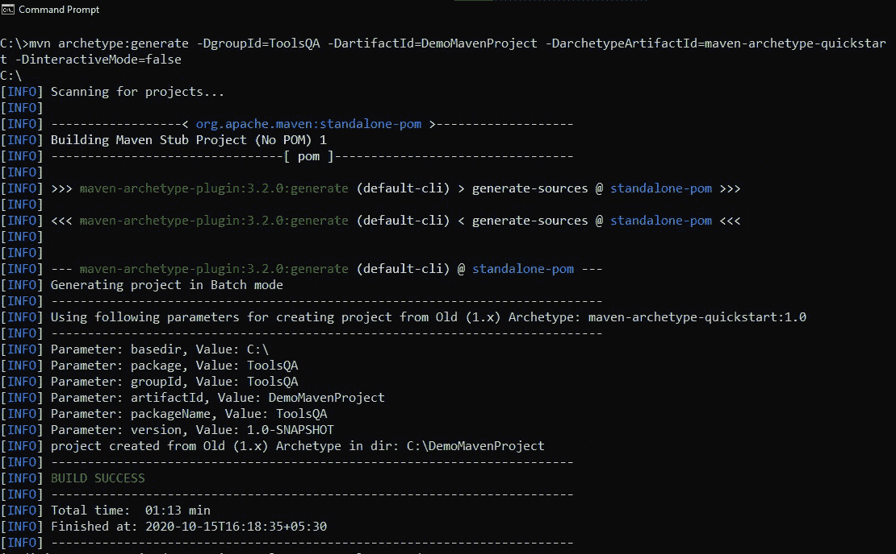
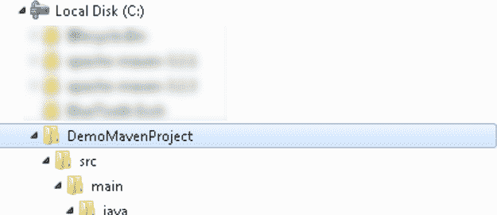

# 从命令提示符

创建新的 Maven 项目

> 原文:[https://www . geesforgeks . org/create-a-new-maven-project-from-command-prompt/](https://www.geeksforgeeks.org/create-a-new-maven-project-from-command-prompt/)

Maven 是基于 POM(项目对象模型)的强大项目管理工具。它用于项目构建、依赖和文档。它像 ANT 一样简化了构建过程。但是它比 ANT 先进太多了。
简而言之，maven 是一个可以用于构建和管理任何基于 Java 的项目的工具。Maven 使 Java 开发人员的日常工作变得更加容易，并且通常有助于理解任何基于 Java 的项目。

**从命令提示符创建新 Maven 项目的步骤:**

**第一步:打开运行，输入‘cmd’打开命令提示符。**



**第二步:使用‘CD’命令，你必须浏览到你想要设置你的项目的文件夹，然后输入下面的命令:**

> mvn 原型:generate-DgroupId = ToolsQA-DartifactId = DemoMavenProject-DarchetypeArtifactId =
> maven-原型-quick start-DinteractiveMode = false


在上面的命令中，您使用的是“DartifactId”，即您的项目名称和“DarchetypeArtifactId”是 Maven 项目的类型。有不同类型的 maven 项目，如 web 项目、java 项目等。

一旦您在键入上述命令后按回车键，它将开始创建 Maven 项目



**第三步:成功构建后，一次去项目位置查看新创建的 maven 项目。现在打开位于项目文件夹中的 pom.xml 文件。默认情况下，POM 是这样生成的:**

## 超文本标记语言

```html
<!---contributed by sambhav228------>
<project xmlns="https://maven.apache.org/POM/3.2.3"
xmlns:xsi="https://www.w3.org/2001/XMLSchema-instance"
    xsi:schemaLocation=
"https://maven.apache.org/POM/3.2.3 http://maven.apache.org/maven-v3_2_3.xsd">
    <modelVersion>4.0.0</modelVersion>
    <groupId>ToolsQA</groupId>
    <artifactId>DemoMavenProject</artifactId>
    <packaging>jar</packaging>
    <version>1.0-SNAPSHOT</version>
    <name>DemoMavenProject</name>
    <url>http://maven.apache.org</url>
    <dependencies>
        <dependency>
            <groupId>junit</groupId>
            <artifactId>junit</artifactId>
            <version>3.8.1</version>
            <scope>test</scope>
        </dependency>
    </dependencies>
</project>
```

**第四步:在 Maven 项目的文件夹结构中，你可以找到你的 DemoMavenProject。**

