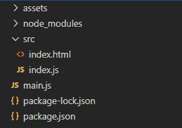
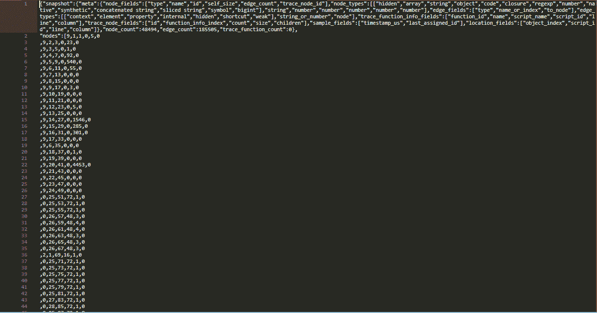
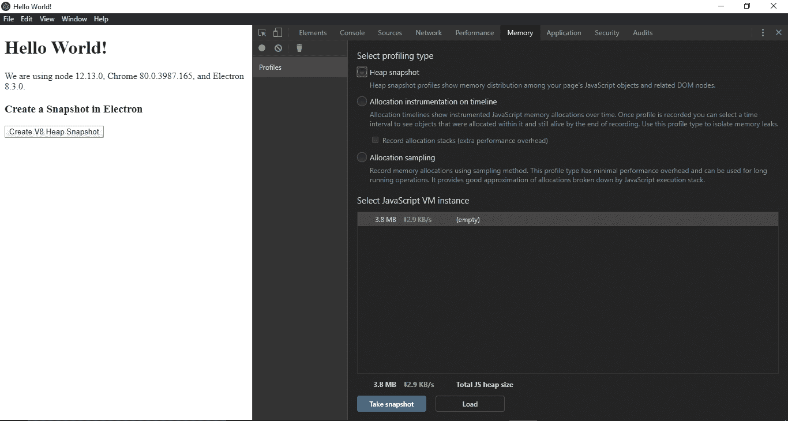

# 在电子 JS 中创建 V8 堆快照

> 原文:[https://www . geesforgeks . org/create-a-V8-heap-snapshot-in-electronijs/](https://www.geeksforgeeks.org/create-a-v8-heap-snapshot-in-electronjs/)

[**electronijs**](https://www.geeksforgeeks.org/introduction-to-electronjs/)是一个开源框架，用于使用能够在**Windows****macOS**和 **Linux** 操作系统上运行的 HTML、CSS 和 JavaScript 等 web 技术构建跨平台原生桌面应用。它将 Chromium 引擎和 [**NodeJS**](https://www.geeksforgeeks.org/introduction-to-nodejs/) 结合成一个单一的运行时。

[**NodeJS**](https://www.geeksforgeeks.org/introduction-to-nodejs/) 是一个使用 Chrome 的 V8 引擎的 JavaScript 运行时。NodeJS 有很多优点，这使得它成为包括 RESTful APIs 在内的后端解决方案的首选。然而，NodeJS 确实有一些与之相关的缺点。NodeJS 的主要缺点之一是由于繁重的计算任务而导致的性能瓶颈。这是因为 NodeJS 是单线程的。这导致处理速度慢，这就是为什么不建议使用 NodeJS 进行繁重的计算。在一个电子应用程序中，我们需要确保 NodeJS 不存在会进一步降低性能的**内存泄漏**。因此，Electron 为我们提供了一种方法，通过这种方法，我们可以使用**浏览器窗口**对象和**网络内容**属性的实例方法拍摄 V8 堆快照。然后，我们可以使用 Chrome **开发工具**使用这个堆来查找我们的电子应用程序中的内存泄漏。本教程将演示如何拍摄 V8 堆快照，并将其上传到 Chrome 开发工具，以便在电子应用程序中进行进一步检查。

我们假设您熟悉上述链接中介绍的先决条件。电子要工作， [**节点**](https://www.geeksforgeeks.org/introduction-to-nodejs/) 和 [**npm**](https://www.geeksforgeeks.org/node-js-npm-node-package-manager/) 需要预装在系统中。

*   **项目结构:**



**示例:**按照 [**中给出的步骤，在电子文档**](https://www.geeksforgeeks.org/drag-and-drop-files-in-electronjs/) 中拖放文件，设置基本的电子应用程序。复制文章中提供的 **main.js** 文件和**index.html**文件的样板代码。还要对**包. json** 文件进行必要的更改，以启动电子应用程序。我们将继续使用相同的代码库构建我们的应用程序。设置电子应用程序所需的基本步骤保持不变。

**package.json:**

```html
{
  "name": "electron-snapshot",
  "version": "1.0.0",
  "description": "Snapshot of Electron",
  "main": "main.js",
  "scripts": {
    "start": "electron ."
  },
  "keywords": [
    "electron"
  ],
  "author": "Radhesh Khanna",
  "license": "ISC",
  "dependencies": {
    "electron": "^8.3.0"
  }
}

```

根据项目结构创建**资产**文件夹。我们将使用**资产**文件夹作为默认路径来存储应用程序生成的 **V8 堆快照**文件。V8 堆快照文件的文件扩展名是**。heapsnapshot** 。
**输出:**此时，我们的基本电子应用程序就设置好了。启动应用程序后，我们应该会看到以下结果。

[](https://media.geeksforgeeks.org/wp-content/uploads/20200512225834/Output-1105.png)

**电子中的堆快照:****浏览器窗口**实例和**网站内容**属性是**主进程**的一部分。要在**渲染器进程**中导入和使用**浏览器窗口**，我们将使用电子**远程**模块。

*   **index.html**:在该文件中添加以下片段。创建 **V8 堆快照**按钮还没有任何相关功能。

## 超文本标记语言

```html
<h3>
  Create a Snapshot in Electron
</h3>
<button id="snap">
  Create V8 Heap Snapshot
</button>
```

*   **index.js** :在该文件中添加以下代码片段。

## java 描述语言

```html
const electron = require('electron')
const path = require('path')

// Importing BrowserWindow using Electron remote
const BrowserWindow = electron.remote.BrowserWindow;

let win = BrowserWindow.getFocusedWindow();

// let win = BrowserWindow.getAllWindows()[0];
const filepath = path.join(__dirname, '../assets/snap.heapsnapshot')

var snap = document.getElementById('snap');
snap.addEventListener('click', (event) => {
    win.webContents.takeHeapSnapshot(filepath)
        .then(console.log('V8 HeapSnapshot taken Successfully'))
        .catch(err => {
            console.log(err);
        });
});
```

**win . webcontents . takeheapsnapshot(文件路径)**实例方法只是获取应用程序内存的 V8 堆快照，并将其保存到给定的文件路径。这个实例方法返回一个**承诺**，当在给定的文件路径下成功创建快照文件时，这个承诺就被解决了。它接受以下参数。

*   **文件路径:字符串**该参数不能为空。它指定了我们想要保存生成的堆快照文件的文件路径。在我们的代码中，我们使用**路径**模块将生成的堆快照文件与文件名称一起保存到**资产**文件夹中。

要在**渲染器进程**中获取当前**浏览器窗口**实例，我们可以使用**浏览器窗口**对象提供的一些静态方法。

*   **BrowserWindow . getall windows():**这个方法返回一个活动/打开的 **BrowserWindow** 实例的数组。在这个应用程序中，我们只有一个活动的**浏览器窗口**实例，它可以直接从数组中引用，如代码所示。
*   **浏览器窗口. getFocusedWindow():** 此方法返回在应用程序中聚焦的**浏览器窗口**实例。如果没有找到当前浏览器窗口实例，则返回**空值**。在这个应用程序中，我们只有一个活动的**浏览器窗口**实例，可以使用这个方法直接引用它，如代码所示。

**输出:**启动应用程序后，我们应该会看到以下结果。

[](https://media.geeksforgeeks.org/wp-content/uploads/20200607034114/Output-1-GIF6.gif)

**snap.heapsnapshot** :

[](https://media.geeksforgeeks.org/wp-content/uploads/20200607034352/Output-2106.png)

**snap.heapsnapshot** 文件只是一组随机的数字。为了理解这个文件，我们需要把它上传到 Chrome **开发工具**中，这样我们就可以评估它的内存泄漏。按照给定的步骤将该文件上传到 Chrome 开发工具。

*   **第 1 步:**在电子应用程序中，启动 Chrome 开发工具，以防它们在应用程序启动时被禁用。我们可以使用快捷键 **Ctrl+Shift+I** 启动。在我们的代码中，我们在应用程序启动时使用**网络内容**属性的**win . webContents . opendevtools()**实例方法默认启用它们，该属性在 **main.js** 文件中指定。
*   **步骤 2:** 在开发工具中，转到**内存**选项卡，在**中选择分析类型**，选择**堆快照**选项。之后，点击**加载**按钮。这将打开本机文件系统对话框。

[](https://media.geeksforgeeks.org/wp-content/uploads/20200607035341/Output-386.png)

*   **第三步:**导航到我们存放**的地方。堆好**文件，点击**打开**。这将上传文件，我们现在可以在 Chrome **开发工具**中查看它。单击文件查看应用程序的统计信息。

**输出:** <video width="600" height="200" controls="" autoplay=""><source src="https://media.geeksforgeeks.org/wp-content/uploads/20200614131422/Output-211.mp4" type="video/mp4" class="aligncenter"></video> 

**注意:**我们也可以使用**进程**对象的**process . takeheapsnapshot(file path)**方法来创建一个电子应用程序的 V8 堆快照文件。电子中的**进程**对象是 [**节点进程**](https://nodejs.org/api/process.html) 对象的扩展，它提供了可在电子应用中使用的额外种类的实例方法和属性。