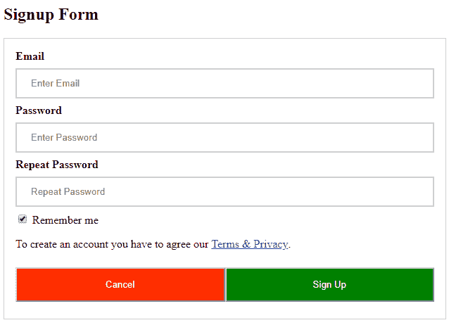
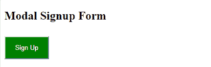
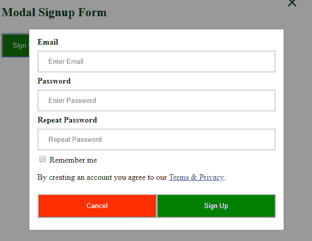

# 如何为网站创建响应性的模态注册表单？

> 原文:[https://www . geesforgeks . org/create-responsive-modal-sign-form-网站/](https://www.geeksforgeeks.org/create-responsive-modal-sign-form-website/)

**按照步骤使用 CSS 创建一个响应的注册表单。**
**第一步:添加 HTML**
使用“表单”元素处理输入。然后为每个字段添加输入(带有匹配标签)
**第二步:添加 CSS**
添加所需 CSS 设计登录页面尽量保持设计简洁。
**输入:**

## 超文本标记语言

```htmlhtml
<!DOCTYPE html>
<html>
<style>
    /*add full-width input fields*/

    input[type=text],
    input[type=password] {
        width: 100%;
        padding: 12px 20px;
        margin: 8px 0;
        display: inline-block;
        border: 2px solid #ccc;
        box-sizing: border-box;
    }
    /* set a style for all buttons*/

    button {
        background-color: Green;
        color: white;
        padding: 15px 20px;
        margin: 8px 0;
        cursor: pointer;
        width: 100%;
    }
    /*set styles for the cancel button*/

    .cancelbtn {
        padding: 15px 20px;
        background-color: #FF2E00;
    }
    /*float cancel and signup buttons and add an equal width*/

    .cancelbtn,
    .signupbtn {
        float: left;
        width: 50%;
    }
    /*add padding to container elements*/

    .container {
        padding: 16px;
    }
    /*clear floats*/

    .clearfix::after {
        content: "";
        clear: both;
        display: table;
    }
    /*styles for cancel button and signup button
      on extra small screens*/

    @media screen and (max-width: 300px) {
        .cancelbtn,
        .signupbtn {
            width: 100%;
        }
    }
</style>

<body>

    <h2>Signup Form</h2>
    <!--Step 1:Adding HTML-->
    <form action="/action_page.php" style="border:1px solid #ccc">
        <div class="container">
            <label><b>Email</b></label>
            <input type="text" placeholder="Enter Email" name="email" required>

            <label><b>Password</b></label>
            <input type="password" placeholder="Enter Password" name="psw" required>

            <label><b>Repeat Password</b></label>
            <input type="password" placeholder="Repeat Password" name="psw-repeat" required>
            <input type="checkbox" checked="checked"> Remember me
            <p>To create an account you have to agree our <a href="#">Terms & Privacy</a>.</p>

            <div class="clearfix">
                <button type="button" class="cancelbtn">Cancel</button>
                <button type="submit" class="signupbtn">Sign Up</button>
            </div>
        </div>
    </form>

</body>

</html>
```

**输出:**



**按照步骤创建响应性模态注册页面**
**步骤 1:添加 HTML。**
使用“表单”元素处理输入。然后为每个字段添加输入(带有匹配的标签)。
**第二步:添加 CSS。**
使用与上述示例相同的 CSS，但进行了某些模态修改:
**输入:**

## 超文本标记语言

```htmlhtml
<!DOCTYPE html>
<html>
<style>
    /*add full-width input fields*/
    input[type=text],
    input[type=password] {
        width: 100%;
        padding: 12px 20px;
        margin: 8px 0;
        display: inline-block;
        border: 2px solid #ccc;
        box-sizing: border-box;
    }
    /* set a style for all buttons*/
    button {
        background-color: green;
        color: white;
        padding: 14px 20px;
        margin: 8px 0;
        cursor: pointer;
        width: 100%;
    }
    /*set styles for the cancel button*/
    .cancelbtn {
        padding: 14px 20px;
        background-color: #FF2E00;
    }
    /*float cancel and signup buttons and add an equal width*/
    .cancelbtn,
    .signupbtn {
        float: left;
        width: 50%
    }
    /*add padding to container elements*/
    .container {
        padding: 16px;
    }
    /*define the modal’s background*/

    .modal {
        display: none;
        position: fixed;
        z-index: 1;
        left: 0;
        top: 0;
        width: 100%;
        height: 100%;
        overflow: auto;
        background-color: rgb(0, 0, 0);
        background-color: rgba(0, 0, 0, 0.4);
        padding-top: 60px;
    }
    /*define the modal-content background*/

    .modal-content {
        background-color: #fefefe;
        margin: 5% auto 15% auto;
        border: 1px solid #888;
        width: 80%;
    }
    /*define the close button*/

    .close {
        position: absolute;
        right: 35px;
        top: 15px;
        color: #000;
        font-size: 40px;
        font-weight: bold;
    }
    /*define the close hover and focus effects*/

    .close:hover,
    .close:focus {
        color: red;
        cursor: pointer;
    }

    .clearfix::after {
        content: "";
        clear: both;
        display: table;
    }

    @media screen and (max-width: 300px) {
        .cancelbtn,
        .signupbtn {
            width: 100%;
        }
    }
</style>

<body>

    <h2>Modal Signup Form</h2>
    <!--Step 1:Adding HTML-->
    <button onclick="document.getElementById('id01').style.display='block'" style="width:auto;">Sign Up</button>

    <div id="id01" class="modal">
        <span onclick="document.getElementById('id01').style.display='none'" class="close" title="Close Modal">×</span>
        <form class="modal-content animate" action="/action_page.php">
            <div class="container">
                <label><b>Email</b></label>
                <input type="text" placeholder="Enter Email" name="email" required>

                <label><b>Password</b></label>
                <input type="password" placeholder="Enter Password" name="psw" required>

                <label><b>Repeat Password</b></label>
                <input type="password" placeholder="Repeat Password" name="psw-repeat" required>
                <input type="checkbox"> Remember me
                <p>By creating an account you agree to our <a href="#">Terms & Privacy</a>.</p>

                <div class="clearfix">
                    <button type="button" onclick="document.getElementById('id01').style.display='none'" class="cancelbtn">Cancel</button>
                    <button type="submit" class="signupbtn">Sign Up</button>
                </div>
            </div>
        </form>
    </div>

    <!--close the modal by just clicking outside of the modal-->
    <script>
        var modal = document.getElementById('id01');

        window.onclick = function(event) {
            if (event.target == modal) {
                modal.style.display = "none";
            }
        }
    </script>

</body>

</html>
```

**输出:**



