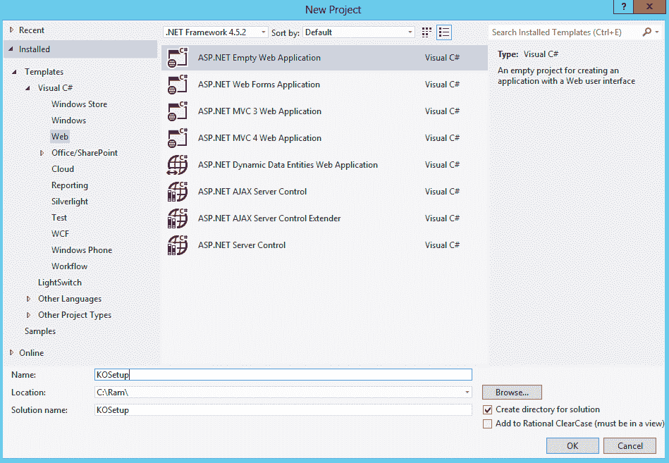
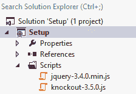
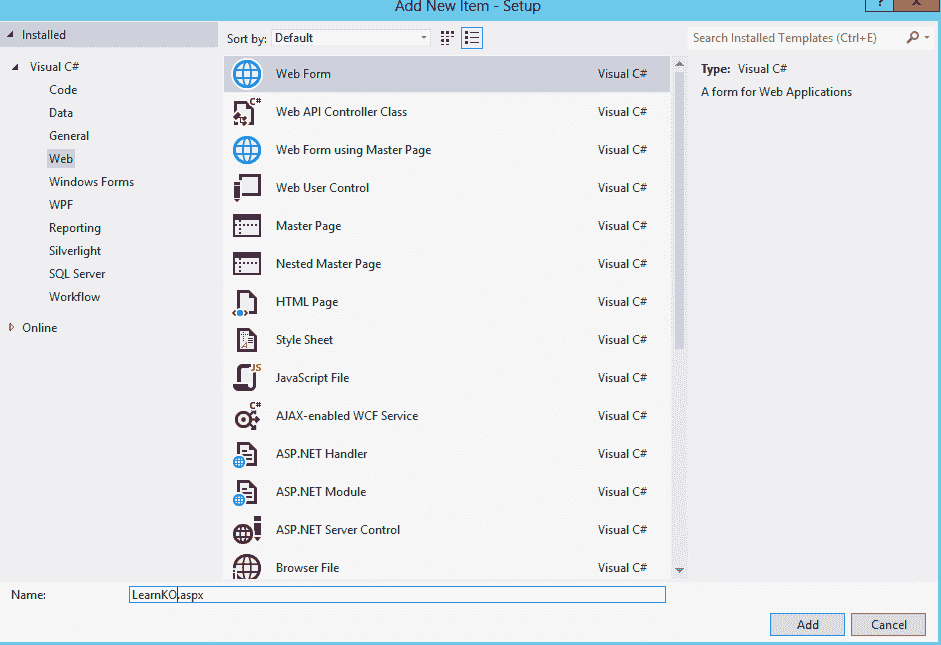
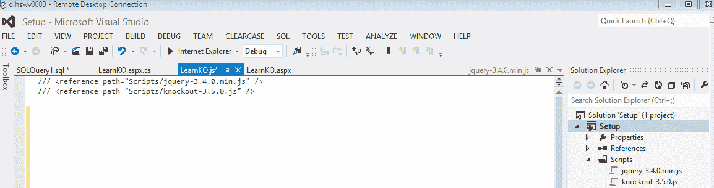
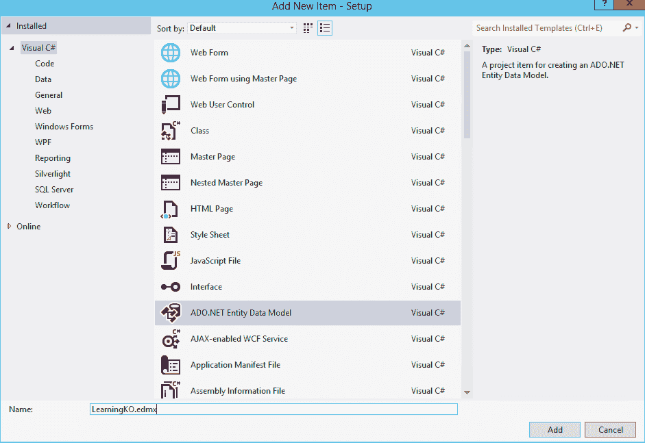
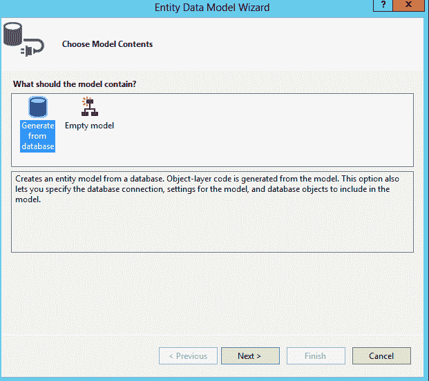
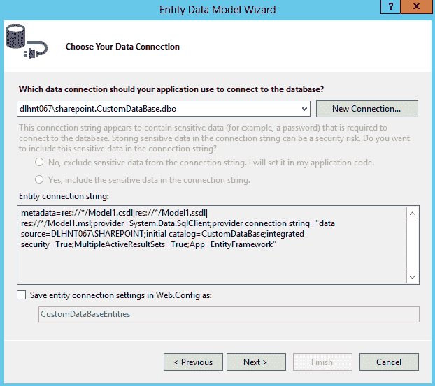
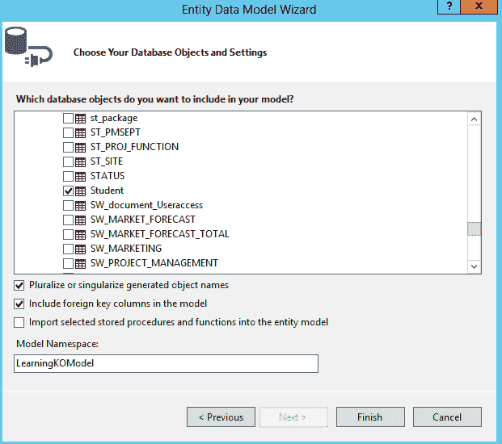
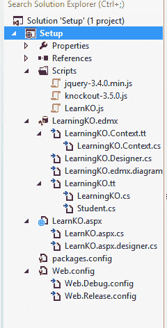
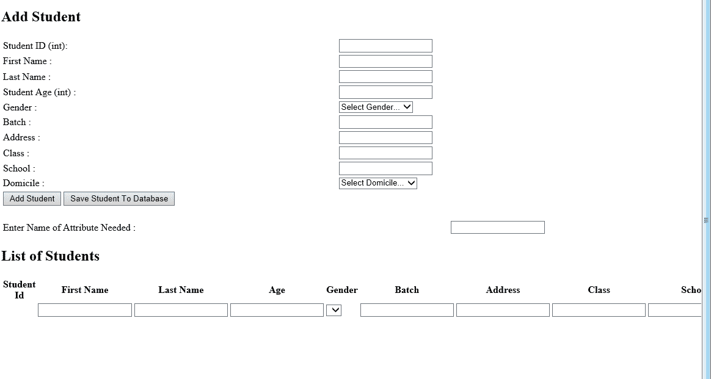

# 在 Visual Studio 中创建淘汰赛应用程序并设置环境

> 原文:[https://www . geesforgeks . org/creating-淘汰赛-应用-伴随-设置-环境-in-visual studio/](https://www.geeksforgeeks.org/creating-knockout-application-along-with-setting-up-environment-in-visual-studio/)

**设置环境–**
**第一步**:打开 Visual Studio，创建 ASP.Net 应用(Web - > Visual Studio【版本】，命名为 KOSetup


**第二步**:安装 jQuery 文件和敲除. js 文件，创建名为 Scripts 的文件夹，将这两个文件(jQuery 和敲除. js)拖拽到 Scripts 文件夹


**第三步**:创建。aspx 页面，将其命名为


**第四步**:创建。js 页面，将其命名为
T3

**第五步**:打开【LearnKO.js】文件，将 jQuery 文件和【敲除. js】库文件拖到【learniko . js】


**第六步**:写$(文档)。ready(函数(){ })；在 LearnKO.js 文件中。当我们的 HTML 文档对象模型被加载到浏览器中时，document.ready 函数被触发。
T3】

**创建剔除应用程序–**

**第 7 步**:创建一个数据库，并在其中创建一个表(命名为 Student)。
T3】

**第 8 步**:创建 ADO.NET 实体数据模型(Visual C# - > Data)，命名为 LearningKO.edmx，
点击添加- >从数据库生成- >选择数据库中创建的表- >取消最后一个选项，即将选择的存储过程和函数导入实体模型- >将模型命名空间命名为 LearningKOModel，我们将在上下文和 tt 文件中获得我们解决方案中的某些文件。






**第 9 步**:在. aspx.cs 页面写方法(代码)

```html
using System;
using System.Collections.Generic;
using System.Linq;
using System.Web;
using System.Web.UI;
using System.Web.UI.WebControls;
using System.Web.Services;

namespace Setup
{
    public partial class LearnKO : System.Web.UI.Page
    {
        protected void Page_Load(object sender, EventArgs e)
        {

        }

        [WebMethod]
        public static Student[] FetchStudents()
        {
            Entities dbEntities = new Entities();

            var data = (from item in dbEntities.Students orderby
             item.StudentId select item).Take(5);

            return data.ToArray();

        }

        [WebMethod]

        public static string SaveStudent(Student[] data)
        {

            try
            {

                var dbContext = new Entities();

                var studentList = from dbStududent in dbContext.Students
                 select dbStududent;

                foreach (Student userDetails in data)
                {

                    var student = new Student();

                    if (userDetails != null)
                    {

                        student.StudentId = userDetails.StudentId;

                        student.FirstName = userDetails.FirstName;

                        student.LastName = userDetails.LastName;

                        student.Address = userDetails.Address;

                        student.Age = userDetails.Age;

                        student.Gender = userDetails.Gender;

                        student.Batch = userDetails.Batch;

                        student.Class = userDetails.Class;

                        student.School = userDetails.School;

                        student.Domicile = userDetails.Domicile;

                    }

                    Student stud = (from st in studentList where 
                    st.StudentId == student.StudentId select st).FirstOrDefault();

                    if (stud == null)

                        dbContext.Students.Add(student);

                    dbContext.SaveChanges();

                }

                return "Data saved to database!";

            }

            catch (Exception ex)
            {

                return "Error: " + ex.Message;

            }

        }

        [WebMethod]

        public static string DeleteStudent(Student data)
        {

            try
            {

                var dbContext = new Entities();

                var student = dbContext.Students.FirstOrDefault
                 (userId => userId.StudentId == data.StudentId);

                    if (student != null)
                    {

                        dbContext.Students.Remove(student);

                        dbContext.SaveChanges();

                    }

                return "Data deleted from database!";

            }

            catch (Exception ex)
            {

                return "Error: " + ex.Message;

            }

        }

        [WebMethod]

        public static string UpdateStudent(Student data)
        {

            try
            {

                var dbContext = new Entities();

                var student = dbContext.Students.FirstOrDefault
                   (userId => userId.StudentId == data.StudentId);

                    if (student != null)
                    {

                        student.FirstName = data.FirstName;
                        student.LastName = data.LastName;
                        student.Address = data.Address;
                        student.Age = data.Age;
                        student.Gender = data.Gender;
                        student.Batch = data.Batch;
                        student.Class = data.Class;
                        student.School = data.School;
                        student.Domicile = data.Domicile;

                        dbContext.SaveChanges();

                    }

                return "Data updated in database!";

            }

            catch (Exception ex)
            {

                return "Error: " + ex.Message;

            }

        }

    }
}
```

**第 10 步**:写入代码。aspx 页面

```html
<%@ Page Language="C#" AutoEventWireup="true" 
CodeBehind="LearnKO.aspx.cs" Inherits="Setup.LearnKO" %>

<!DOCTYPE html>

<html xmlns="http://www.w3.org/1999/xhtml">
<head id="Head1" runat="server">
    <title>Learning Knockout.js</title>
    <script src="Scripts/jquery-3.4.0.min.js"></script>
    <script src="Scripts/knockout-3.5.0.js"></script>
    <script src="Scripts/LearnKO.js"></script>
    <link href="Styles/Style.css" rel="stylesheet" />
</head>
<body>
    <form id="form1" runat="server">

            <h2>Add Student</h2>
        <table style="width:100%;" >

            <tr>
                <td>Student ID (int):</td>
                <td>
                    <input data-bind="value: StudentId" /></td>
                      <!--, valueUpdate:'keypress'-->
                <td><span data-bind="text: StudentId" /></td>
            </tr>
            <tr>
                <td>First Name :</td>
                <td>
                    <input data-bind="value: FirstName" /></td>
                <td  ><span data-bind="text: FirstName" /></td>
            </tr>
            <tr>
                <td>Last Name :</td>
                <td>
                    <input data-bind="value: LastName" /></td>
                <td><span data-bind="text: LastName" /></td>
            </tr>

            <tr>
                <td>Student Age (int) :</td>
                <td>
                    <input data-bind="value: Age" /></td>
                <td><span data-bind="text: Age" /></td>
            </tr>
            <tr>
                <td>Gender :</td>
                <td>
                    <select data-bind="options: Genders, value: Gender, 
                      optionsCaption: 'Select Gender...'"></select></td>
                <td><span data-bind="text: Gender" /></td>
            </tr>
            <tr>
                <td>Batch :</td>
                <td>
                    <input data-bind="value: Batch" /></td>
                <td><span data-bind="text: Batch" /></td>
            </tr>
            <tr>
                <td>Address :</td>
                <td>
                    <input data-bind="value: Address" /></td>
                <td><span data-bind="text: Address" /></td>
            </tr>
            <tr>
                <td>Class :</td>
                <td>
                    <input data-bind="value: Class" /></td>
                <td><span data-bind="text: Class" /></td>
            </tr>
            <tr>
                <td>School :</td>
                <td>
                    <input data-bind="value: School" /></td>
                <td><span data-bind="text: School" /></td>
            </tr>
            <tr>
                <td>Domicile :</td>
                <td>
                    <select data-bind="options: Domiciles, value: Domicile,
                       optionsCaption: 'Select Domicile...'"></select>
                </td>
                <td><span data-bind="text: Domicile" /></td>
            </tr>
            <tr>
                <td colspan="3"  >
                    <button type="button" data-bind="click: AddStudent">
                      Add Student
                    </button>
                    <button type="button" data-bind="click: SaveStudent">
                      Save Student To Database
                    </button>
                </td>
            </tr>

        </table>

        <br />

             <h2>List of Students</h2>
        <table style="width:100%;" data-bind="visible: Students().length >
          0" border="0" >
            <tr>
                <th>Student Id</th>
                <th>First Name</th>
                <th>Last Name</th>
                <th>Age</th>
                <th>Gender</th>
                <th>Batch</th>
                <th>Address</th>
                <th>Class</th>
                <th>School</th>
                <th>Domicile</th>
            </tr>
            <tbody data-bind="foreach: Students">
                <tr>
                    <td><span data-bind="text: StudentId" /></td>
                    <td>
                        <input data-bind="value: FirstName" /></td>
                    <td>
                        <input data-bind="value: LastName" /></td>
                    <td>
                        <input data-bind="value: Age" /></td>

                    <td>
                        <select data-bind="options: $root.Genders, value: Gender">
                        </select></td>
                    <td>
                        <input data-bind="value: Batch" /></td>
                    <td>
                        <input data-bind="value: Address" /></td>
                    <td>
                        <input data-bind="value: Class" /></td>
                    <td>
                        <input data-bind="value: School" /></td>
                    <td>
                        <select data-bind="options: $root.Domiciles,
                         value: Domicile">
                        </select></td>

                    <td><a href="#" data-bind="click: $root.DeleteStudent">
                        Delete</a></td>
                    <td><a href="#" data-bind="click: $root.UpdateStudent">
                        Update</a></td>
                </tr>
            </tbody>
        </table>

    </form>
</body>
</html>
```

**第 11 步**:在 LearnKO.js 页面写代码

```html
/// <reference path="Scripts/jquery-3.4.0.min.js" />
/// <reference path="Scripts/knockout-3.5.0.js" />
function Student(data) {
    this.StudentId = ko.observable(data.StudentId);
    this.FirstName = ko.observable(data.FirstName);
    this.LastName = ko.observable(data.LastName);
    this.Age = ko.observable(data.Age);
    this.Gender = ko.observable(data.Gender);
    this.Batch = ko.observable(data.Batch);
    this.Address = ko.observable(data.Address);
    this.Class = ko.observable(data.Class);
    this.School = ko.observable(data.School);
    this.Domicile = ko.observable(data.Domicile);

}

function StudentViewModel() {
    var self = this;
    self.Domiciles = ko.observableArray(['Delhi', 'Outside Delhi']);
    self.Genders = ko.observableArray(['Male', 'Female']);
    self.Students = ko.observableArray([]);
    self.StudentId = ko.observable();
    self.FirstName = ko.observable();
    self.LastName = ko.observable();
    self.Age = ko.observable();
    self.Batch = ko.observable();
    self.Address = ko.observable();
    self.Class = ko.observable();
    self.School = ko.observable();
    self.Domicile = ko.observable();
    self.Gender = ko.observable();

    self.AddStudent = function () {
        self.Students.push(new Student({
            StudentId: self.StudentId(),
            FirstName: self.FirstName(),
            LastName: self.LastName(),
            Domicile: self.Domicile(),
            Age: self.Age(),
            Batch: self.Batch(),
            Address: self.Address(),
            Class: self.Class(),
            School: self.School(),
            Gender: self.Gender()
        }));
        self.StudentId(""),
        self.FirstName(""),
        self.LastName(""),
        self.Domicile(""),
        self.Age(""),
        self.Batch(""),
        self.Address(""),
        self.Class(""),
        self.School(""),
       self.Gender("")
    };

    self.DeleteStudent = function (student) {

        $.ajax({
            type: "POST",
            url: 'LearnKO.aspx/DeleteStudent',
            data: ko.toJSON({ data: student }),
            contentType: "application/json; charset=utf-8",
            success: function (result) {
                alert(result.d);
                self.Students.remove(student)
            },
            error: function (err) {
                alert(err.status + " - " + err.statusText);
            }
        });

    };

    self.SaveStudent = function () {
        $.ajax({
            type: "POST",
            url: 'LearnKO.aspx/SaveStudent',
            data: ko.toJSON({ data: self.Students }),
            contentType: "application/json; charset=utf-8",
            success: function (result) {
                alert(result.d);
            },
            error: function (err) {
                alert(err.status + " - " + err.statusText);
            }
        });
    };

    self.UpdateStudent = function (student) {
        $.ajax({
            type: "POST",
            url: 'LearnKO.aspx/UpdateStudent',
            data: ko.toJSON({ data: student }),
            contentType: "application/json; charset=utf-8",

                success: function(response) {
                    $(".errMsg ul").remove();
                    var myObject = eval('(' + response.d + ')');
                    if (myObject > 0) {
                        bindData();
                    $(".errMsg").append("<ul><li>Data updated 
                      successfully</li></ul>");
                    }
                    else {
                    $(".errMsg").append("<ul><li>Opppps something
                       went wrong.</li></ul>");
                    }
                    $(".errMsg").show("slow");
                    clear();
                },
                error: function (response) {
                    alert(response.status + ' ' + response.statusText);
            }
        });

    };

    $.ajax({
        type: "POST",
        url: 'LearnKO.aspx/FetchStudents',
        contentType: "application/json; charset=utf-8",
        dataType: "json",
        success: function (results) {
            var students = $.map(results.d, function (item) {
                return new Student(item)
            });
            self.Students(students);
        },
        error: function (err) {
            alert(err.status + " - " + err.statusText);
        }
    });

}

    $(document).ready(function () {
        ko.applyBindings(new StudentViewModel());
    });
```

**第 12 步**:按 F5 运行
应用程序