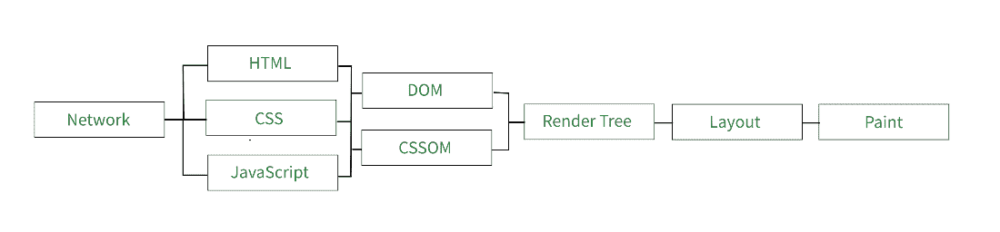

# 关键渲染路径流

> 原文:[https://www.geeksforgeeks.org/critical-rendering-path-flow/](https://www.geeksforgeeks.org/critical-rendering-path-flow/)

你有没有想过当网页加载时，幕后会发生什么，或者你的浏览器是如何处理这些页面的？那你就来对地方了，去了解更多。浏览器将文件转换为网页的流程称为关键渲染路径。

下图显示了**关键渲染路径**的流程。



**关键渲染路径流程图 1.1**

**示例:**现在让我们考虑一个简单网页的示例来理解这个流程，这里我们有一个带有样式内容的 HTML 文档。

## index.html

```html
<html lang="en">
<head>
  <link rel="stylesheet" href="style.css">
</head>
<body>
    <p>Critical Rendering Path</p>

    <label>Hello World</label>
</body>
</html>
```