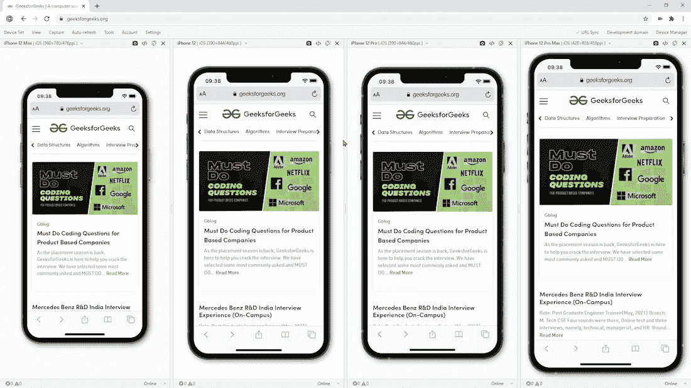
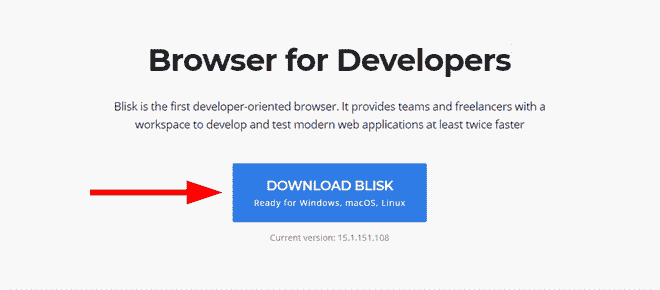
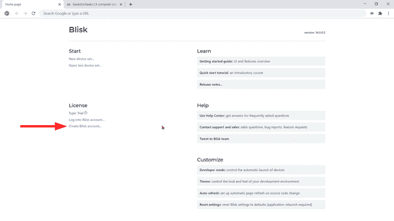
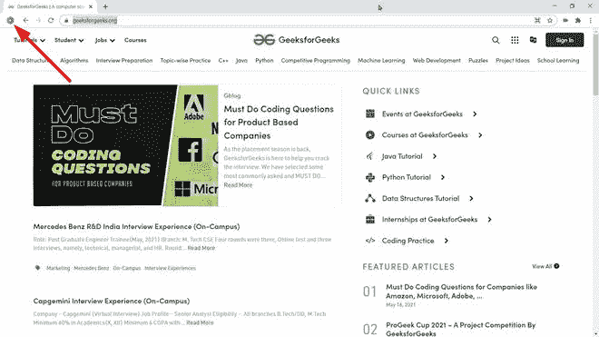
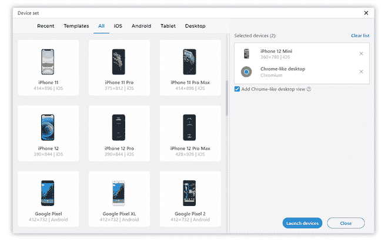

# 使用 Blisk 进行网络应用的跨设备测试

> 原文:[https://www . geeksforgeeks . org/跨设备测试 web 应用程序-with-blisk/](https://www.geeksforgeeks.org/cross-device-testing-of-web-applications-with-blisk/)

这篇文章将教育大家 **Blisk** 。 **Blisk** 是一款基于 Chromium 的网络浏览器，通过提供大量的网络开发和测试工具来提高生产力和代码质量。该应用程序的主要特点是，它提供虚拟手机、平板电脑、笔记本电脑和台式机，用于网络开发和测试。

Blisk 提供两种类型的许可证:每日有限使用的免费许可证和无限使用的付费许可证。安装 Blisk 后，您可以获得两周的免费无限测试。

关闭浏览器

在本教程中，我们以极客网站为例。您可以在任何阶段使用自己的网站:localhost/staging/production。

<video class="wp-video-shortcode" id="video-621823-1" width="640" height="360" preload="metadata" controls=""><source type="video/mp4" src="https://media.geeksforgeeks.org/wp-content/uploads/20210608155537/08-Jun-2021-13-21-637587444978866601.mp4?_=1">[https://media.geeksforgeeks.org/wp-content/uploads/20210608155537/08-Jun-2021-13-21-637587444978866601.mp4](https://media.geeksforgeeks.org/wp-content/uploads/20210608155537/08-Jun-2021-13-21-637587444978866601.mp4)</video>

**分步指南:**

**第一步:安装 Blisk 应用程序—** Blisk 适用于 Windows、macOS 和 Linux (Ubuntu、Debian、Fedora、OpenSUSE)。从官网 [https://blisk.io](https://blisk.io) 下载 Blisk 并安装。

**第二步:创建 Blisk 帐户—** 创建帐户是可选的，但建议使用。Blisk 帐户允许使用额外的功能(截图和屏幕记录器，云存储)，并增加了额外一周的所有功能的无限制免费使用。

**第三步:打开一个你将要合作的网站**

1.  将网址*https://www.geeksforgeeks.org/*粘贴到地址栏，导航到该网站。
2.  点击按钮**切换显影模式**。

**步骤 4:选择设备—** Blisk 启动设备管理器，您可以在其中选择设备。您可以选择不同类型的设备:手机、平板电脑、笔记本电脑和台式机。此外，Blisk 提供了一个类似 Chrome 的视图，它代表了一个常规的 web 视图，就像您浏览器中的任何选项卡一样。根据您的需要，您可以混合使用不同的设备来同时使用它们。

在本教程中，我们将选择 *iPhone 12 Mini* 和*类似 Chrome 的视图*来检查 GeekforGeeks 在普通浏览器中与移动浏览器相比的工作方式。当您的设备设置就绪后，点击按钮**启动设备**。

**第五步:在开发者模式下浏览—** Blisk 用之前选择的设备启动设备集，现在我们可以同时在手机和桌面上执行检查。让我们向下滚动浏览极客网站。您会注意到卷轴从移动设备同步到桌面，这有助于更快地浏览和直观地比较两个视图。

接下来，让我们打开任何一篇文章来检查它的行为。当导航到任何网址时，您会注意到设备和桌面通过网址相互跟随。

**第 6 步:执行检查—** 现在，您可以检查您需要的任何内容。此外，您可以:

*   测试纵向和横向。
*   检查每个设备中出现的 JavaScript 错误。
*   模拟慢速连接。
*   对每个设备独立使用开发工具。
*   切换到另一个设备。
*   检查深色主题。
*   截图问题。
*   录制一段视频，说明重现问题的步骤。
*   将截图和视频保存到云存储中。

**结论:**这个应用程序是为 web 开发人员和 QA 工程师创建的。您可以在日常工作中使用 Blisk 创建网络应用程序，并在多个设备上同时测试它们，以提高您的工作效率，并比以前更快地向客户交付高质量的产品。