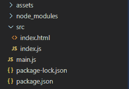
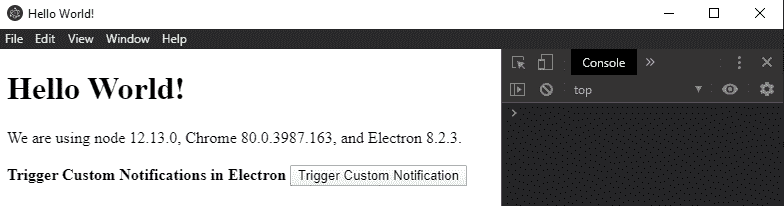
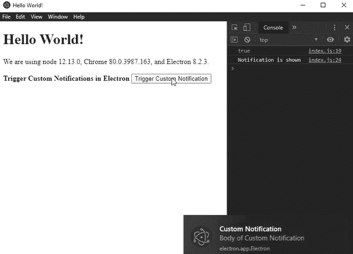
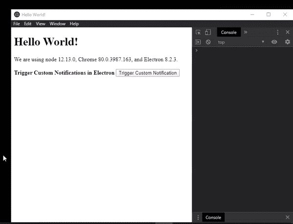

# 电子邮件中的自定义通知

> 原文:[https://www . geesforgeks . org/custom-notifications-in-electronijs/](https://www.geeksforgeeks.org/custom-notifications-in-electronjs/)

**[electronijs](https://www.geeksforgeeks.org/introduction-to-electronjs/)**是一个开源框架，用于使用能够在 Windows、macOS 和 Linux 操作系统上运行的 HTML、CSS 和 JavaScript 等网络技术构建跨平台的本机桌面应用程序。它将 Chromium 引擎和 NodeJS 结合成一个单一的运行时。

电子的核心是一个 **[节点](https://www.geeksforgeeks.org/introduction-to-nodejs/)** 应用程序，具有与本地操作系统环境交互的能力，如文件系统、系统托盘等。为了创建交互式的本地操作系统应用程序，电子需要将其自身与操作系统功能相集成。其中一个重要的功能是桌面通知。所有三种操作系统都有发送桌面通知的规定。电子提供内置的**通知**模块，该模块允许应用程序发送自定义通知，使用操作系统本地通知应用程序接口来显示它。本教程将演示如何使用通知模块创建自定义桌面通知。

我们假设您熟悉上述链接中介绍的先决条件。电子要工作， **[节点](https://www.geeksforgeeks.org/introduction-to-nodejs/)** 和 **[npm](https://www.geeksforgeeks.org/node-js-npm-node-package-manager/)** 需要预装在系统中。

**电子通知:**通知模块是**主流程**的一部分。要导入和使用**渲染器流程**中的通知模块，我们可以使用电子提供的**远程**模块。在本教程中，我们还将使用电子遥控器。有关远程模块的更多详细信息，请参考此[链接](https://www.electronjs.org/docs/api/remote)。

*   **Project Structure:**
    

    **示例:**我们将按照给定的步骤开始构建基本的电子应用程序。

    *   **Step 1:** Navigate to an Empty Directory to setup the project, and run the following command,

        ```htmlhtml
        npm init
        ```

        生成**包. json** 文件。安装 **[电子](https://www.geeksforgeeks.org/introduction-to-electronjs/)** 如果没有安装，使用 npm。

        ```htmlhtml
        npm install electron --save-dev
        ```

        该命令还将创建**包-lock.json** 文件，并安装所需的**节点 _ 模块**依赖项。一旦电子安装成功，打开**包. json** 文件，并在**“脚本”**键下执行必要的更改。

        **package.json:**

        ```htmlhtml
        {
          "name": "electron-notification",
          "version": "1.0.0",
          "description": "Custom notification in Electron",
          "main": "main.js",
          "scripts": {
            "start": "electron"
          },
          "keywords": [
            "electron"
          ],
          "author": "Radhesh Khanna",
          "license": "ISC",
          "dependencies": {
            "electron": "^8.2.5"
          }
        }

        ```

    *   **Step 2:** Create a **main.js** file according to the project structure. This file is the **Main Process** and acts as an entry point into the application. Copy the Boilerplate code for the **main.js** file as given in the following [link](https://www.electronjs.org/docs/tutorial/first-app#electron-development-in-a-nutshell). We will modify the code to suit our project needs.

        **main.js:**

        ```htmlhtml
        const { app, BrowserWindow } = require('electron')

        function createWindow() {
          // Create the browser window.
          const win = new BrowserWindow({
            width: 800,
            height: 600,
            webPreferences: {
              nodeIntegration: true
            }
          })

          // Load the index.html of the app.
          win.loadFile('src/index.html')

          // Open the DevTools.
          win.webContents.openDevTools()
        }

        // This method will be called when Electron has finished
        // initialization and is ready to create browser windows.
        // Some APIs can only be used after this event occurs.
        app.whenReady().then(createWindow)

        // Quit when all windows are closed.
        app.on('window-all-closed', () => {
          // On macOS it is common for applications and their
          // menu bar to stay active until the user quits 
          // explicitly with Cmd + Q
          if (process.platform !== 'darwin') {
            app.quit()
          }
        })

        app.on('activate', () => {
          // On macOS it's common to re-create a window in the
          // app when the  dock icon is clicked and there are
          // no other windows open.
          if (BrowserWindow.getAllWindows().length === 0) {
            createWindow()
          }
        })

        // In this file, you can include the rest of your app's
        // specific main process code. You can also put them in 
        // separate files and require them here.
        ```

    *   **Step 3:** Create the **index.html** file within the *src* directory. We will also copy the boilerplate code for the **index.html** file from the above-mentioned link. We will modify the code to suit our project needs.

        **index.html:**

        ```htmlhtml
        <!DOCTYPE html>
        <html>

        <head>
            <meta charset="UTF-8">
            <title>Hello World!</title>

            <!-- https://electronjs.org/docs/tutorial
                              /security#csp-meta-tag -->
            <meta http-equiv="Content-Security-Policy"
                  content="script-src 'self' 'unsafe-inline';" />
        </head>

        <body>
            <h1>Hello World!</h1> We are using node
            <script>
                document.write(process.versions.node)
            </script>, Chrome
            <script>
                document.write(process.versions.chrome)
            </script>, and Electron
            <script>
                document.write(process.versions.electron)
            </script>.

            <!-- Adding Individual Renderer Process JS File -->
            <script src="index.js"></script>
        </body>

        </html>
        ```

    *   **Output:** At this point, our basic Electron Application is set up. To launch the Electron Application, run the Command:

        ```htmlhtml
        npm start
        ```

        

**通知选项:**现在我们将在**视窗**机器上创建自定义桌面通知。**通知**模块提供特定于操作系统的特定实例事件、实例方法和选项。如果使用了与本机操作系统不兼容的属性，它将被简单忽略。下文提供了这方面的详细清单。

*   **标题:字符串**所有 OS 都支持。通知窗口顶部显示的通知标题
*   **字幕:字符串(可选)**仅支持 *macOS* 。通知的副标题。显示在标题下方
*   **正文:字符串**所有 OS 都支持。通知窗口的正文
*   **静默:布尔型(可选)**所有 OS 都支持。在显示通知时是否忽略操作系统通知声音
*   **图标:字符串(可选)**所有操作系统都支持。要在通知窗口中显示的图标。出于本教程的目的，使用了保存在*“资产”*文件夹中的电子徽标的 PNG 图像
*   **hasReply: Boolean(可选)**仅受 *macOS* 支持。向通知窗口显示内联回复选项
*   **replyPlaceholder: String(可选)**仅由 *macOS* 支持。*“有回复”*输入字段的占位符
*   **紧急:字符串(可选)**仅支持 *Linux* 。通知的紧迫性。数值可以是*“正常”*、*“临界”*或*“低”*。
*   **closeButtonText: String(可选)**仅由 *macOS* 支持。通知的关闭按钮的自定义标题
*   **timeoutType: String(可选)***Windows*和 *Linux* 操作系统支持。通知的超时持续时间。值可以是*【默认】*或*【永不】*。从电子 8.0+开始，有一个 **bug** 与这个属性相关联。将该值设置为*“永不”*，通知应仅在用户手动干预时消失。然而，事实并非如此。不管值多少，通知都会自行消失。你可以在这里跟随 bug 追踪[。](https://github.com/electron/electron/issues/22192)
*   **动作:对象(可选)**仅由 *macOS* 支持。要添加到通知的操作。它是一个对象数组。每个物体由*【类型】*和*【文字】*组成。使用此属性有某些限制。在定义了多个动作的情况下，只使用第一个动作。如果提供了多个动作，那么它们将被列为附加动作，即当鼠标在第一个动作按钮上活动时显示。这种情况也与`hasReply`属性不兼容，如果`hasReply: true`则忽略。
    详细说明请参考本[链接](https://www.electronjs.org/docs/api/structures/notification-action)。
*   **声音:弦乐(可选)**仅由 *macOS* 支持。显示通知时播放的声音文件。除了自定义声音文件之外，还可以使用 macOS 中的任何默认声音。声音文件需要出现在应用程序包中或在此[链接](https://www.electronjs.org/docs/api/notification#playing-sounds)中提到的以下任何位置。在本教程中，自定义声音文件作为 **sound.mp3** 出现在*资源*文件夹中

通知模块还为我们提供了**静态**方法、
T3】通知. isSupported() 。返回一个布尔值，说明当前系统是否支持通知。在**index.html**文件中，在**脚本**标签前添加以下代码。

*   **index.html:**

    ```htmlhtml
    <br><br>
        <strong>
         Trigger Custom Notifications in Electron
        </strong>
        <button id="trigger">
         Trigger Custom Notification
        </button>
    ```

*   **输出:** 

**触发自定义通知**按钮没有任何相关功能。我们将在按钮上添加`EventListener`来触发自定义通知。我们还将向通知对象添加**事件监听器**。按照项目结构创建**索引. js** 文件，并执行以下更改。

*  ```htmlhtml
    const electron = require('electron');
    const path = require('path')

    // Importing the Notification Module from Electron,
    // Since it is a Part of the Main Process, Using the
    // Remote Module to Import it in Renderer Process
    const Notification = electron.remote.Notification;

    var button = document.getElementById('trigger');

    const options = {
        title: 'Custom Notification',
        subtitle: 'Subtitle of the Notification',
        body: 'Body of Custom Notification',
        silent: false,
        icon: path.join(__dirname, '../assets/image.png'),
        hasReply: true,  
        timeoutType: 'never', 
        replyPlaceholder: 'Reply Here',
        sound: path.join(__dirname, '../assets/sound.mp3'),
        urgency: 'critical' 
        closeButtonText: 'Close Button'
        actions: [ {
            type: 'button',
            text: 'Show Button'
        }]
    }

    // Instantiating a new Notifications Object
    // with custom Options
    const customNotification = new Notification(options);

    button.addEventListener('click', function (event) {
        console.log(Notification.isSupported());

        customNotification.show();
        // customNotification.close();
    });

    // Instance Events for the new Notification Object
    customNotification.addListener('click', () => {
        console.log('Notification is Clicked');
    });

    customNotification.addListener('show', () => {
        console.log('Notification is shown');
    });

    customNotification.addListener('close', () => {
        console.log('Notification is Automatically Closed')
    });
    ```** 

*   ****customNotification . show()**实例方法立即向用户显示通知。如果通知已显示，则取消前一个通知，并创建一个具有相同选项的新通知。**
*   ****customNotification . close()**取消通知的实例方法。**
*   ****事件:“点击”**当用户点击通知时，发出事件。**
*   ****事件:“显示”**向用户显示通知时，发出事件。**
*   ****事件:“关闭”**事件在通知关闭时发出。不保证每次都发射。通知将自动关闭，与**“超时类型”**属性无关。**

*   ****输出:** **

****实例事件:**通知模块还提供了另外两个实例事件，仅 **macOS** 支持。**

```htmlhtml
// Emitted when user clicks the reply button from 
// 'hasReply: true' property
customNotification.addListener('reply', (event, reply) => {
    console.log('Replied String is - ', reply);
});

// Emitted when the user clicks on any one action 
// defined in the actions:[{}] property
customNotification.addListener('action', (event, index) => {
    console.log('Index of the action clicked is - ', index);
});
```

****实例属性:**电子通知模块还支持实例属性，可以设置为通知对象。它们可以用来代替选项，还可以在触发自定义通知时更改预定义的选项。详细清单如下。**

```htmlhtml
customNotification.title = 'Title has been Changed';

// Supported in macOS
customNotification.subtitle = 'Subtitle of the Notification';  

customNotification.body = 'Body has been changed';

// Supported in macOS
customNotification.closeButtonText = 'Close Button'  

// Supported in macOS
customNotification.hasReply = true;

// Supported in macOS
customNotification.replyPlaceholder = 'Reply Placeholder'; 

customNotification.silent = false;

// Supported in Linux
customNotification.urgency = 'low';

// Supported in Windows and Linux OS 
// This is a bug, as described above.
customNotification.timeoutType= 'default';
```

*   ****输出:**将这些实例属性添加到**索引. js** 文件后，我们应该会看到以下内容。忽略所有不兼容的实例属性。
    **