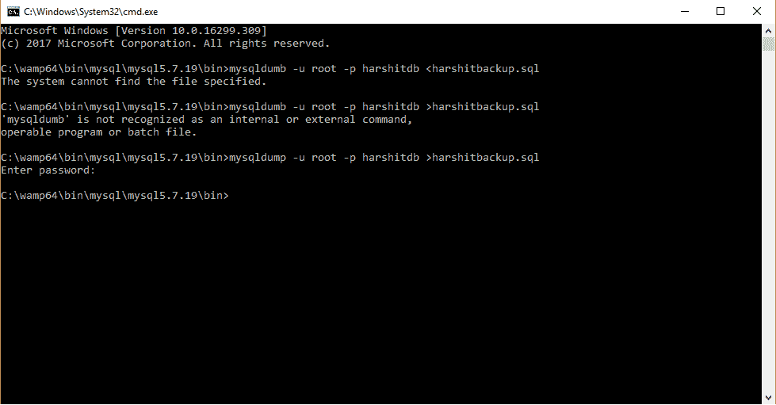

# 【MySQL 数据库备份

> 原文:[https://www.geeksforgeeks.org/database-backup-from-mysql/](https://www.geeksforgeeks.org/database-backup-from-mysql/)

在这里，现在创建的数据库对日常工作非常重要。该数据库从 MySQL 创建，可以从一个系统转移到另一个系统，并使其免受破坏。有时系统会被一些错误破坏，所以创建的数据库是清晰的。因此，可以选择从 MySQL wamp 服务器创建数据库备份。

以下是从 wamp 服务器创建备份的步骤:

1.  去 c 车道。
2.  打开 Wamp 服务器名称文件夹。
3.  打开名为 bin 的文件夹，然后打开 MySQL 文件夹。
4.  现在打开文件夹 mysql5.7.19(这里，5.7.19 是 wamp 服务器的版本，有一些不同的版本，但是你应该只在那个文件夹上)。
5.  然后再次打开垃圾箱文件夹。
6.  然后在上面的地址部分键入 CMD 并输入。

然后会出现一个命令提示符，上面有您执行的下一步的地址。然后打字，

```
mysqldump -u root -p harshitdb >harshitbackup.sql 
```

在这里，harshitdb 表示 harshit 是创建的数据库名称，db 表示数据库。之后，它会创建一个数据库，您可以共享这个数据库，这个数据库不会被损坏或丢失。

打开 cmd(命令提示符)有以下地址链接

```
C:\wamp\bin\mysql\mysql5.7.19\bin>mysqldump -u root -p harshitdb > harshitbackup.sql 
```

然后按回车键。

