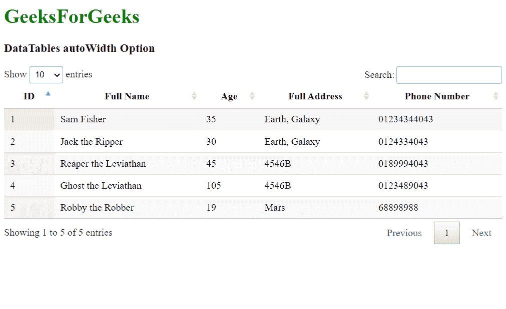
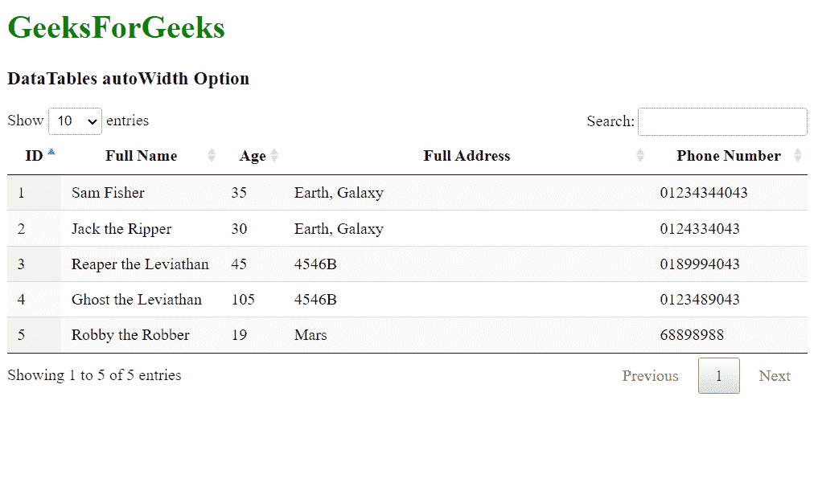

# 可注明日期的汽车识别码选项

> 哎哎哎::1230【https://www . geeksforgeeks . org/datatables-autoidth 选项/

**DataTables** 是 jQuery 插件，可用于为网页的 HTML 表格添加交互和高级控件。这也允许根据用户的需要搜索、排序和过滤表中的数据。数据表还公开了一个强大的应用编程接口，可以进一步用来修改数据的显示方式。

**自动宽度**选项用于指定是否启用数据表中列宽的自动计算。该计算需要一点时间，当使用*列宽*选项显式传递列宽时，该计算可能会被禁用。

**语法:**

```
{ autoWidth: value }
```

**参数:**该选项具有如上所述的单一值，如下所述:

*   **值:**这是一个布尔值，表示是否启用列宽自动计算。默认值为真。

以下示例说明了该选项的使用。

**示例 1:** 在本例中，autoWidth 选项设置为默认状态，这意味着列宽将自动计算。

## 超文本标记语言

```
<!DOCTYPE html>
<html>

<head>
  <!-- jQuery -->
  <script type="text/javascript" 
          src="https://code.jquery.com/jquery-3.5.1.js">
  </script>

  <!-- DataTables CSS -->
  <link rel="stylesheet"
        href=
"https://cdn.datatables.net/1.10.23/css/jquery.dataTables.min.css">

  <!-- DataTables JS -->
  <script src=
"https://cdn.datatables.net/1.10.23/js/jquery.dataTables.min.js">
  </script>
</head>

<body>
  <h1 style="color: green;">
    GeeksForGeeks
  </h1>
  <h3>DataTables autoWidth Option</h3>

  <!-- HTML table with random data -->
  <table id="tableID" class="display nowrap">
    <thead>
      <tr>
        <th>ID</th>
        <th>Full Name</th>
        <th>Age</th>
        <th>Full Address</th>
        <th>Phone Number</th>
      </tr>
    </thead>
    <tbody>
      <tr>
        <td>1</td>
        <td>Sam Fisher</td>
        <td>35</td>
        <td>Earth, Galaxy</td>
        <td>01234344043</td>
      </tr>
      <tr>
        <td>2</td>
        <td>Jack the Ripper</td>
        <td>30</td>
        <td>Earth, Galaxy</td>
        <td>0124334043</td>
      </tr>
      <tr>
        <td>3</td>
        <td>Reaper the Leviathan</td>
        <td>45</td>
        <td>4546B</td>
        <td>0189994043</td>
      </tr>
      <tr>
        <td>4</td>
        <td>Ghost the Leviathan</td>
        <td>105</td>
        <td>4546B</td>
        <td>0123489043</td>
      </tr>
      <tr>
        <td>5</td>
        <td>Robby the Robber</td>
        <td>19</td>
        <td>Mars</td>
        <td>68898988</td>
      </tr>
    </tbody>
  </table>

  <script>

    // Initialize the DataTable
    $(document).ready(function () {
      $('#tableID').DataTable({

        // Enable automatic calculation
        // of column widths in the DataTable
        autoWidth: true
      });
    }); 
  </script>
</body>

</html>
```

**输出:**



**示例 2:** 在此示例中，autoWidth 选项设置为 false，列宽作为数组传递。

## 超文本标记语言

```
<!DOCTYPE html>
<html>

<head>
  <!-- jQuery -->
  <script type="text/javascript" 
          src="https://code.jquery.com/jquery-3.5.1.js">
  </script>

  <!-- DataTables CSS -->
  <link rel="stylesheet"
        href=
"https://cdn.datatables.net/1.10.23/css/jquery.dataTables.min.css">

  <!-- DataTables JS -->
  <script src=
"https://cdn.datatables.net/1.10.23/js/jquery.dataTables.min.js">
  </script>
</head>

<body>
    <h1 style="color: green;">
        GeeksForGeeks
    </h1>
    <h3>DataTables autoWidth Option</h3>

    <!-- HTML table with random data -->
    <table id="tableID" class="display nowrap">
      <thead>
        <tr>
          <th>ID</th>
          <th>Full Name</th>
          <th>Age</th>
          <th>Full Address</th>
          <th>Phone Number</th>
        </tr>
      </thead>
      <tbody>
        <tr>
          <td>1</td>
          <td>Sam Fisher</td>
          <td>35</td>
          <td>Earth, Galaxy</td>
          <td>01234344043</td>
        </tr>
        <tr>
          <td>2</td>
          <td>Jack the Ripper</td>
          <td>30</td>
          <td>Earth, Galaxy</td>
          <td>0124334043</td>
        </tr>
        <tr>
          <td>3</td>
          <td>Reaper the Leviathan</td>
          <td>45</td>
          <td>4546B</td>
          <td>0189994043</td>
        </tr>
        <tr>
          <td>4</td>
          <td>Ghost the Leviathan</td>
          <td>105</td>
          <td>4546B</td>
          <td>0123489043</td>
        </tr>
        <tr>
          <td>5</td>
          <td>Robby the Robber</td>
          <td>19</td>
          <td>Mars</td>
          <td>68898988</td>
        </tr>
      </tbody>
    </table>

    <script>

        // Initialize the DataTable
        $(document).ready(function () {
            $('#tableID').DataTable({

                // Disable automatic calculation
                // of column widths in the DataTable
                autoWidth: false,

                // The columns are explicitly
                // specified as the column array
                columns: [
                    { "width": "5%" },
                    { "width": "20%" },
                    { "width": "5%" },
                    { "width": "50%" },
                    { "width": "25%" }
                ]
            });
        });
    </script>
</body>

</html>
```

**输出:**



**参考:**T2】https://datatables.net/reference/option/autoWidth