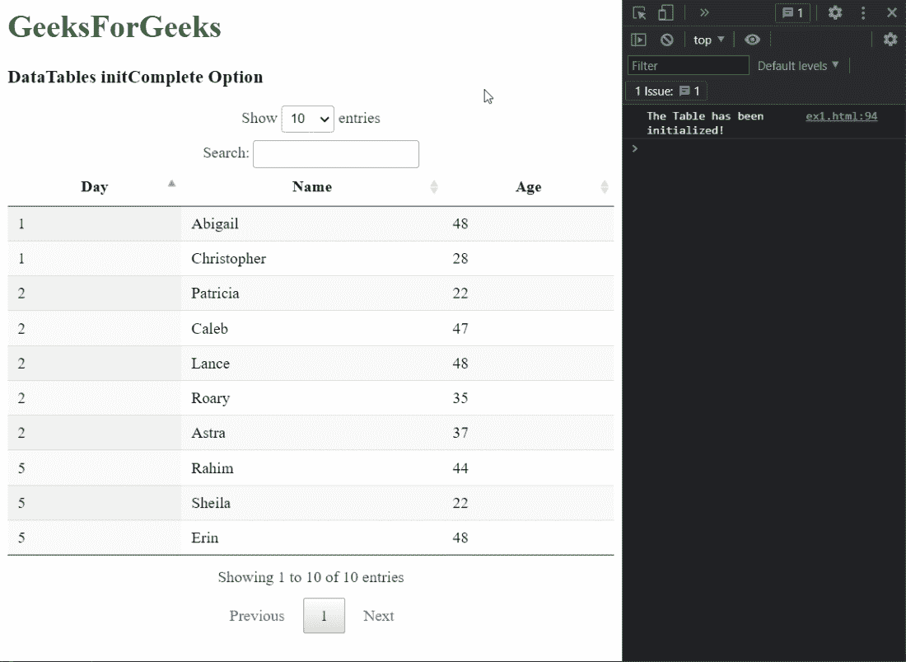
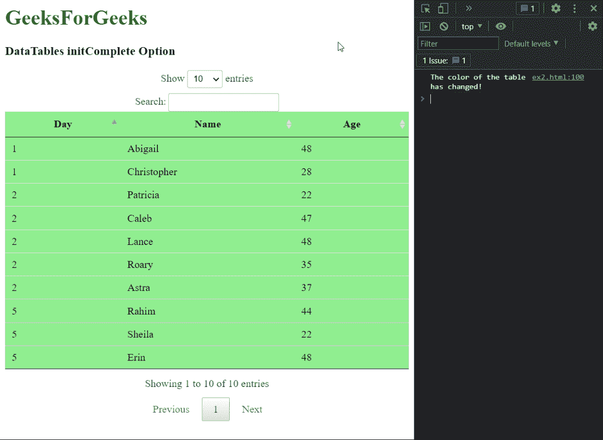

# 可注明日期的初始完成选项

> 哎哎哎:# t0]https://www . geeksforgeeks . org/datatable-init complete 选项/

DataTables 是 jQuery 插件，可以用来为网页的 HTML 表格添加交互式和高级控件。这也允许根据用户的需要搜索、排序和过滤表中的数据。数据表还公开了一个强大的应用编程接口，可以进一步用来修改数据的显示方式。

**initComplete** 选项用于指定当数据表完全加载所有数据时将调用的函数。在数据加载后可能需要以任何方式修改表的情况下，这可能是有用的信息。它以 JSON 参数作为回调，返回服务器返回的数据。

**语法:**

```html
function initComplete( settings, json )
```

**参数:**该选项有两个参数，如上所述，如下所述:

*   **设置:**这是数据表的设置对象，包含初始化该表时使用的所有设置。
*   **json:** 这是使用 *ajax* 选项时从服务器检索到的 json 数据。不使用该选项时是*未定义*。

以下示例说明了该选项的使用。

**示例 1:** 在本例中，我们使用 initComplete 回调记录到控制台，该表已经初始化。

## 超文本标记语言

```html
<!DOCTYPE html>
<html>
<head>
  <!-- jQuery -->
  <script type="text/javascript" 
          src="https://code.jquery.com/jquery-3.5.1.js">
  </script>

  <!-- DataTables CSS -->
  <link rel="stylesheet"
        href=
"https://cdn.datatables.net/1.10.23/css/jquery.dataTables.min.css">

  <!-- DataTables JS -->
  <script src=
"https://cdn.datatables.net/1.10.23/js/jquery.dataTables.min.js">
  </script>

</head>
<body>
  <h1 style="color: green;">
    GeeksForGeeks
  </h1>
  <h3>DataTables initComplete Option</h3>

  <!-- HTML table with random data -->
  <table id="tableID" class="display nowrap">
    <thead>
      <tr>
        <th>Day</th>
        <th>Name</th>
        <th>Age</th>
      </tr>
    </thead>
    <tbody>
      <tr>
        <td>2</td>
        <td>Patricia</td>
        <td>22</td>
      </tr>
      <tr>
        <td>2</td>
        <td>Caleb</td>
        <td>47</td>
      </tr>
      <tr>
        <td>1</td>
        <td>Abigail</td>
        <td>48</td>
      </tr>
      <tr>
        <td>5</td>
        <td>Rahim</td>
        <td>44</td>
      </tr>
      <tr>
        <td>5</td>
        <td>Sheila</td>
        <td>22</td>
      </tr>
      <tr>
        <td>2</td>
        <td>Lance</td>
        <td>48</td>
      </tr>
      <tr>
        <td>5</td>
        <td>Erin</td>
        <td>48</td>
      </tr>
      <tr>
        <td>1</td>
        <td>Christopher</td>
        <td>28</td>
      </tr>
      <tr>
        <td>2</td>
        <td>Roary</td>
        <td>35</td>
      </tr>
      <tr>
        <td>2</td>
        <td>Astra</td>
        <td>37</td>
      </tr>
    </tbody>
  </table>
  <script>

    // Initialize the DataTable
    $(document).ready(function () {
      $('#tableID').DataTable({

        initComplete: function () {
          console.log("The Table has been initialized!")
        }
      });
    }); 
  </script>
</body>
</html>
```

**输出:**



**示例 2:** 在本例中，我们使用回调在表初始化后更改表的颜色。

## 超文本标记语言

```html
<!DOCTYPE html>
<html>
<head>
  <!-- jQuery -->
  <script type="text/javascript" 
          src="https://code.jquery.com/jquery-3.5.1.js">
  </script>

  <!-- DataTables CSS -->
  <link rel="stylesheet"
        href=
"https://cdn.datatables.net/1.10.23/css/jquery.dataTables.min.css">

  <!-- DataTables JS -->
  <script src=
          "https://cdn.datatables.net/1.10.23/js/jquery.dataTables.min.js">
  </script>

</head>
<body>
  <h1 style="color: green;">
    GeeksForGeeks
  </h1>
  <h3>DataTables initComplete Option</h3>

  <!-- HTML table with random data -->
  <table id="tableID" class="display nowrap">
    <thead>
      <tr>
        <th>Day</th>
        <th>Name</th>
        <th>Age</th>
      </tr>
    </thead>
    <tbody>
      <tr>
        <td>2</td>
        <td>Patricia</td>
        <td>22</td>
      </tr>
      <tr>
        <td>2</td>
        <td>Caleb</td>
        <td>47</td>
      </tr>
      <tr>
        <td>1</td>
        <td>Abigail</td>
        <td>48</td>
      </tr>
      <tr>
        <td>5</td>
        <td>Rahim</td>
        <td>44</td>
      </tr>
      <tr>
        <td>5</td>
        <td>Sheila</td>
        <td>22</td>
      </tr>
      <tr>
        <td>2</td>
        <td>Lance</td>
        <td>48</td>
      </tr>
      <tr>
        <td>5</td>
        <td>Erin</td>
        <td>48</td>
      </tr>
      <tr>
        <td>1</td>
        <td>Christopher</td>
        <td>28</td>
      </tr>
      <tr>
        <td>2</td>
        <td>Roary</td>
        <td>35</td>
      </tr>
      <tr>
        <td>2</td>
        <td>Astra</td>
        <td>37</td>
      </tr>
    </tbody>
  </table>
  <script>

    // Initialize the DataTable
    $(document).ready(function () {
      $('#tableID').DataTable({

        initComplete: function (settings, json) {

          // Set the background color of the table
          // to green after the initialisation of the
          // table has completed
          $("#tableID, td, tr")
            .css("background-color", "lightgreen" );

          console.log(
            "The color of the table has changed!"
          )
        }
      });
    }); 
  </script>
</body>
</html>
```

**输出:**

