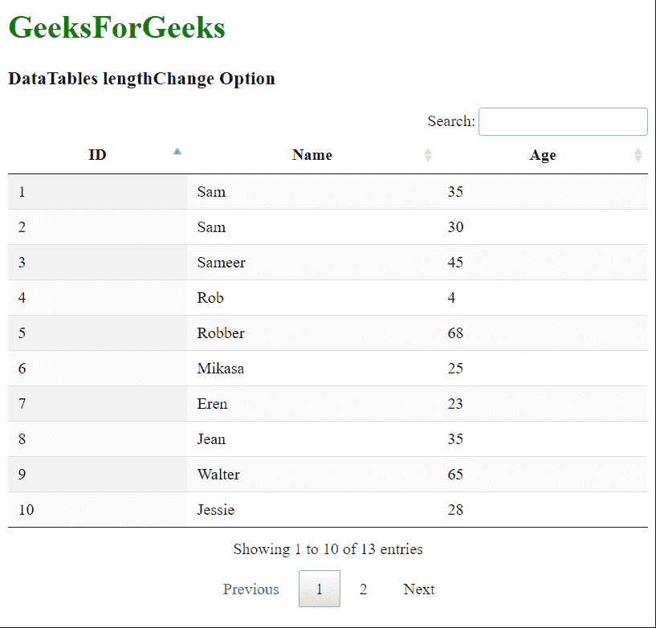
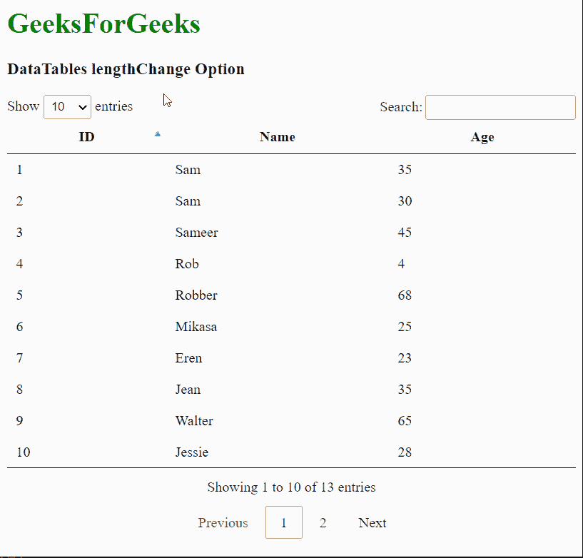

# 可注明日期的词汇量变化选项

> 哎哎哎:# t0]https://www . geeksforgeeks . org/datatable-lengthen change-option/

**DataTables** 是 jQuery 插件，可用于为网页的 HTML 表格添加交互和高级控件。这也允许根据用户的需要搜索、排序和过滤表中的数据。数据表还公开了一个强大的应用编程接口，可以进一步用来修改数据的显示方式。

**长度更改**选项用于指定是否显示用于更改每页行数的下拉列表。该下拉列表仅在数据表分页启用时显示，因为禁用它会自动删除下拉列表。一个**真**值显示下拉菜单，一个**假**值删除下拉菜单。

**语法:**

```html
{ lengthChange: value }
```

**选项值:**该选项具有如上所述的单一值，如下所述:

*   **值:**这是一个布尔值，指定是否显示用于更改行数的下拉列表。默认值为真。

以下示例说明了该选项的使用。

**示例 1:** 此示例通过移除下拉列表来禁用每页行数的更改。

## 超文本标记语言

```html
<html>
<head>
  <!-- jQuery -->
  <script type="text/javascript"
          src="https://code.jquery.com/jquery-3.5.1.js">
  </script>

  <!-- DataTables CSS -->
  <link rel="stylesheet"
        href=
"https://cdn.datatables.net/1.10.23/css/jquery.dataTables.min.css">

  <!-- DataTables JS -->
  <script src=
"https://cdn.datatables.net/1.10.23/js/jquery.dataTables.min.js">
  </script>
</head>
<body>
  <h1 style="color: green;">
    GeeksForGeeks
  </h1>
  <h3>DataTables lengthChange Option</h3>

  <!-- HTML table with student data -->
  <table id="tableID" class="display">
    <thead>
      <tr>
        <th>ID</th>
        <th>Name</th>
        <th>Age</th>
      </tr>
    </thead>
    <tbody>
      <tr>
        <td>1</td>
        <td>Sam</td>
        <td>35</td>
      </tr>
      <tr>
        <td>2</td>
        <td>Sam</td>
        <td>30</td>
      </tr>
      <tr>
        <td>3</td>
        <td>Sameer</td>
        <td>45</td>
      </tr>
      <tr>
        <td>4</td>
        <td>Rob</td>
        <td>4</td>
      </tr>
      <tr>
        <td>5</td>
        <td>Robber</td>
        <td>68</td>
      </tr>
      <tr>
        <td>6</td>
        <td>Mikasa</td>
        <td>25</td>
      </tr>
      <tr>
        <td>7</td>
        <td>Eren</td>
        <td>23</td>
      </tr>
      <tr>
        <td>8</td>
        <td>Jean</td>
        <td>35</td>
      </tr>
      <tr>
        <td>9</td>
        <td>Walter</td>
        <td>65</td>
      </tr>
      <tr>
        <td>10</td>
        <td>Jessie</td>
        <td>28</td>
      </tr>
      <tr>
        <td>11</td>
        <td>Gabi</td>
        <td>20</td>
      </tr>
      <tr>
        <td>12</td>
        <td>Tim</td>
        <td>30</td>
      </tr>
      <tr>
        <td>13</td>
        <td>Max</td>
        <td>35</td>
      </tr>
    </tbody>
  </table>
  <script>

    // Initialize the DataTable
    $(document).ready(function () {
      $('#tableID').DataTable({

        // Disable the option to change
        // length in the DataTable
        lengthChange: false
      });
    }); 
  </script>
</body>
</html>
```

**输出:**



**示例 2:** 该示例允许更改数据表每页的行数。

## 超文本标记语言

```html
<html>
<head>
  <!-- jQuery -->
  <script type="text/javascript"
          src="https://code.jquery.com/jquery-3.5.1.js">
  </script>

  <!-- DataTables CSS -->
  <link rel="stylesheet"
        href=
"https://cdn.datatables.net/1.10.23/css/jquery.dataTables.min.css">

  <!-- DataTables JS -->
  <script src=
"https://cdn.datatables.net/1.10.23/js/jquery.dataTables.min.js">
  </script>
</head>
<body>
  <h1 style="color: green;">
    GeeksForGeeks
  </h1>
  <h3>DataTables lengthChange Option</h3>

  <!-- HTML table with student data -->
  <table id="tableID" class="display">
    <thead>
      <tr>
        <th>ID</th>
        <th>Name</th>
        <th>Age</th>
      </tr>
    </thead>
    <tbody>
      <tr>
        <td>1</td>
        <td>Sam</td>
        <td>35</td>
      </tr>
      <tr>
        <td>2</td>
        <td>Sam</td>
        <td>30</td>
      </tr>
      <tr>
        <td>3</td>
        <td>Sameer</td>
        <td>45</td>
      </tr>
      <tr>
        <td>4</td>
        <td>Rob</td>
        <td>4</td>
      </tr>
      <tr>
        <td>5</td>
        <td>Robber</td>
        <td>68</td>
      </tr>
      <tr>
        <td>6</td>
        <td>Mikasa</td>
        <td>25</td>
      </tr>
      <tr>
        <td>7</td>
        <td>Eren</td>
        <td>23</td>
      </tr>
      <tr>
        <td>8</td>
        <td>Jean</td>
        <td>35</td>
      </tr>
      <tr>
        <td>9</td>
        <td>Walter</td>
        <td>65</td>
      </tr>
      <tr>
        <td>10</td>
        <td>Jessie</td>
        <td>28</td>
      </tr>
      <tr>
        <td>11</td>
        <td>Gabi</td>
        <td>20</td>
      </tr>
      <tr>
        <td>12</td>
        <td>Tim</td>
        <td>30</td>
      </tr>
      <tr>
        <td>13</td>
        <td>Max</td>
        <td>35</td>
      </tr>
    </tbody>
  </table>
  <script>

    // Initialize the DataTable
    $(document).ready(function () {
      $('#tableID').DataTable({

        // Enable the option to change
        // length in the DataTable
        lengthChange: true
      });
    }); 
  </script>
</body>
</html>
```

**输出:**

