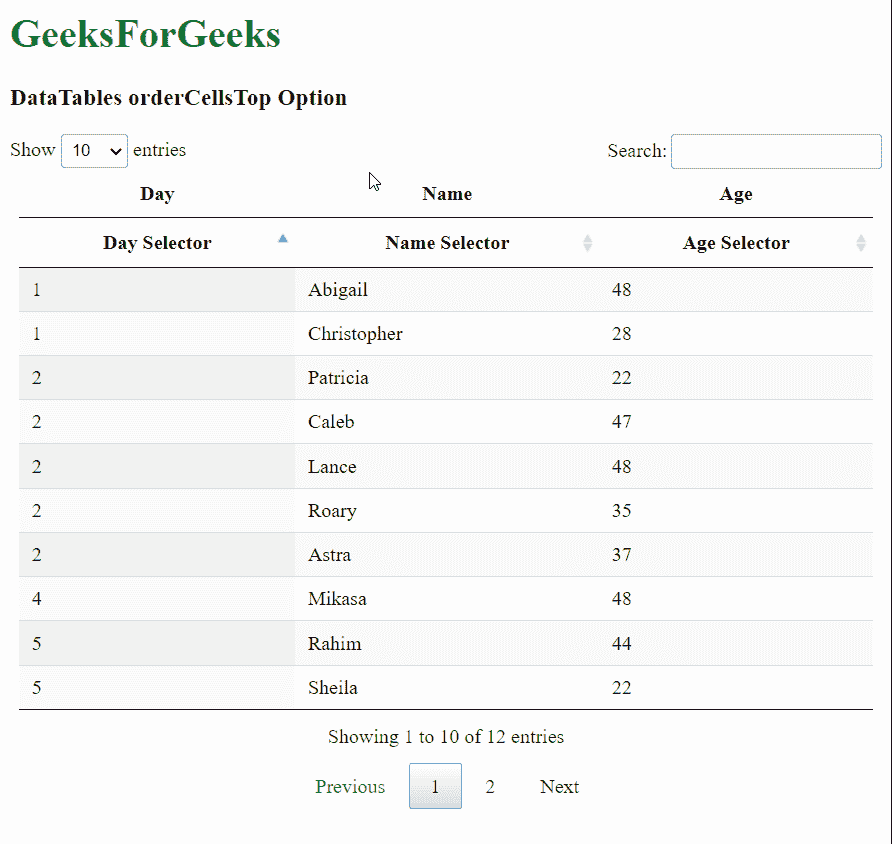
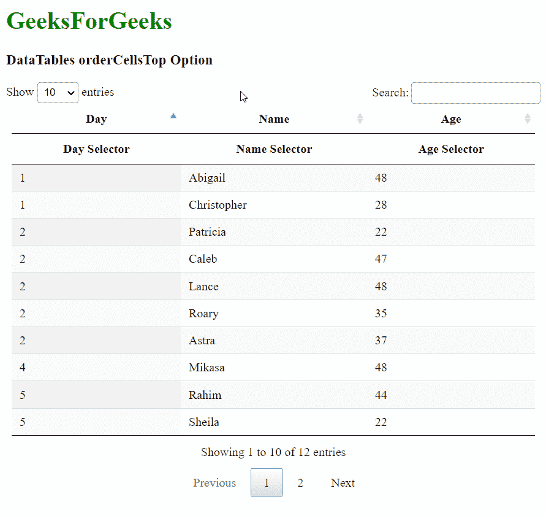

# 可注明日期的 orderCellsTop 选项

> 哎哎哎:# t0]https://www . geeksforgeeks . org/datatable-order cellstop 选项/

**DataTables** 是 jQuery 插件，可用于为网页的 HTML 表格添加交互和高级控件。这也允许根据用户的需要搜索、排序和过滤表中的数据。数据表还公开了一个强大的应用编程接口，可以进一步用来修改数据的显示方式。

**orderecellstop**选项用于指定订单事件处理程序将应用于表格中的哪个单元格。这可以在使用多个复杂标题的情况下使用。将选项设置为 *true* 会将订单事件处理程序附加到表格的顶部唯一单元格，而将选项设置为 *false* 会将其附加到表格的底部单元格，这是默认行为。

```
{ orderCellsTop: value }
```

**参数:**该选项具有如上所述的单一值，如下所述:

*   **值:**这是一个布尔值，用于指定订单事件处理程序将附加到标题的哪个单元格中。默认值为假。

以下示例说明了该选项的使用。

**示例 1:** 在本例中，订单事件处理程序将应用于标题的顶部单元格。

## 超文本标记语言

```
<!DOCTYPE html>
<html>

<head>
  <!-- jQuery -->
  <script type="text/javascript" 
          src="https://code.jquery.com/jquery-3.5.1.js">
  </script>

  <!-- DataTables CSS -->
  <link rel="stylesheet"
        href=
"https://cdn.datatables.net/1.10.23/css/jquery.dataTables.min.css">

  <!-- DataTables JS -->
  <script src=
          "https://cdn.datatables.net/1.10.23/js/jquery.dataTables.min.js">
  </script>
</head>

<body>
  <h1 style="color: green;">
    GeeksForGeeks
  </h1>
  <h3>DataTables orderCellsTop Option</h3>

  <!-- HTML table with random data -->
  <table id="tableID" class="display nowrap">
    <thead>
      <tr>
        <th>Day</th>
        <th>Name</th>
        <th>Age</th>
      </tr>
      <tr>
        <th>Day Selector</th>
        <th>Name Selector</th>
        <th>Age Selector</th>
      </tr>
    </thead>
    <tbody>
      <tr>
        <td>2</td>
        <td>Patricia</td>
        <td>22</td>
      </tr>
      <tr>
        <td>2</td>
        <td>Caleb</td>
        <td>47</td>
      </tr>
      <tr>
        <td>1</td>
        <td>Abigail</td>
        <td>48</td>
      </tr>
      <tr>
        <td>5</td>
        <td>Rahim</td>
        <td>44</td>
      </tr>
      <tr>
        <td>5</td>
        <td>Sheila</td>
        <td>22</td>
      </tr>
      <tr>
        <td>2</td>
        <td>Lance</td>
        <td>48</td>
      </tr>
      <tr>
        <td>5</td>
        <td>Erin</td>
        <td>48</td>
      </tr>
      <tr>
        <td>1</td>
        <td>Christopher</td>
        <td>28</td>
      </tr>
      <tr>
        <td>2</td>
        <td>Roary</td>
        <td>35</td>
      </tr>
      <tr>
        <td>4</td>
        <td>Mikasa</td>
        <td>48</td>
      </tr>
      <tr>
        <td>2</td>
        <td>Astra</td>
        <td>37</td>
      </tr>
      <tr>
        <td>5</td>
        <td>Eren</td>
        <td>48</td>
      </tr>
    </tbody>
  </table>

  <script>

    // Initialize the DataTable
    $(document).ready(function () {
      $('#tableID').DataTable({

        // Use the bottom cell for
        // the order listener
        orderCellsTop: false,
      });
    }); 
  </script>
</body>

</html>
```

**输出:**



**示例 2:** 在本例中，订单事件处理程序将应用于标题的底部单元格。

## 超文本标记语言

```
<!DOCTYPE html>
<html>

<head>
  <!-- jQuery -->
  <script type="text/javascript" 
          src="https://code.jquery.com/jquery-3.5.1.js">
  </script>

  <!-- DataTables CSS -->
  <link rel="stylesheet"
        href=
"https://cdn.datatables.net/1.10.23/css/jquery.dataTables.min.css">

  <!-- DataTables JS -->
  <script src=
          "https://cdn.datatables.net/1.10.23/js/jquery.dataTables.min.js">
  </script>
</head>

<body>
  <h1 style="color: green;">
    GeeksForGeeks
  </h1>
  <h3>DataTables orderCellsTop Option</h3>

  <!-- HTML table with random data -->
  <table id="tableID" class="display nowrap">
    <thead>
      <tr>
        <th>Day</th>
        <th>Name</th>
        <th>Age</th>
      </tr>
      <tr>
        <th>Day Selector</th>
        <th>Name Selector</th>
        <th>Age Selector</th>
      </tr>
    </thead>
    <tbody>
      <tr>
        <td>2</td>
        <td>Patricia</td>
        <td>22</td>
      </tr>
      <tr>
        <td>2</td>
        <td>Caleb</td>
        <td>47</td>
      </tr>
      <tr>
        <td>1</td>
        <td>Abigail</td>
        <td>48</td>
      </tr>
      <tr>
        <td>5</td>
        <td>Rahim</td>
        <td>44</td>
      </tr>
      <tr>
        <td>5</td>
        <td>Sheila</td>
        <td>22</td>
      </tr>
      <tr>
        <td>2</td>
        <td>Lance</td>
        <td>48</td>
      </tr>
      <tr>
        <td>5</td>
        <td>Erin</td>
        <td>48</td>
      </tr>
      <tr>
        <td>1</td>
        <td>Christopher</td>
        <td>28</td>
      </tr>
      <tr>
        <td>2</td>
        <td>Roary</td>
        <td>35</td>
      </tr>
      <tr>
        <td>4</td>
        <td>Mikasa</td>
        <td>48</td>
      </tr>
      <tr>
        <td>2</td>
        <td>Astra</td>
        <td>37</td>
      </tr>
      <tr>
        <td>5</td>
        <td>Eren</td>
        <td>48</td>
      </tr>
    </tbody>
  </table>

  <script>

    // Initialize the DataTable
    $(document).ready(function () {
      $('#tableID').DataTable({

        // Use the top unique cell for
        // the order listener
        orderCellsTop: true,
      });
    }); 
  </script>
</body>

</html>
```

**输出:**



**参考:**T2】https://datatables.net/reference/option/orderCellsTop