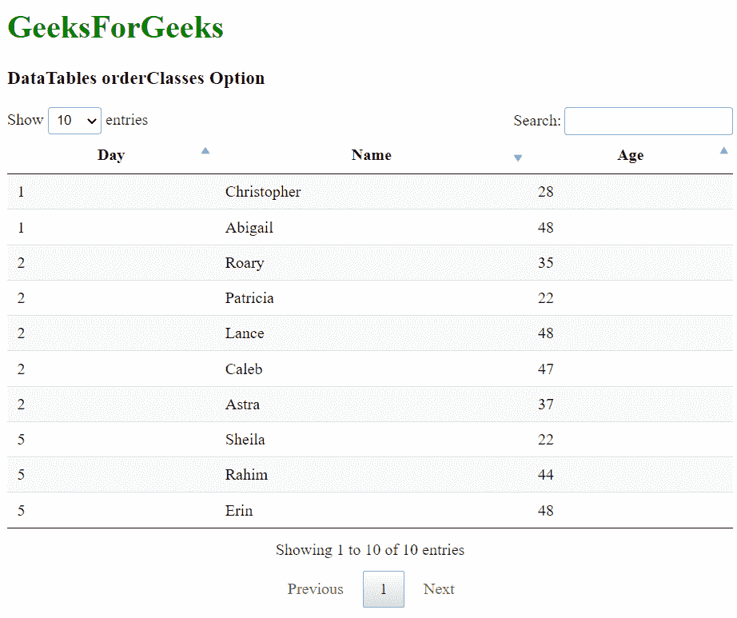
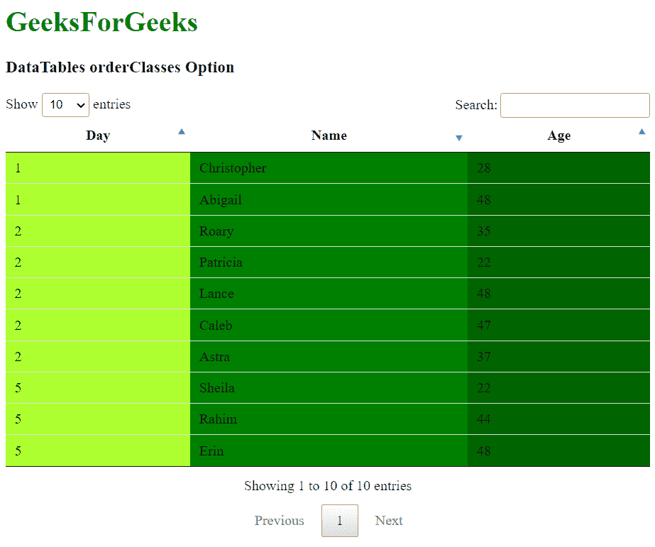

# 可注明日期的订单类选项

> 原文:[https://www . geesforgeks . org/datatables-order class-option/](https://www.geeksforgeeks.org/datatables-orderclasses-option/)

**DataTables** 是 jQuery 插件，可用于为网页的 HTML 表格添加交互和高级控件。这也允许根据用户的需要搜索、排序和过滤表中的数据。数据表还公开了一个强大的应用编程接口，可以进一步用来修改数据的显示方式。

**orderClasses** 选项用于指定当前排序的列是否会应用一个类。默认情况下，数据表将类*排序 _1* 、*排序 _2* 和*排序 _3* 应用于已排序的列。这将突出显示已排序的列，以便区分它们。类后的数字表示使用的排序级别，最大级别为 3，之后重复最后一个类。

但是，可以使用此选项禁用此功能，以提高旧系统的性能，或者在需要处理大量行的情况下。

```html
{ orderClasses: value }
```

**参数:**该选项具有如上所述的单一值，如下所述:

*   **值:**这是一个布尔值，用于指定是否使用预定义的类突出显示表中当前排序的列。默认值为真。

以下示例说明了该选项的使用。

**示例 1:** 在此示例中，排序类被禁止添加到列中。三个排序类的背景色已经使用 CSS 进行了修改，以使差异更加明显。

## 超文本标记语言

```html
<html>
<head>
  <!-- jQuery -->
  <script type="text/javascript" 
          src="https://code.jquery.com/jquery-3.5.1.js">
  </script>

  <!-- DataTables CSS -->
  <link rel="stylesheet"
        href=
"https://cdn.datatables.net/1.10.23/css/jquery.dataTables.min.css">

  <!-- DataTables JS -->
  <script src=
          "https://cdn.datatables.net/1.10.23/js/jquery.dataTables.min.js">
  </script>

  <style>

    /* Specify the background color in the
    classes applied to the sorted columns */
    .sorting_1 {
      background-color: greenyellow !important;
    }

    .sorting_2 {
      background-color: green !important;
    }

    .sorting_3 {
      background-color: darkgreen !important;
    }
  </style>
</head>
<body>
  <h1 style="color: green;">
    GeeksForGeeks
  </h1>
  <h3>DataTables orderClasses Option</h3>

  <!-- HTML table with random data -->
  <table id="tableID" class="display nowrap">
    <thead>
      <tr>
        <th>Day</th>
        <th>Name</th>
        <th>Age</th>
      </tr>
    </thead>
    <tbody>
      <tr>
        <td>2</td>
        <td>Patricia</td>
        <td>22</td>
      </tr>
      <tr>
        <td>2</td>
        <td>Caleb</td>
        <td>47</td>
      </tr>
      <tr>
        <td>1</td>
        <td>Abigail</td>
        <td>48</td>
      </tr>
      <tr>
        <td>5</td>
        <td>Rahim</td>
        <td>44</td>
      </tr>
      <tr>
        <td>5</td>
        <td>Sheila</td>
        <td>22</td>
      </tr>
      <tr>
        <td>2</td>
        <td>Lance</td>
        <td>48</td>
      </tr>
      <tr>
        <td>5</td>
        <td>Erin</td>
        <td>48</td>
      </tr>
      <tr>
        <td>1</td>
        <td>Christopher</td>
        <td>28</td>
      </tr>
      <tr>
        <td>2</td>
        <td>Roary</td>
        <td>35</td>
      </tr>
      <tr>
        <td>2</td>
        <td>Astra</td>
        <td>37</td>
      </tr>
    </tbody>
  </table>
  <script>

    // Initialize the DataTable
    $(document).ready(function () {
      $('#tableID').DataTable({

        order: [[0, 'asc'], [1, 'desc'], [2, 'asc']],

        // Disable the highlighting of
        // columns that are sorted
        orderClasses: false,
      });
    }); 
  </script>
</body>
</html>
```

**输出:**



**示例 2:** 在此示例中，相关类被启用并添加到列中。三个排序类的背景色已经使用 CSS 进行了修改，以使差异更加明显。

## 超文本标记语言

```html
<html>
<head>
  <!-- jQuery -->
  <script type="text/javascript" 
          src="https://code.jquery.com/jquery-3.5.1.js">
  </script>

  <!-- DataTables CSS -->
  <link rel="stylesheet"
        href=
"https://cdn.datatables.net/1.10.23/css/jquery.dataTables.min.css">

  <!-- DataTables JS -->
  <script src=
          "https://cdn.datatables.net/1.10.23/js/jquery.dataTables.min.js">
  </script>

  <style>

    /* Specify the background color in the
    classes applied to the sorted columns */
    .sorting_1 {
      background-color: greenyellow !important;
    }

    .sorting_2 {
      background-color: green !important;
    }

    .sorting_3 {
      background-color: darkgreen !important;
    }
  </style>
</head>
<body>
  <h1 style="color: green;">
    GeeksForGeeks
  </h1>
  <h3>DataTables orderClasses Option</h3>

  <!-- HTML table with random data -->
  <table id="tableID" class="display nowrap">
    <thead>
      <tr>
        <th>Day</th>
        <th>Name</th>
        <th>Age</th>
      </tr>
    </thead>
    <tbody>
      <tr>
        <td>2</td>
        <td>Patricia</td>
        <td>22</td>
      </tr>
      <tr>
        <td>2</td>
        <td>Caleb</td>
        <td>47</td>
      </tr>
      <tr>
        <td>1</td>
        <td>Abigail</td>
        <td>48</td>
      </tr>
      <tr>
        <td>5</td>
        <td>Rahim</td>
        <td>44</td>
      </tr>
      <tr>
        <td>5</td>
        <td>Sheila</td>
        <td>22</td>
      </tr>
      <tr>
        <td>2</td>
        <td>Lance</td>
        <td>48</td>
      </tr>
      <tr>
        <td>5</td>
        <td>Erin</td>
        <td>48</td>
      </tr>
      <tr>
        <td>1</td>
        <td>Christopher</td>
        <td>28</td>
      </tr>
      <tr>
        <td>2</td>
        <td>Roary</td>
        <td>35</td>
      </tr>
      <tr>
        <td>2</td>
        <td>Astra</td>
        <td>37</td>
      </tr>
    </tbody>
  </table>
  <script>

    // Initialize the DataTable
    $(document).ready(function () {
      $('#tableID').DataTable({

        order: [[0, 'asc'], [1, 'desc'], [2, 'asc']],

        // Enable the highlighting of
        // columns that are sorted
        orderClasses: true,
      });
    }); 
  </script>
</body>
</html>
```

**输出:**



**参考文献**:[https://datatables.net/reference/option/orderClasses](https://datatables.net/reference/option/orderClasses)