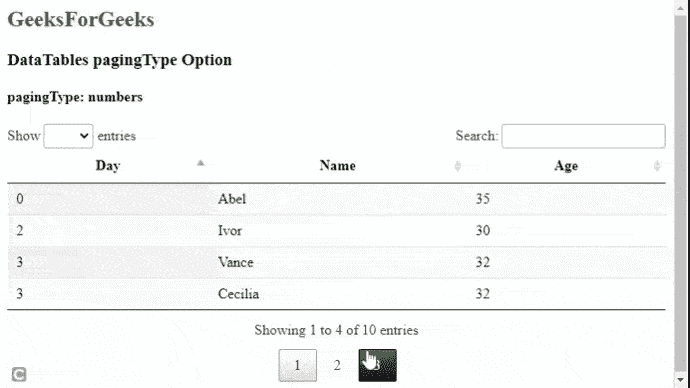
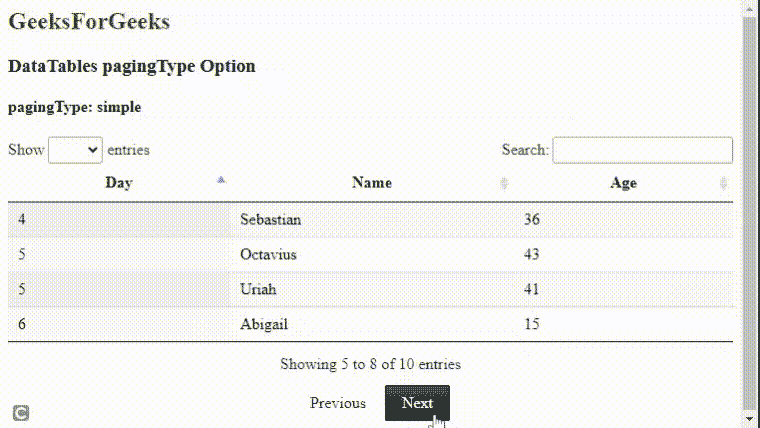
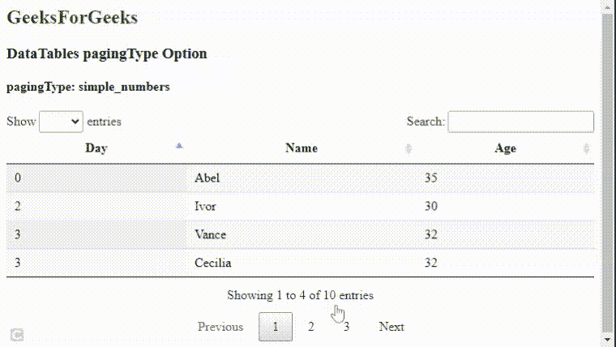
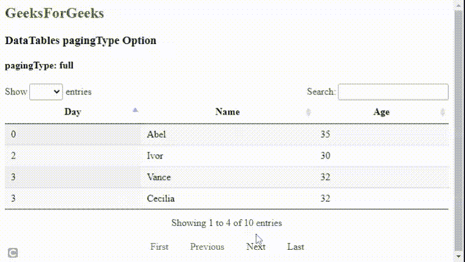
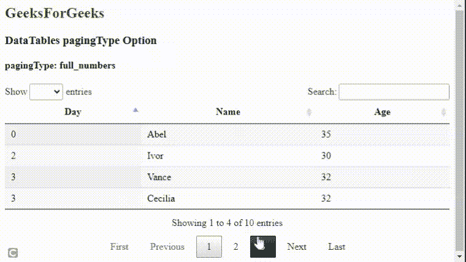
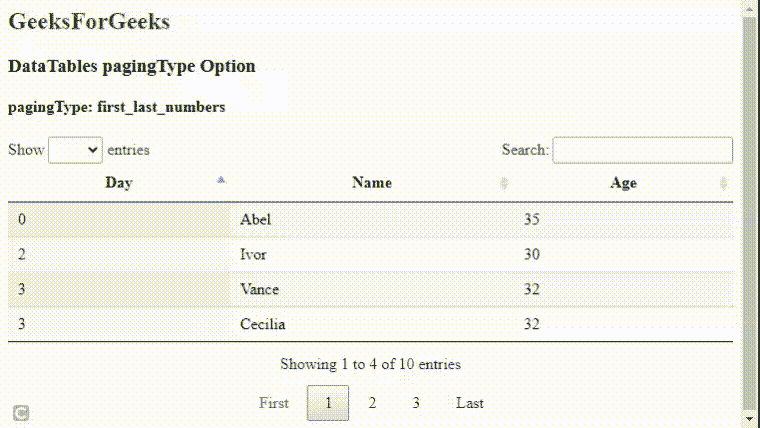

# 可注明日期的 pagingType Option

> 哎哎哎:# t0]https://www . geeksforgeeks . org/datatable-pagingtype 选项/

**DataTables** 是一个 jQuery 插件，可以用来为网页的 HTML 表格添加交互和高级控件。这也允许根据用户的需要搜索、排序和过滤表中的数据。数据表还公开了一个强大的应用编程接口，可以进一步用来修改数据的显示方式。

***分页类型*** 选项用于指定将显示在数据表下方进行分页的控件类型。它接受一个字符串值，该值可以通过使用 6 种内置类型的可用控件来指定。这些由以下值指定。

*   **简单:**在这种类型的控件中，只显示“上一个”和“下一个”按钮。
*   **simple_numbers:** 在这种类型的控件中，“上一页”和“下一页”按钮与页码一起显示。
*   **满:**在这种类型的控件中，只显示“第一个”、“上一个”、“下一个”和“最后一个”按钮。
*   **full_numbers:** 在这种类型的控件中，“第一个”、“上一个”、“下一个”和“最后一个”按钮与页码一起显示。
*   **数字:**在这种类型的控件中，只显示页码。
*   **first_last_numbers:** 在这种类型的控件中，“first”和“last”按钮与页码一起显示。

可以使用数据表插件添加其他类型。

**语法:**

```
{ pagingType: value }
```

**参数:**该选项有一个如上所述的单一值，如下所述。

*   **值:**这是一个字符串值，指定将显示的控件类型。

下面的示例说明了该选项的使用。我们将看到内置于数据表中的所有不同的分页类型。

**示例 1:** 在这种类型的控件中，按钮与页码一起显示。

## 超文本标记语言

```
<html>
<head>
  <!-- jQuery -->
  <script type="text/javascript" 
          src="https://code.jquery.com/jquery-3.5.1.js">
  </script>

  <!-- DataTables CSS -->
  <link rel="stylesheet" 
        href=
"https://cdn.datatables.net/1.10.23/css/jquery.dataTables.min.css">

  <!-- DataTables JS -->
  <script src=
"https://cdn.datatables.net/1.10.23/js/jquery.dataTables.min.js">
  </script>

</head>

<body>
  <h2 style="color:green;">
    GeeksForGeeks
  </h2>
  <h3>DataTables pagingType Option</h3>

  <!-- HTML table with random data -->
  <h4>pagingType: numbers</h4>
  <table id="table_numbers" 
         class="display nowrap" 
         style="width: 100%;">
  </table>

  <script>

    // Define the columns and content
    // of the DataTable
    let columnData = [
      { title: "Day" },
      { title: "Name" },
      { title: "Age" }
    ];

    let tableData = [
      ["2", "Ivor", "30"],
      ["3", "Vance", "32"],
      ["5", "Octavius", "43"],
      ["0", "Abel", "35"],
      ["3", "Cecilia", "32"],
      ["4", "Sebastian", "36"],
      ["5", "Uriah", "41"],
      ["6", "Abigail", "15"],
      ["10", "Sam", "68"],
      ["33", "Richard", "25"]
    ]

    // Initialize the DataTable
    $(document).ready(function () {
      $('#table_numbers').DataTable({
        data: tableData,
        columns: columnData,
        pageLength: 4,

        // Specify the paging type to be used
        // in the DataTable
        pagingType: "numbers"
      });
    });

     </script>
</body>
</html>
```

**输出:**



**示例 2:** 在这种类型的控件中，仅显示“上一个”和“下一个”按钮。

## 超文本标记语言

```
<html>
<head>
  <!-- jQuery -->
  <script type="text/javascript" 
          src="https://code.jquery.com/jquery-3.5.1.js">
  </script>

  <!-- DataTables CSS -->
  <link rel="stylesheet" 
        href=
"https://cdn.datatables.net/1.10.23/css/jquery.dataTables.min.css">

  <!-- DataTables JS -->
  <script src=
"https://cdn.datatables.net/1.10.23/js/jquery.dataTables.min.js">
  </script>

</head>

<body>
  <h2 style="color:green;">
    GeeksForGeeks
  </h2>
  <h3>DataTables pagingType Option</h3>

  <!-- HTML table with random data -->
  <h4>pagingType: simple</h4>
  <table id="table_simple" 
         class="display nowrap" 
         style="width: 100%;">
  </table>

  <script>

    // Define the columns and content
    // of the DataTable
    let columnData = [
      { title: "Day" },
      { title: "Name" },
      { title: "Age" }
    ];

    let tableData = [
      ["2", "Ivor", "30"],
      ["3", "Vance", "32"],
      ["5", "Octavius", "43"],
      ["0", "Abel", "35"],
      ["3", "Cecilia", "32"],
      ["4", "Sebastian", "36"],
      ["5", "Uriah", "41"],
      ["6", "Abigail", "15"],
      ["10", "Sam", "68"],
      ["33", "Richard", "25"]
    ]

    // Initialize the DataTable
      $(document).ready(function () {
      $('#table_simple').DataTable({

        data: tableData,
        columns: columnData,
        pageLength: 4,

        // Specify the paging type to be used
        // in the DataTable
        pagingType: "simple"
      });
    });

     </script>
</body>
</html>
```

**输出:**



**示例 3:** 在这种类型的控件中，“上一页”和“下一页”按钮与页码一起显示

## 超文本标记语言

```
<html>
<head>
  <!-- jQuery -->
  <script type="text/javascript" 
          src="https://code.jquery.com/jquery-3.5.1.js">
  </script>

  <!-- DataTables CSS -->
  <link rel="stylesheet" 
        href=
"https://cdn.datatables.net/1.10.23/css/jquery.dataTables.min.css">

  <!-- DataTables JS -->
  <script src=
"https://cdn.datatables.net/1.10.23/js/jquery.dataTables.min.js">
  </script>

</head>

<body>
  <h2 style="color:green;">
    GeeksForGeeks
  </h2>
  <h3>DataTables pagingType Option</h3>

  <!-- HTML table with random data -->
  <h4>pagingType: simple_numbers</h4>
  <table id="table_simple_numbers" 
         class="display nowrap" 
         style="width: 100%;">
  </table>

  <script>

    // Define the columns and content
    // of the DataTable
    let columnData = [
      { title: "Day" },
      { title: "Name" },
      { title: "Age" }
    ];

    let tableData = [
      ["2", "Ivor", "30"],
      ["3", "Vance", "32"],
      ["5", "Octavius", "43"],
      ["0", "Abel", "35"],
      ["3", "Cecilia", "32"],
      ["4", "Sebastian", "36"],
      ["5", "Uriah", "41"],
      ["6", "Abigail", "15"],
      ["10", "Sam", "68"],
      ["33", "Richard", "25"]
    ]

    // Initialize the DataTable
     $(document).ready(function () {
      $('#table_simple_numbers').DataTable({

        data: tableData,
        columns: columnData,
        pageLength: 4,

        // Specify the paging type to be used
        // in the DataTable
        pagingType: "simple_numbers"
      });
    });

     </script>
</body>
</html>
```

**输出:**



**示例 4:** 在这种类型的控件中，仅显示“第一个”、“上一个”、“下一个”和“最后一个”按钮。

## 超文本标记语言

```
<html>
<head>
  <!-- jQuery -->
  <script type="text/javascript" 
          src="https://code.jquery.com/jquery-3.5.1.js">
  </script>

  <!-- DataTables CSS -->
  <link rel="stylesheet" 
        href=
"https://cdn.datatables.net/1.10.23/css/jquery.dataTables.min.css">

  <!-- DataTables JS -->
  <script src=
"https://cdn.datatables.net/1.10.23/js/jquery.dataTables.min.js">
  </script>

</head>

<body>
  <h2 style="color:green;">
    GeeksForGeeks
  </h2>
  <h3>DataTables pagingType Option</h3>

  <!-- HTML table with random data -->
  <h4>pagingType: full</h4>
  <table id="table_full" 
         class="display nowrap" 
         style="width: 100%;">
  </table>

  <script>

    // Define the columns and content
    // of the DataTable
    let columnData = [
      { title: "Day" },
      { title: "Name" },
      { title: "Age" }
    ];

    let tableData = [
      ["2", "Ivor", "30"],
      ["3", "Vance", "32"],
      ["5", "Octavius", "43"],
      ["0", "Abel", "35"],
      ["3", "Cecilia", "32"],
      ["4", "Sebastian", "36"],
      ["5", "Uriah", "41"],
      ["6", "Abigail", "15"],
      ["10", "Sam", "68"],
      ["33", "Richard", "25"]
    ]

    // Initialize the DataTable
     $(document).ready(function () {
      $('#table_full').DataTable({

        data: tableData,
        columns: columnData,
        pageLength: 4,

        // Specify the paging type to be used
        // in the DataTable
        pagingType: "full"
      });
    });

     </script>
</body>
</html>
```

**输出:**



**示例 5:** 在这种类型的控件中，“第一个”、“上一个”、“下一个”和“最后一个”按钮与页码一起显示。

## 超文本标记语言

```
<html>
<head>
  <!-- jQuery -->
  <script type="text/javascript" 
          src="https://code.jquery.com/jquery-3.5.1.js">
  </script>

  <!-- DataTables CSS -->
  <link rel="stylesheet" 
        href=
"https://cdn.datatables.net/1.10.23/css/jquery.dataTables.min.css">

  <!-- DataTables JS -->
  <script src=
"https://cdn.datatables.net/1.10.23/js/jquery.dataTables.min.js">
  </script>

</head>

<body>
  <h2 style="color:green;">
    GeeksForGeeks
  </h2>
  <h3>DataTables pagingType Option</h3>

  <!-- HTML table with random data -->
  <h4>pagingType: full_numbers</h4>
  <table id="table_full_numbers" 
         class="display nowrap" 
         style="width: 100%;">
  </table>

  <script>

    // Define the columns and content
    // of the DataTable
    let columnData = [
      { title: "Day" },
      { title: "Name" },
      { title: "Age" }
    ];

    let tableData = [
      ["2", "Ivor", "30"],
      ["3", "Vance", "32"],
      ["5", "Octavius", "43"],
      ["0", "Abel", "35"],
      ["3", "Cecilia", "32"],
      ["4", "Sebastian", "36"],
      ["5", "Uriah", "41"],
      ["6", "Abigail", "15"],
      ["10", "Sam", "68"],
      ["33", "Richard", "25"]
    ]

    // Initialize the DataTable
     $(document).ready(function () {
      $('#table_full_numbers').DataTable({

        data: tableData,
        columns: columnData,
        pageLength: 4,

        // Specify the paging type to be used
        // in the DataTable
        pagingType: "full_numbers"
      });
    });
     </script>
</body>
</html>
```

**输出:**



**示例 6:** 在这种类型的控件中，“第一个”和“最后一个”按钮与页码一起显示。

## 超文本标记语言

```
<html>
<head>
  <!-- jQuery -->
  <script type="text/javascript" 
          src="https://code.jquery.com/jquery-3.5.1.js">
  </script>

  <!-- DataTables CSS -->
  <link rel="stylesheet" 
        href=
"https://cdn.datatables.net/1.10.23/css/jquery.dataTables.min.css">

  <!-- DataTables JS -->
  <script src=
"https://cdn.datatables.net/1.10.23/js/jquery.dataTables.min.js">
  </script>

</head>

<body>
  <h2 style="color:green;">
    GeeksForGeeks
  </h2>
  <h3>DataTables pagingType Option</h3>

  <!-- HTML table with random data -->
  <h4>pagingType: first_last_numbers</h4>
  <table id="table_first_last_numbers"
         class="display nowrap" 
         style="width: 100%;">
  </table>

  <script>

    // Define the columns and content
    // of the DataTable
    let columnData = [
      { title: "Day" },
      { title: "Name" },
      { title: "Age" }
    ];

    let tableData = [
      ["2", "Ivor", "30"],
      ["3", "Vance", "32"],
      ["5", "Octavius", "43"],
      ["0", "Abel", "35"],
      ["3", "Cecilia", "32"],
      ["4", "Sebastian", "36"],
      ["5", "Uriah", "41"],
      ["6", "Abigail", "15"],
      ["10", "Sam", "68"],
      ["33", "Richard", "25"]
    ]

    // Initialize the DataTable
     $(document).ready(function () {
      $('#table_first_last_numbers').DataTable({

        data: tableData,
        columns: columnData,
        pageLength: 4,

        // Specify the paging type to be used
        // in the DataTable
        pagingType: "first_last_numbers"
      });
    });
     </script>
</body>
</html>
```

**输出:**



**参考链接:**[https://datatables.net/reference/option/pagingType](https://datatables.net/reference/option/pagingType)