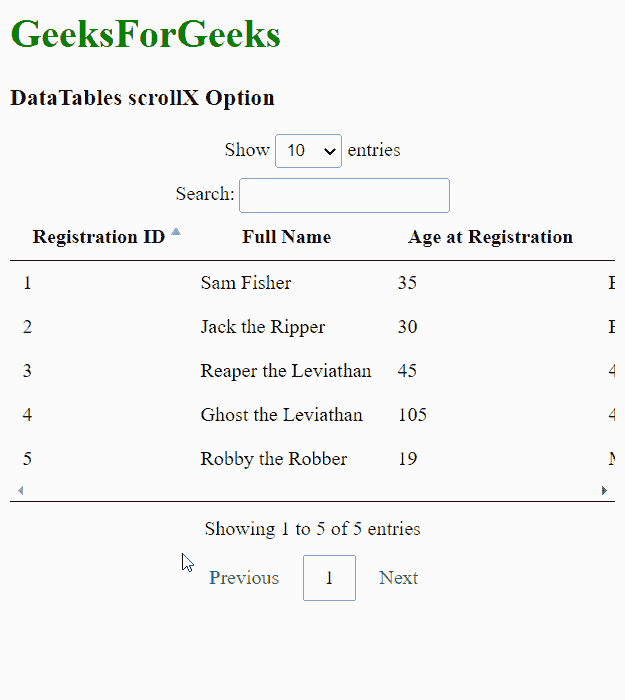
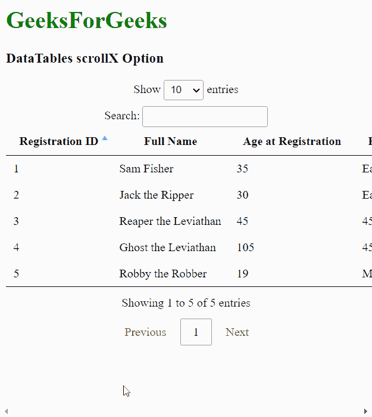

# 可注明日期的卷轴选项

> 哎哎哎:# t0]https://www . geeksforgeeks . org/datatable-scroll x 选项/

**DataTables** 是 jQuery 插件，可用于为网页的 HTML 表格添加交互和高级控件。这也允许根据用户的需要搜索、排序和过滤表中的数据。数据表还公开了一个强大的应用编程接口，可以进一步用来修改数据的显示方式。

**滚动**选项用于指定是否应在数据表中启用水平滚动。该选项将使用户能够水平滚动表格本身中任何溢出的内容。当有很多列或列不适合布局时，可以使用这种方法。一个**真**值启用该滚动，一个**假**值禁用该滚动。

**语法:**

```html
{ scrollX: value }
```

**选项值:**该选项具有如上所述的单一值，如下所述:

*   **值:**这是一个布尔值，用于启用或禁用数据表的水平滚动。默认值为假。

以下示例说明了该选项的使用。

**示例 1:** 本示例启用数据表的水平滚动。

## 超文本标记语言

```html
<html>
<head>
  <!-- jQuery -->
  <script type="text/javascript" 
          src="https://code.jquery.com/jquery-3.5.1.js">
  </script>

  <!-- DataTables CSS -->
  <link rel="stylesheet"
        href=
"https://cdn.datatables.net/1.10.23/css/jquery.dataTables.min.css">

  <!-- DataTables JS -->
  <script src=
"https://cdn.datatables.net/1.10.23/js/jquery.dataTables.min.js">
  </script>
</head>
<body>
  <h1 style="color: green;">
    GeeksForGeeks
  </h1>
  <h3>DataTables scrollX Option</h3>

  <!-- HTML table with random data -->
  <table id="tableID" class="display nowrap"
         style="width: 100%">
    <thead>
      <tr>
        <th>Registration ID</th>
        <th>Full Name</th>
        <th>Age at Registration</th>
        <th>Full Address</th>
        <th>Phone Number</th>
      </tr>
    </thead>
    <tbody>
      <tr>
        <td>1</td>
        <td>Sam Fisher</td>
        <td>35</td>
        <td>Earth, Galaxy</td>
        <td>01234344043</td>
      </tr>
      <tr>
        <td>2</td>
        <td>Jack the Ripper</td>
        <td>30</td>
        <td>Earth, Galaxy</td>
        <td>0124334043</td>
      </tr>
      <tr>
        <td>3</td>
        <td>Reaper the Leviathan</td>
        <td>45</td>
        <td>4546B</td>
        <td>0189994043</td>
      </tr>
      <tr>
        <td>4</td>
        <td>Ghost the Leviathan</td>
        <td>105</td>
        <td>4546B</td>
        <td>0123489043</td>
      </tr>
      <tr>
        <td>5</td>
        <td>Robby the Robber</td>
        <td>19</td>
        <td>Mars</td>
        <td>68898988</td>
      </tr>
    </tbody>
  </table>
  <script>

    // Initialize the DataTable
    $(document).ready(function () {
      $('#tableID').DataTable({

        // Enable the horizontal scrolling
        // of data in DataTable
        scrollX: true
      });
    }); 
  </script>
</body>
</html>
```

**输出:**



**示例 2:** 本示例禁用数据表的水平滚动。

## 超文本标记语言

```html
<html>
<head>
  <!-- jQuery -->
  <script type="text/javascript" 
          src="https://code.jquery.com/jquery-3.5.1.js">
  </script>

  <!-- DataTables CSS -->
  <link rel="stylesheet"
        href=
"https://cdn.datatables.net/1.10.23/css/jquery.dataTables.min.css">

  <!-- DataTables JS -->
  <script src=
"https://cdn.datatables.net/1.10.23/js/jquery.dataTables.min.js">
  </script>
</head>
<body>
  <h1 style="color: green;">
    GeeksForGeek
    s</h1>
  <h3>DataTables scrollX Option</h3>

  <!-- HTML table with random data -->
  <table id="tableID" class="display nowrap"
         style="width: 100%">
    <thead>
      <tr>
        <th>Registration ID</th>
        <th>Full Name</th>
        <th>Age at Registration</th>
        <th>Full Address</th>
        <th>Phone Number</th>
      </tr>
    </thead>
    <tbody>
      <tr>
        <td>1</td>
        <td>Sam Fisher</td>
        <td>35</td>
        <td>Earth, Galaxy</td>
        <td>01234344043</td>
      </tr>
      <tr>
        <td>2</td>
        <td>Jack the Ripper</td>
        <td>30</td>
        <td>Earth, Galaxy</td>
        <td>0124334043</td>
      </tr>
      <tr>
        <td>3</td>
        <td>Reaper the Leviathan</td>
        <td>45</td>
        <td>4546B</td>
        <td>0189994043</td>
      </tr>
      <tr>
        <td>4</td>
        <td>Ghost the Leviathan</td>
        <td>105</td>
        <td>4546B</td>
        <td>0123489043</td>
      </tr>
      <tr>
        <td>5</td>
        <td>Robby the Robber</td>
        <td>19</td>
        <td>Mars</td>
        <td>68898988</td>
      </tr>
    </tbody>
  </table>
  <script>

    // Initialize the DataTable
    $(document).ready(function () {
      $('#tableID').DataTable({

        // Disable the horizontal scrolling
        // of data in DataTable
        scrollX: false
      });
    }); 
  </script>
</body>
</html>
```

**输出:**

