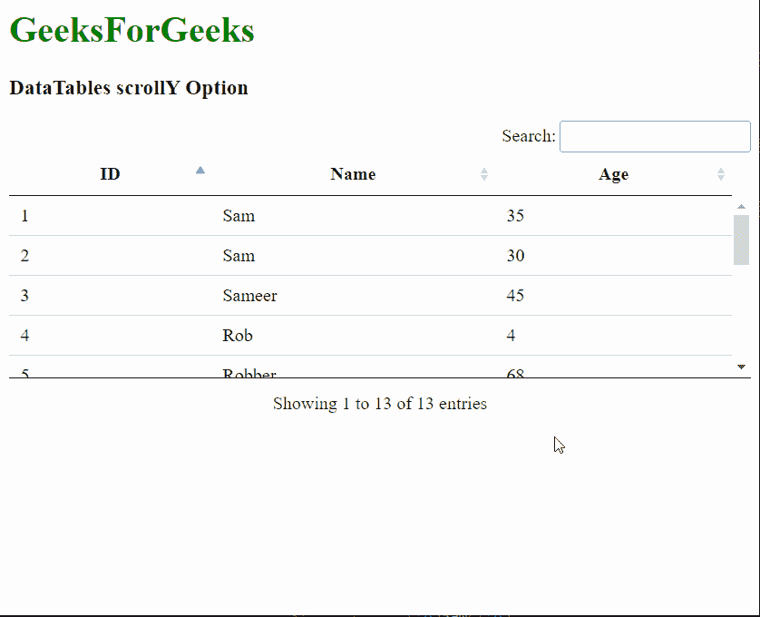
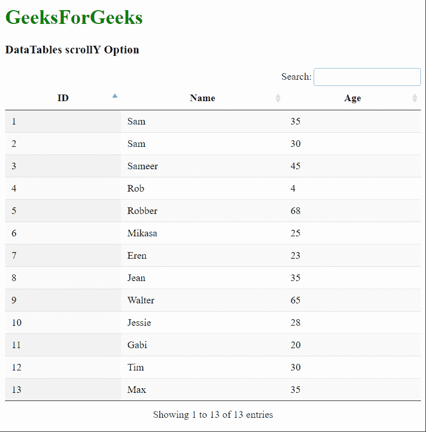

# 数据表滚动选项

> 原文:[https://www.geeksforgeeks.org/datatables-scrolly-option/](https://www.geeksforgeeks.org/datatables-scrolly-option/)

**DataTables** 是 jQuery 插件，可用于为网页的 HTML 表格添加交互和高级控件。这也允许根据用户的需要搜索、排序和过滤表中的数据。数据表还公开了一个强大的应用编程接口，可以进一步用来修改数据的显示方式。

**滚动**选项用于指定是否应在数据表中启用垂直滚动。该选项将数据表的高度限制为给定值，并允许用户滚动表本身中溢出的内容。这可用于需要在有限空间内放置多张桌子的情况。高度值可以以任何 CSS 单位或数字给出，该数字将被视为像素值。

**语法:**

```html
{ scrollY: value }
```

**选项值:**该选项具有如上所述的单一值，如下所述:

*   **值:**这是一个字符串值，用于指定数据表的高度并启用垂直滚动。默认值为空字符串。

以下示例说明了该选项的使用。

**示例 1:** 本示例启用数据表的垂直滚动。

## 超文本标记语言

```html
<html>
<head>
  <!-- jQuery -->
  <script type="text/javascript" 
          src="https://code.jquery.com/jquery-3.5.1.js">
  </script>

  <!-- DataTables CSS -->
  <link rel="stylesheet" 
        href=
"https://cdn.datatables.net/1.10.23/css/jquery.dataTables.min.css">

  <!-- DataTables JS -->
  <script src=
"https://cdn.datatables.net/1.10.23/js/jquery.dataTables.min.js">
  </script>
</head>

<body>
  <h1 style="color: green;">
    GeeksForGeeks
  </h1>
  <h3>DataTables scrollY Option</h3>

  <!-- HTML table with student data -->
  <table id="tableID" class="display">
    <thead>
      <tr>
        <th>ID</th>
        <th>Name</th>
        <th>Age</th>
      </tr>
    </thead>
    <tbody>
      <tr>
        <td>1</td>
        <td>Sam</td>
        <td>35</td>
      </tr>
      <tr>
        <td>2</td>
        <td>Sam</td>
        <td>30</td>
      </tr>
      <tr>
        <td>3</td>
        <td>Sameer</td>
        <td>45</td>
      </tr>
      <tr>
        <td>4</td>
        <td>Rob</td>
        <td>4</td>
      </tr>
      <tr>
        <td>5</td>
        <td>Robber</td>
        <td>68</td>
      </tr>
      <tr>
        <td>6</td>
        <td>Mikasa</td>
        <td>25</td>
      </tr>
      <tr>
        <td>7</td>
        <td>Eren</td>
        <td>23</td>
      </tr>
      <tr>
        <td>8</td>
        <td>Jean</td>
        <td>35</td>
      </tr>
      <tr>
        <td>9</td>
        <td>Walter</td>
        <td>65</td>
      </tr>
      <tr>
        <td>10</td>
        <td>Jessie</td>
        <td>28</td>
      </tr>
      <tr>
        <td>11</td>
        <td>Gabi</td>
        <td>20</td>
      </tr>
      <tr>
        <td>12</td>
        <td>Tim</td>
        <td>30</td>
      </tr>
      <tr>
        <td>13</td>
        <td>Max</td>
        <td>35</td>
      </tr>
    </tbody>
  </table>
  <script>

    // Initialize the DataTable
    $(document).ready(function () {
      $('#tableID').DataTable({

        // Enable the vertical scrolling
        // of data in DataTable to 160px
        scrollY: "160px",

        // Disable the paging and
        // allow collapsing of the
        // table when data is less
        paging: false,
        scrollCollapse: true
      });
    }); 
  </script>
</body>
</html>
```

**输出:**



**示例 2:** 本示例禁用数据表的垂直滚动。

## 超文本标记语言

```html
<html>
<head>
  <!-- jQuery -->
  <script type="text/javascript"
          src="https://code.jquery.com/jquery-3.5.1.js">
  </script>

  <!-- DataTables CSS -->
  <link rel="stylesheet"
        href=
"https://cdn.datatables.net/1.10.23/css/jquery.dataTables.min.css">

  <!-- DataTables JS -->
  <script src=
"https://cdn.datatables.net/1.10.23/js/jquery.dataTables.min.js">
  </script>
</head>
<body>
  <h1 style="color: green;">
    GeeksForGeeks
  </h1>
  <h3>DataTables scrollY Option</h3>

  <!-- HTML table with student data -->
  <table id="tableID" class="display">
    <thead>
      <tr>
        <th>ID</th>
        <th>Name</th>
        <th>Age</th>
      </tr>
    </thead>
    <tbody>
      <tr>
        <td>1</td>
        <td>Sam</td>
        <td>35</td>
      </tr>
      <tr>
        <td>2</td>
        <td>Sam</td>
        <td>30</td>
      </tr>
      <tr>
        <td>3</td>
        <td>Sameer</td>
        <td>45</td>
      </tr>
      <tr>
        <td>4</td>
        <td>Rob</td>
        <td>4</td>
      </tr>
      <tr>
        <td>5</td>
        <td>Robber</td>
        <td>68</td>
      </tr>
      <tr>
        <td>6</td>
        <td>Mikasa</td>
        <td>25</td>
      </tr>
      <tr>
        <td>7</td>
        <td>Eren</td>
        <td>23</td>
      </tr>
      <tr>
        <td>8</td>
        <td>Jean</td>
        <td>35</td>
      </tr>
      <tr>
        <td>9</td>
        <td>Walter</td>
        <td>65</td>
      </tr>
      <tr>
        <td>10</td>
        <td>Jessie</td>
        <td>28</td>
      </tr>
      <tr>
        <td>11</td>
        <td>Gabi</td>
        <td>20</td>
      </tr>
      <tr>
        <td>12</td>
        <td>Tim</td>
        <td>30</td>
      </tr>
      <tr>
        <td>13</td>
        <td>Max</td>
        <td>35</td>
      </tr>
    </tbody>
  </table>
  <script>

    // Initialize the DataTable
    $(document).ready(function () {
      $('#tableID').DataTable({

        // Disable the vertical scrolling
        // of data in DataTable
        scrollY: "",

        // Disable the paging
        paging: false,
      });
    }); 
  </script>
</body>
</html>
```

**输出:**

