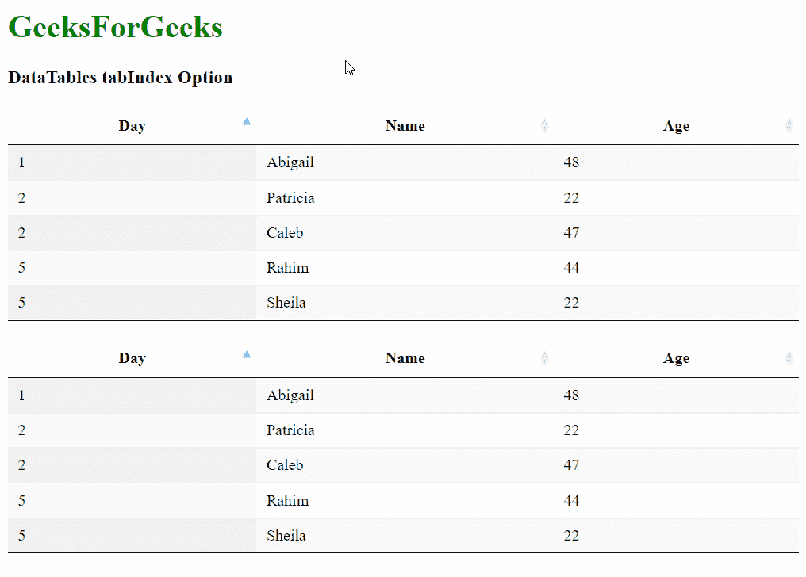
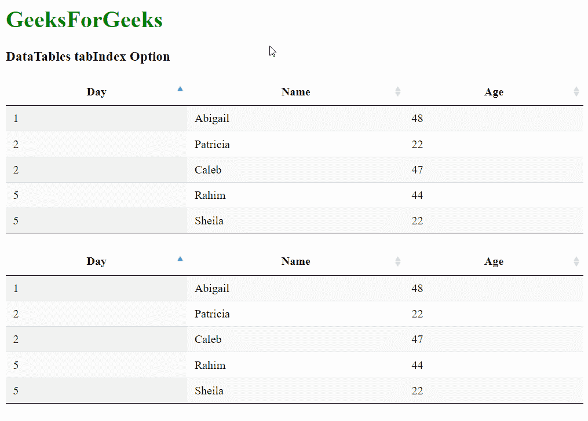

# 可注明日期的 tabIndex 选项

> 原文:[https://www.geeksforgeeks.org/datatables-tabindex-option/](https://www.geeksforgeeks.org/datatables-tabindex-option/)

**DataTables** 是一个 jQuery 插件，可以用来为网页的 HTML 表格添加交互和高级控件。这也允许根据用户的需要搜索、排序和过滤表中的数据。数据表还公开了一个强大的应用编程接口，可以进一步用来修改数据的显示方式。

***tabIndex*** 选项用于指定在页面上选择表格控件的流程顺序。此选项可用于否决此流，并更改键盘与页面交互的方式。默认情况下，一个数据表将有一个已经分配给它的*表格索引*，这样就可以不用鼠标就可以访问控件。

值-1 将意味着表的内置导航将被禁用，并阻止使用键盘导航页面。

```
{ tabIndex: value }
```

**参数:**该选项有一个如上所述的单一值，如下所述。

*   **值:**这是一个整数值，指定使用 tab 键时表格的流向。默认值为 0。

下面的例子说明了这个选项的使用。

**示例 1:** 在此示例中，第一个表的 *tabIndex* 设置为 2，第二个表的 *tabIndex* 设置为 1，因此第二个表的控件在第一个表之前被选中。

## 超文本标记语言

```
<html>
<head>
  <!-- jQuery -->
  <script type="text/javascript"
          src="https://code.jquery.com/jquery-3.5.1.js">
  </script>

  <!-- DataTables CSS -->
  <link rel="stylesheet" href=
"https://cdn.datatables.net/1.10.23/css/jquery.dataTables.min.css">

  <!-- DataTables JS -->
  <script src=
"https://cdn.datatables.net/1.10.23/js/jquery.dataTables.min.js">
  </script>
</head>
<body>
  <h1 style="color: green;">
    GeeksForGeeks
  </h1>
  <h3>DataTables tabIndex Option</h3>

  <!-- HTML table with random data -->
  <table id="tableID" class="display nowrap">
    <thead>
      <tr>
        <th>Day</th>
        <th>Name</th>
        <th>Age</th>
      </tr>
    </thead>
    <tbody>
      <tr>
        <td>2</td>
        <td>Patricia</td>
        <td>22</td>
      </tr>
      <tr>
        <td>2</td>
        <td>Caleb</td>
        <td>47</td>
      </tr>
      <tr>
        <td>1</td>
        <td>Abigail</td>
        <td>48</td>
      </tr>
      <tr>
        <td>5</td>
        <td>Rahim</td>
        <td>44</td>
      </tr>
      <tr>
        <td>5</td>
        <td>Sheila</td>
        <td>22</td>
      </tr>
    </tbody>
  </table>
  <br>

  <!-- HTML table with random data -->
  <table id="tableID2" class="display nowrap">
    <thead>
      <tr>
        <th>Day</th>
        <th>Name</th>
        <th>Age</th>
      </tr>
    </thead>
    <tbody>
      <tr>
        <td>2</td>
        <td>Patricia</td>
        <td>22</td>
      </tr>
      <tr>
        <td>2</td>
        <td>Caleb</td>
        <td>47</td>
      </tr>
      <tr>
        <td>1</td>
        <td>Abigail</td>
        <td>48</td>
      </tr>
      <tr>
        <td>5</td>
        <td>Rahim</td>
        <td>44</td>
      </tr>
      <tr>
        <td>5</td>
        <td>Sheila</td>
        <td>22</td>
      </tr>
    </tbody>
  </table>
  <script>

    // Initialize the DataTable
    $(document).ready(function () {
      $('#tableID').DataTable({

        info: false,
        paging: false,
        searching: false,

        // Specify the tabindex value for
        // selecting the controls of the table
        tabIndex: 2,
      });

      $('#tableID2').DataTable({

        info: false,
        paging: false,
        searching: false,

        // Specify the tabindex value for
        // selecting the controls of the table
        tabIndex: 1,
      });
    });
  </script>
</body>
</html>
```

**输出:**



**示例 2:** 在本例中，第一个表的*表索引*设置为-1，因此第一个表在文档流中不可选择。

## 超文本标记语言

```
<html>
<head>
  <!-- jQuery -->
  <script type="text/javascript"
          src="https://code.jquery.com/jquery-3.5.1.js">
  </script>

  <!-- DataTables CSS -->
  <link rel="stylesheet" href=
"https://cdn.datatables.net/1.10.23/css/jquery.dataTables.min.css">

  <!-- DataTables JS -->
  <script src=
"https://cdn.datatables.net/1.10.23/js/jquery.dataTables.min.js">
  </script>
</head>
<body>
  <h1 style="color: green;">
    GeeksForGeeks
  </h1>
  <h3>DataTables tabIndex Option</h3>

  <!-- HTML table with random data -->
  <table id="tableID" class="display nowrap">
    <thead>
      <tr>
        <th>Day</th>
        <th>Name</th>
        <th>Age</th>
      </tr>
    </thead>
    <tbody>
      <tr>
        <td>2</td>
        <td>Patricia</td>
        <td>22</td>
      </tr>
      <tr>
        <td>2</td>
        <td>Caleb</td>
        <td>47</td>
      </tr>
      <tr>
        <td>1</td>
        <td>Abigail</td>
        <td>48</td>
      </tr>
      <tr>
        <td>5</td>
        <td>Rahim</td>
        <td>44</td>
      </tr>
      <tr>
        <td>5</td>
        <td>Sheila</td>
        <td>22</td>
      </tr>
    </tbody>
  </table>
  <br>

  <!-- HTML table with random data -->
  <table id="tableID2" class="display nowrap">
    <thead>
      <tr>
        <th>Day</th>
        <th>Name</th>
        <th>Age</th>
      </tr>
    </thead>
    <tbody>
      <tr>
        <td>2</td>
        <td>Patricia</td>
        <td>22</td>
      </tr>
      <tr>
        <td>2</td>
        <td>Caleb</td>
        <td>47</td>
      </tr>
      <tr>
        <td>1</td>
        <td>Abigail</td>
        <td>48</td>
      </tr>
      <tr>
        <td>5</td>
        <td>Rahim</td>
        <td>44</td>
      </tr>
      <tr>
        <td>5</td>
        <td>Sheila</td>
        <td>22</td>
      </tr>
    </tbody>
  </table>
  <script>

    // Initialize the DataTable
    $(document).ready(function () {
      $('#tableID').DataTable({

        info: false,
        paging: false,
        searching: false,

        // Disable the selecting of the
        // controls of the table
        tabIndex: -1,
      });

      $('#tableID2').DataTable({

        info: false,
        paging: false,
        searching: false,

        // Specify the tabindex value for
        // selecting the controls of the table
        tabIndex: 0,
      });
    });
  </script>
</body>
</html>
```

**输出:**



第一个表不可选择

**参考:**

[https://datatables.net/reference/option/tabIndex](https://datatables.net/reference/option/tabIndex)