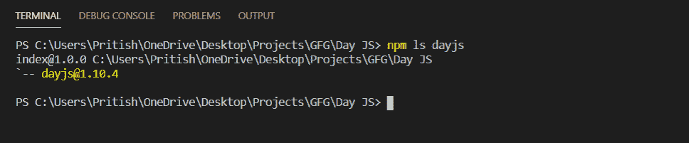
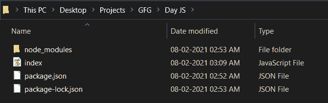
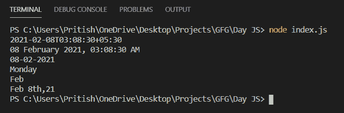

# DayJS 介绍及安装

> 原文:[https://www . geesforgeks . org/day js-introduction-and-installation/](https://www.geeksforgeeks.org/dayjs-introduction-and-installation/)

Day js 是一个轻量级的日期和时间操作库。它是具有相同现代 API 的矩 js 的替代。最新版本的 day js 的大小为 7Kb(缩小)和 2Kb (Gzipped)。由于其体积小，加载时间更短，从而提高了应用程序的整体性能。

**特征:**

1.  它很容易使用，而且因为它有与矩量法相同的应用编程接口，所以使用它非常容易。
2.  它因体积小而广受欢迎。

**安装 DayJS:**

*   您可以访问“https://day . js . org/docs/en/installation/installation”获取文档。可以使用此命令安装软件包。

    ```
    npm install dayjs
    ```

*   您也可以将 CDN 链接添加到项目中。链接如下。

*   After installing, you can check the installed version of the package with this command.

    ```
    npm ls dayjs
    ```

    

*   要开始使用 DayJS，请创建一个名为 **index.js** 的文件。这个包可以用这个命令包含在 index.js 中。

```
const dayjs = require('dayjs');
```

**项目结构:**项目结构如下图所示。



**文件名- index.js:**

## java 描述语言

```
const dayjs = require('dayjs');

// 2021-02-08T03:08:30+05:30 - ISO 8601 standard
console.log(dayjs().format());

// 08 February 2021, 03:08:30 AM
console.log(dayjs().format('DD MMMM YYYY, hh:mm:ss A')); 

// 08-02-2021
console.log(dayjs().format('DD-MM-YYYY'));

// Monday
console.log(dayjs().format('dddd')); 

// Feb
console.log(dayjs().format('MMM'));

// Feb 8th,21 
console.log(dayjs().format("MMM D[th],YY")); 

```

**运行文件:**在终端运行以下命令执行 index.js 文件。

```
node index.js
```

**输出:**



[MomentJS 模块](https://www.geeksforgeeks.org/node-js-moment-module/)的工作与 DayJS 相同，但是当您将 web 应用程序的性能作为最高优先级时，MomentJS 会因为其复杂的 API 和大的包大小而带来问题。Dayjs 是 moment js 的一个很好的替代品，与 moment js 相比，它的体积非常小。因此，这就是我们如何在应用程序中使用 DayJS 来操作、验证和显示日期和时间。