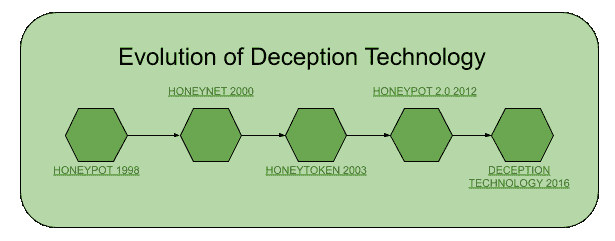

# 欺骗技术

> 原文:[https://www.geeksforgeeks.org/deception-technology/](https://www.geeksforgeeks.org/deception-technology/)

欺骗使更积极的安全行动成为可能。欺骗的目的是避免一个已经设法渗透网络的网络罪犯造成任何巨大的损害。它提供了对攻击者更准确、更快速的检测。它不会产生误报。蜜罐是第一种简单的欺骗形式。它旨在检测现有的入侵，并将入侵情报直接返回给网络安全团队。任何其他网络安全都会发送大量的被攻击警报每个警报都需要具体解决，但大多数都是误报这太耗时，需要越来越多的员工。因此，我们只需要减少误报警报，但这增加了误报的可能性。假阴性的可能性比假阳性更有效，为了检测这种线程，我们需要使用欺骗技术。

下面描述了两种欺骗技术。

*   **主动欺骗:**主动欺骗会故意向主体(入侵者或黑客)提供不准确的信息，从而上当。
*   **被动欺骗:**被动欺骗会提供不完整的信息，o 另一半信息。入侵者会试图获得所有信息，然后落入陷阱。

**欺骗技术的演进:**

**欺骗技术工作原理:**
欺骗技术是针对 MILDEC 或者军事欺骗。欺骗技术的工作原理更容易理解，一个虚假的诱饵网络将在现有的基础设施上运行，但真正的工作人员看不到。当任何黑客或入侵者访问该基础设施时，他们将能够看到诱饵是一个入侵基础设施的机会，他们会上当。

入侵者的诱饵必须简单，这样入侵者就可以轻松突破守卫，落入陷阱。诱饵应该表现得像组织的重要信息或数据，只有这样，攻击者才会穿透安全。入侵者不应该识别欺骗技术的设置。设置最好由一个系统自动完成，该系统映射定义诱饵内容和定位的真实网络。

**欺骗技术适用方法:**

*   **捎带:**当犯罪分子贴上标签并授权他人进入受保护地点或有限区域时，就会发生捎带。不安全的无线网络可以被搭载。
*   **冒名顶替:**犯罪分子可以利用网站和社交媒体帖子破坏个人的可靠性。冒充是伪装成另一个人的行为，目的是获取个人、组织等的数据。
*   **基于网络的欺骗:**在工作中发送恶作剧电子邮件、笑话、电影和与业务无关的电子邮件可能会违反组织的可接受使用政策，并导致纪律处分活动。
*   **肩部冲浪:**肩部冲浪是指通过直接观察获取个人数据。攻击者可以使用双筒望远镜或电路摄像机进行肩部冲浪。肩部冲浪最常见的被盗数据包括信用卡号、PINs、访问码等。
*   **恶作剧:**恶作剧是一种旨在欺骗的行为。一场骗局所造成的干扰与一次真正的破坏所造成的干扰是一样的。反应会做出不必要的恐惧和不合理的行为。客户通过电子邮件和在线网络传递骗局。骗局会引起客户的回应。

**欺骗技术的重要性:**欺骗技术依赖于对存在的识别，而不是已知的签名。它将识别所有类型的入侵和入侵者，无论是网络罪犯、做得比协议规定更多的承包商，还是寻求即将到来的合并信息的员工。