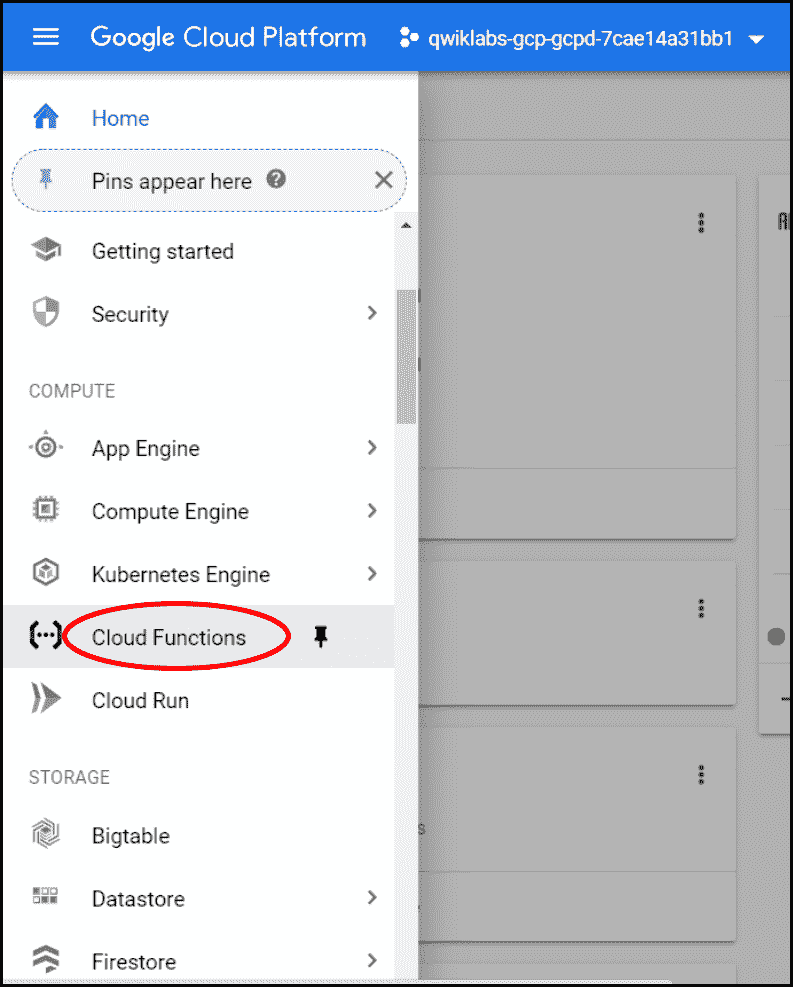
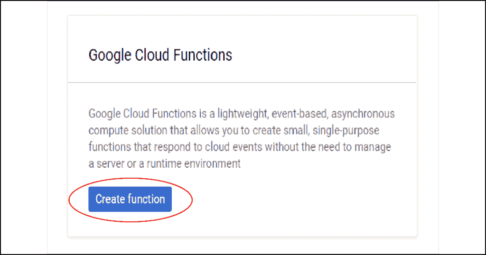
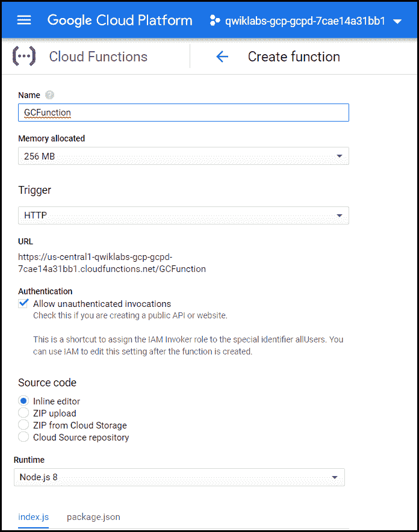
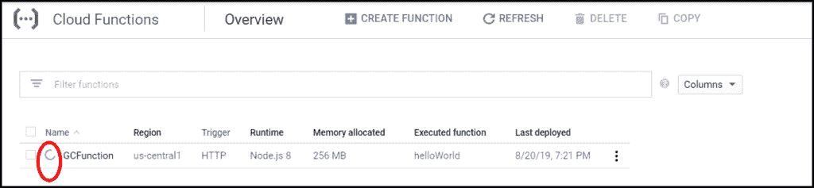
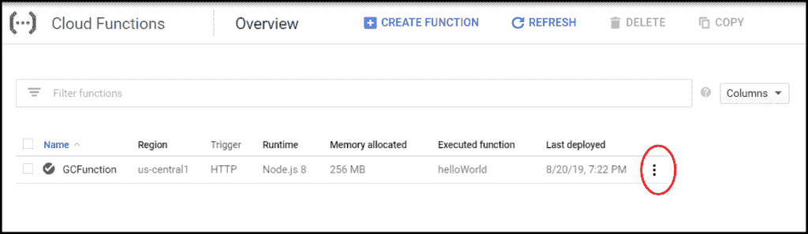
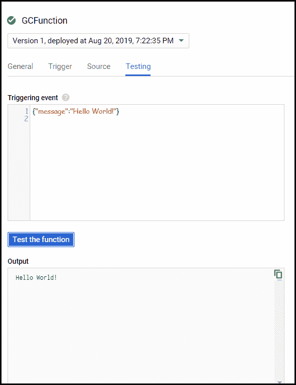
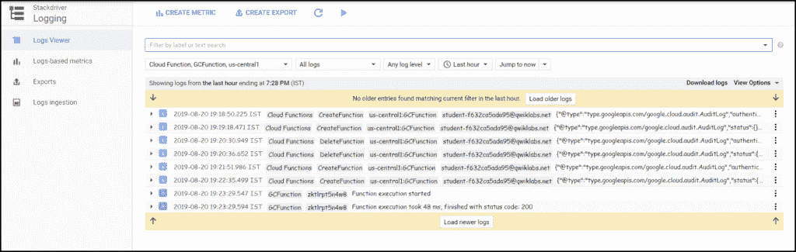

# 在谷歌云平台上部署云功能

> 原文:[https://www . geesforgeks . org/deploy-cloud-function-on-Google-cloud-platform/](https://www.geeksforgeeks.org/deploy-cloud-function-on-google-cloud-platform/)

## 云功能

谷歌云功能是一个用于构建和连接云服务的无服务器执行环境。通过**无服务器**，意味着云功能消除了管理服务器、配置或更新软件以及修补操作系统的负担。软件和基础设施完全由谷歌管理。你只需要添加代码。

**云功能的主要特征是:**

*   没有服务器管理
*   自动缩放
*   只在代码运行时支付
*   运行代码以响应事件
*   开放而熟悉
*   连接和扩展云服务

## 它们是如何工作的？

云服务(Stackdriver、云数据存储等。)发出所需的事件(直接 HTTP 调用等)。)，云函数通过调用其他服务(如 API)来响应这些事件。调用其他服务后，云功能写回云服务。

**云功能的少数用例:**

1.  与第三方服务和应用编程接口集成
2.  无服务器移动后端
3.  无服务器物联网后端

谷歌云函数让你可以用传统的编程语言进行编码，包括 Python 和 JavaScript。这有助于精通 Java 或 Python 的开发人员快速轻松地上传函数。

因此，在本文中，我们将创建一个函数，将其部署在谷歌云上，测试该函数并检查日志。

## 创建函数

创建一个函数非常容易。在这里，我们将使用云控制台创建一个函数。

1.  In the **Navigation Menu**, hover over **Cloud Functions**.

    

2.  If you have not created any functions before, you will be asked whether you want to create a new function. Click on **Create Function**.

    

3.  Now, you will see an intimidating form containing different specifications you need to select in order to create a function. For your understanding, let us fill them as follows:
    *   **名称:** GCFunction
    *   **分配的内存:**默认
    *   **触发器:** HTTP 触发器(避免直接通过 HTTPs 端点调用。)
    *   **源代码:**内联编辑器
    *   **要执行的功能:** helloWorld

    

4.  点击**创建**。

## 部署功能

点击**创建**，进入**云功能概述**页面，可以看到自己创建的所有功能、区域、触发器、分配的内存、执行的功能、上次部署的日期和时间。

页面加载后，您可以在函数名称旁边看到一个小微调图标。这表示您的功能正在部署中。



一旦部署，微调图标会变成绿色的勾号，表示您的功能已成功部署。



## 测试功能

1.  在**云功能概述**页面中，在**最后部署的**列旁边，您可能会发现 3 个点，显示您的功能菜单。点击**测试功能**。
2.  Now, a **Function details** page will open. In the **Triggering event** box, add

    ```
    {"message":"Hello World!"}
    ```

    。在这个测试表单中，我们提供了一个 JSON 格式的消息。接下来，点击**测试功能**。这调用了我们的函数，out 函数的输出将在输出框中显示给我们，您可以看到您的函数被执行了。
    T3】输出:

    ```
    Hello World!
    ```

3.  Below the Output box, in the **Logs field**, you might see **finished with status code:200**. A status code of **200** indicates that your function was successfully executed.

    日志包含一些元数据，显示我们的函数执行所花费的时间，以及它返回的状态代码。此外，它还会有我们的函数抛出的消息或错误(如果有的话)。



## 查看日志

您可以从**云功能概述**页面的显示菜单中查看日志。回到**云功能概述**页面，找到三个点，点击**查看日志**。日志页面将如下所示:



云功能非常容易创建、使用和管理。很少有云功能的时尚和智能应用

*   虚拟助手和聊天机器人
*   视频和图像分析
*   情感分析