# 使用 Azure 应用服务部署您的网络应用

> 原文:[https://www . geeksforgeeks . org/deployment-your-web-app-using-azure-app-service/](https://www.geeksforgeeks.org/deploying-your-web-app-using-azure-app-service/)

**先决条件:** [微软 Azure 简介|一项云计算服务](https://www.geeksforgeeks.org/introduction-microsoft-azure-cloud-computing-service/)

大多数计算机科学学生从网络开发或机器学习开始。现在在学习了如何创建网站之后，我们应该学会在线部署它。通过部署我们的网站，我们可以与其他人共享，执行 alpha 或 beta 测试，在网站上执行实时更改等。这些实践帮助我们发现错误，找到解决问题的更好的方法，我们可以学到一些不同于其他同学或同事的东西。

我们可以使用微软 Azure、亚马逊 AWS 或谷歌云等云服务来部署我们的网站。在本文中，我们将学习如何通过 Github 使用 Azure 应用服务部署网站。

在我们继续之前，您可能想了解:

*   [关于微软 Azure](https://www.geeksforgeeks.org/introduction-microsoft-azure-cloud-computing-service/)
*   [基于云的服务](https://www.geeksforgeeks.org/cloud-based-services/)

**注:**微软 Azure 对新用户有免费试用优惠。您可以访问此 [<u>链接</u>](https://azure.microsoft.com/en-us/free/) ，免费创建一个新的微软 Azure 帐户。

本教程的先决条件是:

*   微软蓝色帐户
*   GitHub 帐户
*   一个网页示例

**第一步:打开您的 Microsoft Azure 帐户**
登录 Microsoft Azure 帐户。之后，您必须打开您的 Azure 门户。
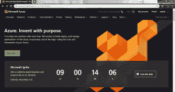

**第二步:创建一个新的应用服务**
进入仪表盘左侧的导航面板，选择应用服务。
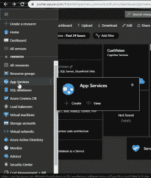
点击添加按钮。这将打开面板以创建新的应用服务。

**步骤 3:设置我们的应用服务的属性**
我们必须设置我们的应用服务的某些属性。

*   选择您的 Azure 订阅。
*   选择资源组。
*   输入您的网络应用程序的名称。该名称将成为您网站的名称。
*   **运行时堆栈:**选择用于创建和运行 web 应用的平台或框架。
*   根据您的意愿选择操作系统。
*   **地区:**云服务器放置在不同的位置。选择离您当前位置最近的地区。

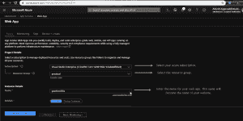
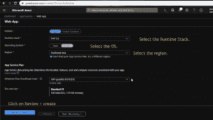
剩下的细节照原样留下。点击**查看+创建**按钮。

**第四步:验证并创建 App 服务**
点击**审核+创建**按钮后，Azure 将验证设置，如果发现将返回错误。
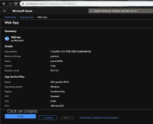
点击**创建**并等待一段时间，您的 App Service 将被创建。现在，我们必须将其与我们的 GitHub 配置文件连接起来，以部署我们的网络应用程序。

**第五步:查看我们新创建的应用服务**
这是我们新创建的应用服务的面板，名为**练习功能**。此面板包含更改我们的应用服务属性、测试我们的网络应用、执行分析和各种其他任务的功能。
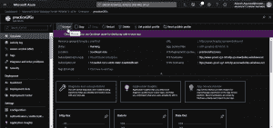
点击**浏览**选项卡。它会将您当前的应用程序服务作为网站打开。

**第六步:设置部署中心**
点击左侧面板**部署中心**。Azure 提供了不同的资源来部署您的 web 应用程序，其中包括:

*   码头工人
*   开源代码库
*   Bitbucket
*   OneDrive

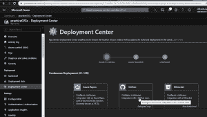
既然我们想从 GitHub 配置文件中部署我们的 We App，请点击 **GitHub** 。它会要求你登录你的 GitHub 个人资料。
现在选择**应用服务构建调查**构建提供商。这项功能帮助我们在 Azure 中的网络应用程序中执行更改。
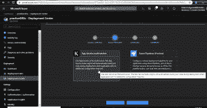

*   选择您要部署的**组织**。
*   选择您想要部署的**存储库**。确保你网站的主页名为**index.html**。
*   选择**分支**。

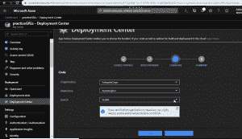
点击**继续**按钮验证汇总。如果一切正常，点击**完成**按钮，等待一段时间。
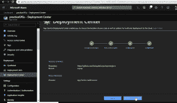

**第七步:查看我们的 Web App**
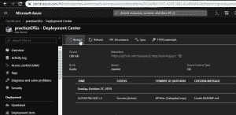
部署成功后，点击**浏览**，瞧！您的网络应用将会上线。现在你的网络应用已经上线，你可以通过网址与他人分享你的网站。