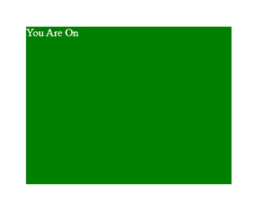

# 使用 tilt.js

设计 3D 悬停批注卡

> 原文:[https://www . geesforgeks . org/design-a-3d-hover-annotation-card-use-tilt-js/](https://www.geeksforgeeks.org/design-a-3d-hover-annotation-card-using-tilt-js/)

**3D 悬停注释卡:**悬停时，该卡将在顶部显示另一张 3D 效果的卡，该卡还具有倾斜效果。这个效果可以使用**香草倾斜. js** 库和 **CSS** 来创建。

**安装:**这可以通过使用节点包管理器(npm)或通过在代码中添加 CDN 链接来安装。

*   **npm 命令:**

    ```html
    npm install vanilla-tilt
    ```

*   **CDN 链接:**

    > https://cdnjs.cloudflare.com/ajax/libs/vanilla-tilt/1.7.0/vanilla-tilt.min.js

**示例:**下面的示例使用 tilt.js 创建 3D 悬停效果卡。

## 超文本标记语言

```html
<!DOCTYPE html>
<html lang="en">

<head>
    <meta charset="UTF-8" />
    <meta name="viewport" content="width=device-width, 
                       initial-scale=1.0" />
    <!--CDN Link-->
    <script src=
"https://cdnjs.cloudflare.com/ajax/libs/vanilla-tilt/1.7.0/vanilla-tilt.min.js">
    </script>

    <style>
        .parent_box {
            top: 30px;
            left: 30px;
            position: relative;
            width: 300px;
            height: 230px;
            margin: 10px 0;
            transform-style: preserve-3d;
            background-color: green;
            color: white;
        }

        .parent_box:hover {
            box-shadow: 0 50px 80px rgba(0, 0, 0, 0.2);
        }

        .parent_box .base_element {
            position: absolute;
            top: 0;
            left: 0;
            width: 100%;
            height: 100%;
        }

        .parent_box .content_box {
            background-color: white;
            position: absolute;
            top: 30%;
            left: 40px;
            right: 40px;
            font-weight: 700;
            font-size: 20px;
            color: green;
            text-align: center;
            transform: translateZ(20px) scaleY(0);
            padding: 40px 25px;
            transform-origin: top;
            transform: 0.5s;
            transform-style: preserve-3d;
        }

        .parent_box:hover .content_box {
            transform: translateZ(50px) scaleY(1);
        }
    </style>
</head>

<body>
    <div class="parent_box" data-tilt data-tilt-scale="1.1">

        <!-- Initial Element-->
        <div class="Base_element">
            You Are On
        </div>

        <!--Element To Be Showed On Hovering-->
        <div class="content_box">
            Geeks For Geeks
        </div>
    </div>

    <script type="text/javascript">
        VanillaTilt.init(document.querySelectorAll(".parent_box"), {

            // max tilt rotation (degrees)
            max: 25,

            // Speed of the enter/exit transition
            speed: 400,
        });
    </script>
</body>

</html>
```

**输出:**



三维悬停注释卡