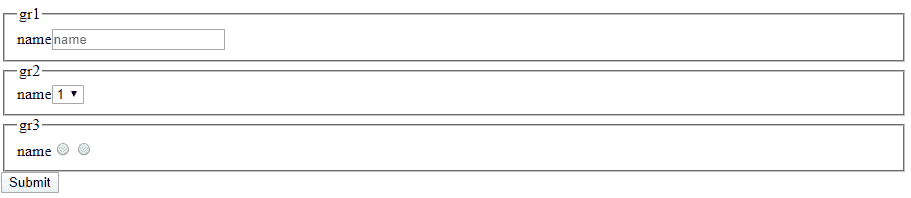

# 设计一个表单组件，从用户那里获取输入并显示一个表单

> 原文:[https://www . geeksforgeeks . org/design-a-form-component-从用户那里获取输入并显示表单/](https://www.geeksforgeeks.org/design-a-form-component-which-takes-input-from-its-user-and-displays-a-form/)

**设计:**下面是它应该支持的东西:

*   表单字段的分组
*   字段验证
*   提交按钮

例如，用户可能想要验证输入是否是有效的地址，并且可能想要该组件对电子邮件等进行默认验证。
让我们尝试为我们的组件创建一个非常基础的数据模型。

对于我们的极简实现，我们可能想要使用这些字段。

*   **标识:**字段的标识
*   **类型:**文本/下拉列表等
*   **子类型:**对于输入类型文本，我们可能需要密码等
*   **下拉/单选的值:**
*   **验证器:**用户提供的自定义验证器。我们可以使用“电子邮件”等值来提供默认验证。
*   **组:**该字段应属于的组
*   **占位符:**字段需要时的占位符。
*   **处理程序:**为提交按钮点击提供回调/选项

为此，我们将尝试在 JS 中使用 MVC 模式。首先，让我们开发我们的模型类。

对于我们的极简实现，我们将在模型类中保留这个组件的输入。
我们的模型将有组件的输入，现在将被硬编码，并且一个事件将通知我们的输入已经改变。
这里是极简实现

```html
function ListModel() {
    this._formInput=[ {
        "id": "id1",
        "type":"text",
        "name":"name",
        "placeholder":"name",
        "values":"",
        "validator":function () {
            console.log("test1");
        }
        ,
        "group":"gr1"
    }
    ,
    {
        "id": "id2",
        "type":"dropdown",
        "name":"name",
        "placeholder":"name",
        "values":[1,
        2,
        3],
        "validator":function () {
            console.log("test2");
        }
        ,
        "group":"gr2"
    }
    ,
    {
        "id": "id3",
        "type":"radio",
        "name":"name",
        "placeholder":"name",
        "values":["male",
        "female"],
        "validator":function () {
            console.log("test");
        }
        ,
        "group":"gr3"
    }
    ,
    {
        "id":"id4",
        "type":"button",
        "name":"name",
        "placeholder":"name",
        "values":"",
        "handler": function () {
            console.log("test3");
        }
        ,
        "group":"gr3"
    }
    ];
    this.itemAdded=new Event(this);
}

ListModel.prototype= {
    addItem: function () {
        this.itemAdded.notify();
    }
    ,
    getFormInput: function () {
        return [].concat(this._formInput);
    }
    ,
}

;
```

在这里，事件类是基本的发布/订阅实现，其中每个模块都可以对事件做出反应。这是事件类

```html
function Event(sender) {
    this._sender = sender;
    this._listeners = [];
}
Event.prototype = {
    attach: function(listener) {
        this._listeners.push(listener);
    },
    notify: function(args) {
        var index;
        for (index = 0; index < this._listeners.length; index += 1) {
            this._listeners[index](this._sender, args);
        }
    }
};
```

现在来看我们的控制器。对于我们的示例用例，我们已经触发了仅在控制器初始化时添加到模型中的项目。
**下面是班级:**

```html
function ListController(model, view) {
    this._model = model;
    this._view = view;
    var _this = this;
    _this.returnResult();
}
ListController.prototype = {
    returnResult : function () {
        this._model.addItem();
    }
};
```

现在进入我们的主类，它将最终呈现我们的视图类。

**这里是视图类:**

```html
function ListView(model) {
    this._model = model;
    var _this = this;
    this._model.itemAdded.attach(function () {
        _this.addResult();
    });
    this._validators = [];
}
```

这里我们存储模型(在我们的例子中是这个组件的输入)和每个字段的验证器。
此外，我们将事件处理程序附加到我们的模型变更中，这将创建视图。这是完整的代码

```html
ListView.prototype = {
    addResult: function() {
        var data = this._model.getFormInput();
        this.createContent(data);
    },
    createContent: function(data) {
        var totalFieldGroup = [];
        var fieldGroup = [];
        var groups = {};
        for (var itr = 0; itr < data.length; itr++) {
            if (!totalFieldGroup.includes(data[itr]["group"]))
                totalFieldGroup.push(data[itr]["group"]);
            if (typeof data[itr]["validator"] == "function")
                this._validators.push(data[itr]["validator"]);
        }
        var form = document.createElement("form");
        for (var j = 0; j < totalFieldGroup.length; j++) {
            fieldGroup.push(data.filter(function(individual) {
                if (individual["group"] == totalFieldGroup[j]) {
                    return true;
                } else {
                    return false;
                }
            }));
            var fieldset = document.createElement("fieldset");
            var legend = document.createElement("legend");
            legend.innerHTML = fieldGroup[0][0]["group"];
            fieldset.appendChild(legend);
            this.createComponent(fieldGroup, fieldset);
            form.appendChild(fieldset);
            fieldGroup = [];
        }
        var subbtn = data.filter(function(individual) {
            if (individual["type"] == "button") {
                return true;
            } else {
                return false;
            }
        });
        if (subbtn.length == 0) {
            alert("no submit button found");
            return;
        }
        var btn = this.addSubmitButton(subbtn, form);
        form.appendChild(btn);
        form.setAttribute("id", "parentForm");
        document.body.appendChild(form);
    },
    addSubmitButton: function(subbtn, form) {
        var x = document.createElement("button");
        x.setAttribute("type", "submit");
        x.innerHTML = "Submit";
        var self = this;
        x.addEventListener("click", function() {
            for (var i = 0; i < self._validators.length; i++) {
                self._validators[i]();
            }
            subbtn[0]["handler"]();
            form.submit();
        });
        return x;
    },
    createComponent: function(fieldGroup, fieldset) {
        var ret = fieldset;
        for (var i = 0; i < fieldGroup.length; i++) {
            switch (fieldGroup[0][i].type) {
                case "text":
                    var label = document.createElement("label");
                    label.innerHTML = fieldGroup[0][i].name;
                    var x = document.createElement("INPUT");
                    x.setAttribute("type", "text");
                    x.setAttribute("placeholder", 
                                   fieldGroup[0][i].placeholder);
                    x.setAttribute("id", fieldGroup[0][i].id);
                    fieldset.append(label);
                    fieldset.append(x);
                    break;
                case "dropdown":
                    var label = document.createElement("label");
                    label.innerHTML = fieldGroup[0][i].name;
                    var select = document.createElement("select");
                    select.setAttribute("id", fieldGroup[0][i].id);
                    for (var k = 0; k < fieldGroup[0][i].values.length; k++) {
                        var option = document.createElement("option");
                        option.innerHTML = fieldGroup[0][i].values[k];
                        select.appendChild(option);
                    }
                    select.setAttribute("placeholder", 
                                        fieldGroup[0][i].placeholder);
                    fieldset.append(label);
                    fieldset.append(select);
                    break;
                case "radio":
                    var label1 = document.createElement("label");
                    label1.innerHTML = fieldGroup[0][i].name;
                    var label = document.createElement("radiogroup");
                    for (var k = 0; k < fieldGroup[0][i].values.length; k++) {
                        var radio = document.createElement("input");
                        radio.type = "radio";
                        radio.label = fieldGroup[0][i].values[k];
                        radio.innerHTML = fieldGroup[0][i].values[k];
                        radio.value = fieldGroup[0][i].values[k];
                        label.appendChild(radio);
                    }
                    label1.appendChild(label);
                    fieldset.append(label1);
                    break;
            }
        }
    }
};
```

下面是我们如何实例化组件

```html
window.onload = function() {
    var model = new ListModel([]),
        view = new ListView(model),
        controller = new ListController(model, view);
};
```

**输出:**
