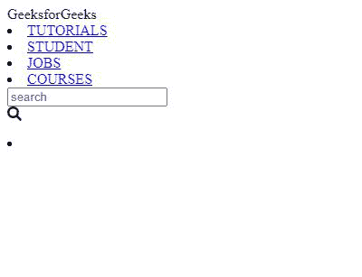
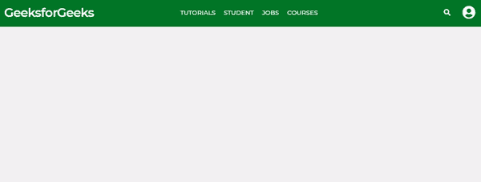

# 设计带有动画搜索框的导航栏

> 原文:[https://www . geesforgeks . org/design-a-导航栏-带动画搜索框/](https://www.geeksforgeeks.org/design-a-navigation-bar-with-animated-search-box/)

导航栏是网站最重要的组成部分之一。它是顶部栏，通常包含菜单形式的所有基本链接。

在本教程中，我们将创建一个包含以下组件的导航栏:

*   菜单
*   动画搜索栏
*   登录图标
*   标志；徽标

但是在继续讨论代码之前，让我们看看我们将为代码、基本结构和样式使用什么语言，以及动画搜索栏使用什么 JQuery。

**进场:**

*   用 HTML 代码链接 jquery 和样式表。
*   使用**切换**类为动画搜索栏设计 jquery 代码。
*   使用**导航**类来构造要包含在导航栏上的元素。
*   使用 CSS 将每个元素和整个导航栏设计为一个整体。

下面是上述方法的实现:

**代码:**

## 超文本标记语言

```html
<!DOCTYPE html>
<html lang="en" dir="ltr">

<head>
    <meta charset="utf-8">

    <!-- Linking the stylesheet -->
    <link rel="stylesheet" href=
"https://cdnjs.cloudflare.com/ajax/libs/font-awesome/4.7.0/css/font-awesome.min.css">

    <!-- Linking the Jquery script -->
    <script src="https://code.jquery.com/jquery-3.5.1.min.js"></script>

    <script>
        $(document).ready(function() {
            $(".fa-search").click(function() {
                $(".icon").toggleClass("active");
                $("input[type='text']").toggleClass("active");
            });
        });
    </script>

    <meta name="viewport" content=
        "width=device-width, initial-scale=1.0">
    <script src="https://kit.fontawesome.com/a076d05399.js"></script>

    <style>

        /* Importing the fonts */
        @import url(
'https://fonts.googleapis.com/css?family=Montserrat:400,500,600,700&display=swap');
        * {
            margin: 0;
            padding: 0;
            outline: none;
            box-sizing: border-box;
            font-family: 'Montserrat', sans-serif;
        }

        /* Body of the page */
        body {
            background: #f2f2f2;
        }

        /* Styling all the elements in nav as a whole */
        nav {
            background: #037729;
            display: flex;
            flex-wrap: wrap;
            align-items: center;
            justify-content: space-between;
            height: 70px;
            padding: 0 100px;
        }

        /* Styling the logo */
        nav .logo {
            color: #fff;
            font-size: 30px;
            font-weight: 600;
            letter-spacing: -1px;
        }

        /* Styling all the nav items as a whole */
        nav .nav-items {
            display: flex;
            flex: 1;
            padding: 0 0 0 200px;
        }

        /* Styling the list items in the nav tag */
        nav .nav-items li {
            list-style: none;
            padding: 0 10px;
        }

        /* Styling each list items */
        nav .nav-items li a {
            color: #fff;
            font-size: 15px;
            font-weight: 500;
            text-decoration: none;
        }

        /* Setting the hover colour on the list items*/

        nav .nav-items li a:hover {
            color: #19191b;
        }

        nav .searchbar {
            position: relative;
        }

        /* Styling the search box where the 
            input would be given */
        nav .searchbar input[type="text"] {
            border: 0;
            padding: 0;
            width: 0px;
            height: 35px;
            border-radius: 3px;
            transition: all 0.3s ease;
        }

        /* Styling the search bar icon */
        nav .searchbar .icon {
            display: flex;
            position: absolute;
            top: 0;
            right: 0;
            width: 35px;
            height: 100%;
            background: none;
            border-radius: 3px;
            color: #fff;
            transition: all 0.5s 0.3s ease;
        }

        nav .searchbar .icon i {
            position: absolute;
            top: 50%;
            left: 50%;
            transform: translate(-50%, -50%);
            cursor: pointer;
        }

        nav .searchbar .icon.active {
            background: #062333;
            transition: all 0.3s ease;
        }

        nav .searchbar input[type="text"].active {
            width: 250px;
            padding: 0 10px;
            transition: all 0.5s 0.2s ease;
        }

        nav .licon li {
            list-style: none;
            display: flex;
        }

        nav .licon li a {
            padding: 0 20px;
        }

        /* Changing the colour of the login 
            icon when hovered over*/

        .fa-user-circle:hover {
            color: #0e0d0d !important;
        }
    </style>
</head>

<body>
    <nav>
        <div class="logo">
            GeeksforGeeks
        </div>

        <div class="nav-items">

            <!-- The Menu items -->
            <li><a href="#">TUTORIALS</a></li>
            <li><a href="#">STUDENT</a></li>
            <li><a href="#">JOBS</a></li>
            <li><a href="#">COURSES</a></li>
        </div>

        <!-- Defining the search bars -->
        <div class="searchbar">
            <input type="text" placeholder="search">
            <div class="icon">
                <i class="fas fa-search"></i>
            </div>
        </div>

        <!-- Defining the login button -->
        <div class="licon">
            <li>
                <a href="#">
                    <i class="fas fa-user-circle
                        fa-2x" style="color: white;">
                    </i>
                </a>
            </li>
        </div>
    </nav>
</body>

</html>
```

**输出:**

*   **仅将 HTML 文件与 jQuery 一起添加会产生以下结果:**

****

*   **添加 CSS 样式表以及 HTML 和 jquery 代码将产生最终结果:**

****